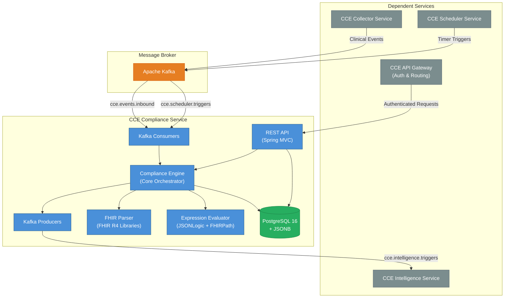
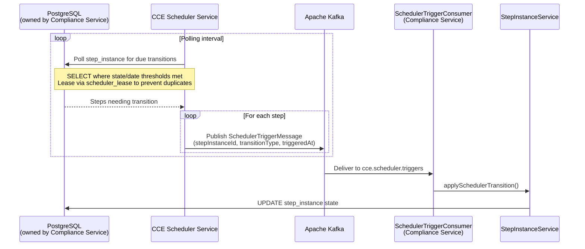
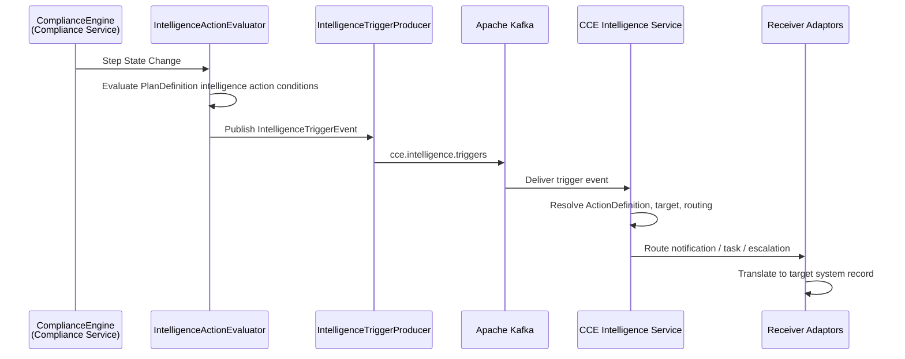
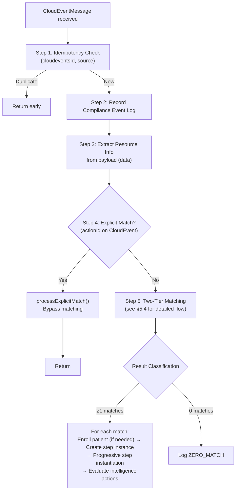
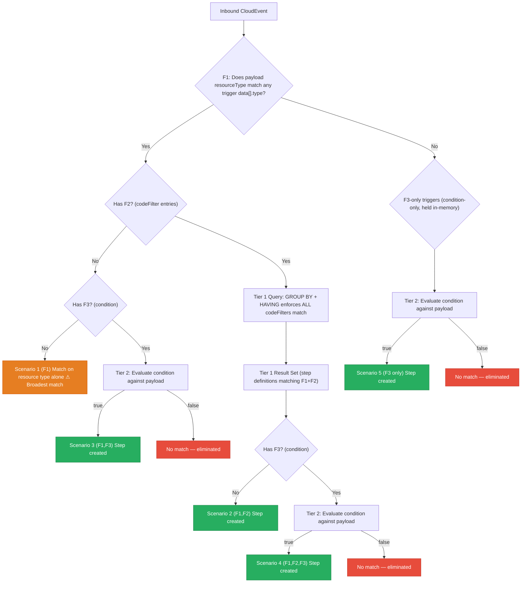
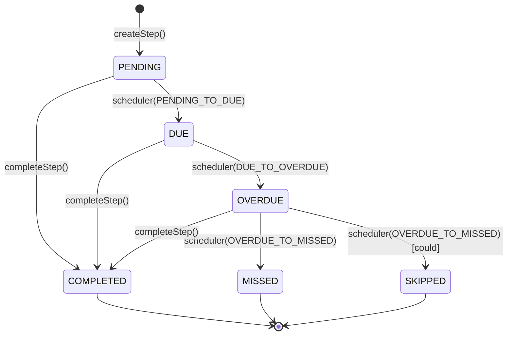
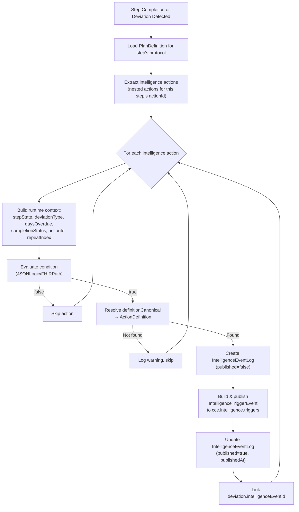
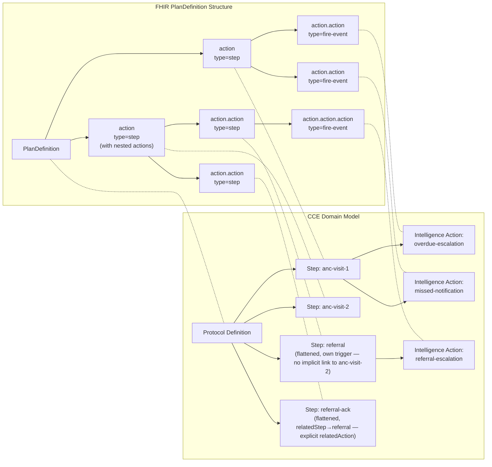
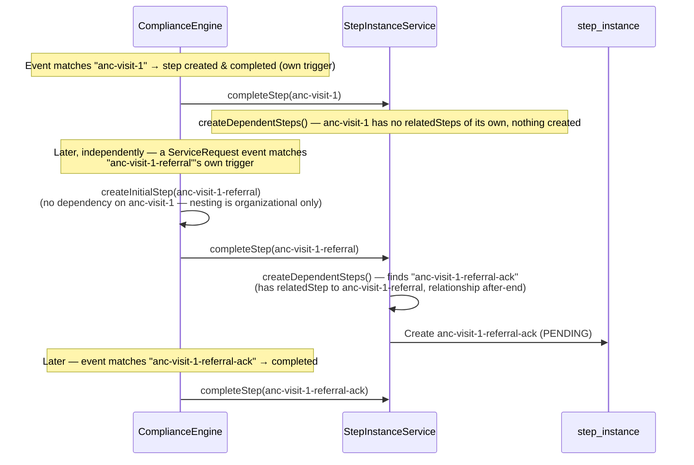
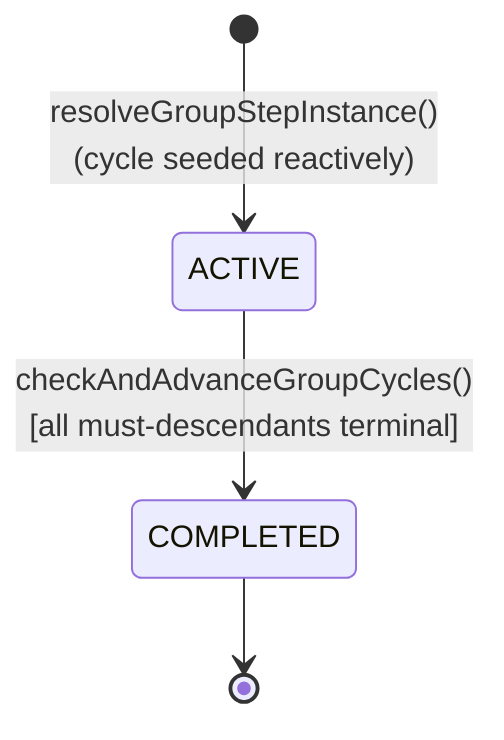

# Architecture & Design

## 1. System Context

The **CCE Compliance Service** is a core microservice within the **Clinical Compliance Engine (CCE)** platform. It tracks patient adherence to clinical protocols defined as FHIR R4 `PlanDefinition` resources — consuming clinical events, matching them against protocol steps, detecting deviations, evaluating intelligence actions, and publishing intelligence trigger events to downstream services.



**This service does NOT handle:** event collection/ingestion (CCE Collector Service), scheduling (CCE Scheduler Service), analytics, alerting (CCE Intelligence Service), or authentication/authorization (handled by the API Gateway).

### 1.1 Scheduler Service Contract

The **CCE Scheduler Service** is a headless background service with no REST API. It drives time-based step state transitions by polling the Compliance Service's `step_instance` table and publishing trigger messages to Kafka. Communication between the two services is **exclusively via Kafka** — there are no direct service-to-service HTTP calls.



#### Polling Query

The Scheduler Service identifies steps that need transitions using:

```sql
SELECT s FROM StepInstance s WHERE
  (s.state = 'PENDING' AND s.dueDate <= :now) OR
  (s.state = 'DUE' AND s.overdueDate <= :now) OR
  (s.state = 'OVERDUE' AND s.missedDate <= :now)
ORDER BY COALESCE(s.dueDate, s.overdueDate, s.missedDate) ASC
```

Each condition maps to a specific `transitionType`:

| Condition | Transition Type | Effect on Compliance Service |
|---|---|---|
| `state = PENDING` AND `dueDate ≤ now` | `PENDING_TO_DUE` | Step becomes actionable |
| `state = DUE` AND `overdueDate ≤ now` | `DUE_TO_OVERDUE` | Deviation recorded (`OVERDUE`) |
| `state = OVERDUE` AND `missedDate ≤ now` | `OVERDUE_TO_MISSED` | `MISSED` (must) or `SKIPPED` (could) |

#### Watermark Cursor (Time-Ordered IDs)

The `id` columns of `protocol_instance`, `step_instance`, and `deviation` are **UUID v7** (RFC 9562) values generated application-side by `UuidV7Generator` (wired via Hibernate `@UuidGenerator`), replacing the previous random v4 (`gen_random_uuid()`) defaults, which were dropped in migration `V4`. A v7 UUID encodes a 48-bit millisecond creation timestamp in its most-significant bytes; because PostgreSQL orders the `uuid` type by a byte-wise comparison, sorting by `id` is (approximately) creation order — no separate timestamp column or index is required.

This lets the Scheduler Service treat `step_instance.id` as a **monotonic watermark**. Instead of rescanning the table, it persists the highest id it has already examined and, on the next poll, discovers newly created steps with a cursor scan:

```sql
SELECT s FROM StepInstance s WHERE s.id > :watermark ORDER BY s.id ASC
```

The date-threshold query above (overdue/missed detection) remains the mechanism for *time-based transitions*; the watermark is a complementary cursor for **incremental discovery of newly enrolled work** in creation order.

**Guarantees & limits:**
- Ordering holds at **millisecond** granularity. Within a millisecond, `UuidV7Generator` uses a 12-bit monotonic counter so ids from a single Compliance Service process stay strictly increasing; across multiple instances or under clock skew, same-millisecond ordering is best-effort.
- The watermark is therefore an **at-least-once** cursor, not exactly-once — a boundary row may be re-observed, so consumers must stay idempotent (scheduler-driven deviation creation already is, via the `deviation_step_type_key` guard).

#### Ownership & Coordination

| Aspect | Owner | Details |
|---|---|---|
| **`step_instance` table** | Compliance Service | Schema, writes, Flyway migrations |
| **`scheduler_lease` table** | Scheduler Service | Prevents duplicate trigger publishing across Scheduler instances |
| **Polling reads** | Scheduler Service | Read-only access to `step_instance` (state, dueDate, overdueDate, missedDate) |
| **State writes** | Compliance Service | Only the Compliance Service updates `step_instance.state` — the Scheduler never writes to it |
| **Kafka topic** | Shared | `cce.scheduler.triggers` — Scheduler produces, Compliance consumes |

> **Key invariant:** The Scheduler Service is a **read-only observer** of `step_instance`. It detects when a time threshold is crossed and notifies the Compliance Service via Kafka. The Compliance Service is the sole authority for state transitions — this ensures all business rules (requiredBehavior, deviation recording, auto-skip) are enforced in one place.

### 1.2 Intelligence Service Contract

The **CCE Intelligence Service** is the downstream consumer of intelligence trigger events published by the Compliance Service. It receives structured trigger events via Kafka, resolves delivery targets, and routes notifications, tasks, and escalations to the appropriate **Receiver Adaptors**. Communication is **exclusively via Kafka** — there are no direct service-to-service HTTP calls.



#### Message Contract

The Compliance Service publishes `IntelligenceTriggerEvent` messages to `cce.intelligence.triggers`. Each message contains all the context the Intelligence Service needs to route and deliver the action:

| Field | Purpose | Source |
|---|---|---|
| `id` | Unique event identifier | Generated UUID |
| `type` | Event category (e.g., `cce.compliance.deviation.overdue`) | Derived from deviation type or step completion status |
| `subject` | Patient identifier | Protocol instance subject |
| `actionId` | PlanDefinition step that triggered the intelligence action | Step instance's action ID |
| `protocolCanonical` | Protocol `url\|version` | Protocol definition canonical |
| `facilityId` | Facility where the event occurred | CloudEvent extension attribute |
| `metadata` | Additional context (due dates, timing, severity) | Step and deviation runtime state |
| `eventPayload` | Original FHIR resource payload from the inbound CloudEvent | CloudEvent `data` (null for scheduler-driven deviations) |

See [Kafka Events §5.3](kafka-events.md#53-intelligencetriggerevent-outbound--cceintelligencetriggers) for the full message schema.

#### Ownership & Boundaries

| Aspect | Owner | Details |
|---|---|---|
| **Intelligence action evaluation** | Compliance Service | Evaluates PlanDefinition intelligence action conditions, resolves `definitionCanonical` to `ActionDefinition` |
| **Trigger event publishing** | Compliance Service | Publishes `IntelligenceTriggerEvent` to Kafka; creates `intelligence_event_log` record (published=false → true) |
| **`action_definition` table** | Compliance Service | Schema, writes, Flyway migrations — stores `ActivityDefinition` resources referenced by intelligence actions |
| **`intelligence_event_log` table** | Compliance Service | Tracks each intelligence action execution with evaluation context and Kafka event payload |
| **Event consumption & routing** | Intelligence Service | Consumes from `cce.intelligence.triggers`, resolves delivery targets, routes to Receiver Adaptors |
| **Notification/task delivery** | Intelligence Service + Receiver Adaptors | Translates intelligence events into system-specific records (SMS, in-app alerts, EMR tasks, escalation workflows) |
| **Kafka topic** | Shared | `cce.intelligence.triggers` — Compliance produces, Intelligence consumes |

> **Key invariant:** The Compliance Service is the **sole publisher** to `cce.intelligence.triggers`. It evaluates conditions and publishes structured trigger events but has no knowledge of how they are delivered. The Intelligence Service is the sole consumer — it owns the routing logic, adaptor selection, and delivery confirmation. This separation ensures the Compliance Service remains **delivery-agnostic** and the Intelligence Service can evolve its routing independently.

## 2. Technology Stack

| Category | Technology | Version | Purpose |
|---|---|---|---|
| **Runtime** | Java | 21 LTS | Language runtime |
| **Framework** | Spring Boot | 3.4.2 | Application framework |
| **Persistence** | Spring Data JPA / Hibernate | 6.x | ORM and data access |
| **Database** | PostgreSQL | 16 | JSONB, GIN indexes |
| **Migration** | Flyway | 10.x | Schema version management |
| **JSONB Mapping** | Hibernate 6 `@JdbcTypeCode(SqlTypes.JSON)` | 6.x | Native JPA ↔ PostgreSQL JSONB |
| **Messaging** | Spring Kafka | 3.x | Event-driven messaging |
| **FHIR** | FHIR Libraries | 4.0.1 | FHIR R4 PlanDefinition parsing & validation |
| **Expression** | Apache Johnzon JsonLogic | 2.0.2 | Tier 2 conditional evaluation (JSONLogic) |
| **Metrics** | Micrometer + Prometheus | 1.x | Application metrics |
| **Tracing** | OpenTelemetry | 1.x | Distributed tracing |
| **Testing** | JUnit 5 + Mockito | 5.x / 5.x | Unit testing with mocked dependencies |

## 3. Package Structure

```
org.openphc.cce.compliance
├── ComplianceServiceApplication.java          # @SpringBootApplication entry point
├── config/                                    # AppConfig, ObservabilityConfig
├── domain/
│   ├── entity/                                # 13 JPA entities (incl. ActionDefinition, IntelligenceEventLog, Facility, GroupStepInstance)
│   ├── enums/                                 # 12 value-based enums
│   └── repository/                            # 13 Spring Data JPA repositories
├── fhir/                                      # FHIR parsing, JSONLogic & FHIRPath evaluation
├── kafka/
│   ├── config/                                # Consumer/Producer factories, topic bindings
│   ├── consumer/                              # InboundEventConsumer, SchedulerTriggerConsumer
│   ├── model/                                 # CloudEventMessage, IntelligenceTriggerEvent
│   └── producer/                              # IntelligenceTriggerProducer
├── service/                                   # 13 business logic services + supporting records/components
└── web/                                       # Controllers, DTOs, DtoMapper, ExceptionHandler
```

## 4. Core Pipeline — ComplianceEngine

The `ComplianceEngine` is the central orchestrator. All inbound event processing flows through it:



### 4.1 Resource Extraction

Resource metadata is extracted from the CloudEvent **payload** (`data`), never from the envelope:

| Field | Extraction Paths |
|---|---|
| `resourceType` | `data.resourceType` (e.g., `"Observation"`, `"Encounter"`) |
| `allCodes` | `data.code.coding[*]`, `data.type.coding[*]`, `data.category[*].coding[*]`, `data.clinicalStatus.coding[*]`, `data.identifier[*]` (system+value), `data.status` |

### 4.2 Clinical Event Time Extraction

When an inbound event **completes** a step, the completion is attributed to the **clinical occurrence time** — when the act actually happened — rather than the time the event reached the service. This keeps a completed step's `completed_at`, its `completionStatus`, and the calculated due/overdue/missed dates of any **dependent steps** accurate even when events arrive late (offline sync, batch upload, retries, DLQ replay).

`ClinicalEventTimeExtractor` derives this time from the FHIR payload using a resource-type → clinical-time-field table, handling FHIR's polymorphic `[x]` choice types by probing concrete field names in priority order:

| Resource type | Clinical-time fields (first match wins) |
|---|---|
| `Observation` | `effectiveDateTime` → `effectiveInstant` → `effectivePeriod.start` → `issued` → `effectivePeriod.end` |
| `Encounter` | `period.start` → `period.end` |
| `Procedure` | `performedDateTime` → `performedPeriod.start` → `performedPeriod.end` |
| `Immunization` | `occurrenceDateTime` |
| `MedicationAdministration` | `effectiveDateTime` → `effectivePeriod.start` → `effectivePeriod.end` |
| `MedicationDispense` | `whenHandedOver` → `whenPrepared` |
| `MedicationRequest` | `authoredOn` |
| `Condition` | `onsetDateTime` → `onsetPeriod.start` → `recordedDate` |
| `AllergyIntolerance` | `onsetDateTime` → `recordedDate` → `lastOccurrence` |
| `ServiceRequest` | `occurrenceDateTime` → `authoredOn` → `occurrencePeriod.end` |
| `Consent` | `dateTime` |
| `DiagnosticReport` | `effectiveDateTime` → `issued` → `effectivePeriod.end` |

A `Period`'s `end` bound is always the last-resort candidate in each row above — it reflects "when it finished," not when the clinical act occurred, so every other field (including that same Period's `start`, where present) is tried first.

Values are parsed leniently (partial precision `2026` / `2026-03` / full timestamps with offset). The extractor is **best-effort** — an unmapped resource type, missing field, or unparseable value returns nothing and the caller falls back.

**Resolution order** for the completion time (`ComplianceEngine.resolveOccurredAt`):

1. **Clinical time from the FHIR payload** (above) — only for FHIR payloads (`application/fhir+json`).
2. **CloudEvent envelope `time`** — the emitter/adaptor's transmission clock; stable across retries/DLQ replay. Used for non-FHIR (`application/json`) payloads and as the FHIR fallback.
3. **`now()`** — defensive last resort.

The resolved time is **clamped to `now()`** in `StepInstanceService.completeStep` (a step cannot have completed in the future; a bad or skewed source clock must not push downstream schedules out). Because the result only ever *improves* on the previously-used ingestion time, unmapped resource types degrade safely to prior behavior.

**Enrollment anchoring:** the same `resolveOccurredAt(event)` result is also used as a new `ProtocolInstance.enrolled_at` (previously `now()`). So a patient's enrollment — and any downstream analytics that date-filter cohorts on `enrolled_at` — reflects when they *clinically* entered care, not when the event was processed, consistent with step completion. Enrollment is idempotent, so `enrolled_at` is fixed by the first matching event to be processed. Unlike `completed_at`, enrollment does **not** apply the `completeStep` future-clamp (it does not anchor step schedules — those anchor on `completed_at`), so its only clock guard is `resolveOccurredAt`'s own `now()` last resort.

> **Late-arriving completions:** when ingestion lag exceeds a dependent step's offset, that step can be created with `overdue_date`/`missed_date` already in the past and transition (possibly recording a deviation) at the next scheduler cycle. This is real-world-accurate — the step genuinely is overdue — and is a consequence of anchoring to clinical time.

### 4.3 Metric time semantics

Every number CCE reports is measured on one of two clocks, chosen by what the metric is about. Getting this distinction right is what keeps clinical KPIs stable when events arrive late:

> **Metric time semantics** — two clocks, chosen by metric type:
>
> - **Functional metrics** — clinical/business KPIs (e.g. adoption, compliance, deviations, event volume, referrals, patient cohorts). Measured on **clinical `event_time`**: when the clinical act actually happened, as carried on the inbound event. Date filters and daily rollups for these use `event_time`, so ingestion lag (offline sync, batch upload, retries, DLQ replay) never shifts the numbers.
> - **Technical / operational metrics** — pipeline health and ingestion throughput (e.g. events received, connector/queue health). Measured on **processing / system time** (`received_at` / `now()`): when the platform physically received or processed the data.
>
> Rule of thumb: "when did it happen clinically?" → `event_time`; "when did our system handle it?" → `received_at` / `now()`.

Within this service, `resolveOccurredAt(event)` — clinical payload time → CloudEvent envelope `time` → `now()` fallback (see §4.2) — is the concrete implementation of the clinical clock. It anchors **both** step-completion timing (`step_instance.completed_at`) and protocol enrollment (`protocol_instance.enrolled_at`), so the functional metrics that date-filter off those columns are all measured on `event_time`. Technical metrics stay on system time — `compliance_event_log.received_at` records ingestion, and the ingestion/consumer counters in §8.1 count processing events as they happen.

## 5. Two-Tier Matching Algorithm

### 5.1 Tier 1 — Structural Match

Inverted index lookup on the `trigger_index` table using `GROUP BY` + `HAVING` to enforce **AND semantics** across all `codeFilter` entries:

```sql
SELECT protocol_definition_id, action_id
FROM trigger_index
WHERE resource_type = :resourceType
  AND CONCAT(path, '|', code_system, '|', code_value) IN (:codeTriples)
GROUP BY protocol_definition_id, action_id
HAVING COUNT(DISTINCT path) = (
    SELECT COUNT(DISTINCT t2.path)
    FROM trigger_index t2
    WHERE t2.protocol_definition_id = trigger_index.protocol_definition_id
      AND t2.action_id = trigger_index.action_id
      AND t2.resource_type = trigger_index.resource_type
);
```

The `:codeTriples` parameter is a list of `path|system|code` strings extracted from the inbound event payload. The correlated subquery counts the **total** distinct paths each action requires, ensuring actions with different numbers of codeFilters are correctly evaluated in a single query.

The index is built at protocol load time by decomposing each action's `TriggerDefinition.data[].codeFilter[]` into `(resourceType, path, codeSystem, codeValue, protocolDefinitionId, actionId)` rows.

### 5.2 Condition-Only Triggers

Triggers that have no `data[]` section (only a `condition`) are **not indexed** in `trigger_index`. They are held in-memory and evaluated via Tier 2 for every inbound event. These are validated at protocol load time — a trigger with no `data[]` and no `condition` is rejected.

### 5.3 Tier 2 — Condition Evaluation

For each Tier 1 candidate, evaluates the trigger's `condition` expression.  **Triggers with no `condition` pass automatically**.

| Variable | Source |
|---|---|
| `event` | CloudEvent data payload |
| `patient` | Patient context (`patientId`, demographics) |
| `step` | Current step context (`actionId`, `repeatIndex`, `state`) |
| `protocol` | Protocol context (`protocolCanonical`, `status`) |

**Supported languages:**
- `text/jsonlogic` — via Apache Johnzon `JsonLogic`
- `text/fhirpath` — via FHIR `IFhirPath` engine (R4)
- Any other — rejected with `UnsupportedExpressionLanguageException`

### 5.4 How Matching Works — Step by Step

> **Terminology:** In FHIR, `PlanDefinition.action[]` defines the steps of a protocol. In CCE, each `action` is a **step definition** — a template that becomes a `step_instance` when matched for a specific patient. Throughout this section, "step definition" and "action" are used interchangeably.

A trigger definition has three filter components. Each component is **independent** — a trigger may use any combination:

| Component | FHIR Path | What it checks |
|---|---|---|
| **F1** — Resource type | `trigger.data[].type` | Does the payload's `resourceType` match? (e.g., `Encounter`) |
| **F2** — Code filters | `trigger.data[].codeFilter[]` | Do the payload's coded fields match the required `(path, system, code)` tuples? |
| **F3** — Condition | `trigger.condition` | Does the payload satisfy a JSONLogic/FHIRPath expression? |

> **F1 is implicit:** Every trigger that has a `data[]` section always has `data[].type` (the FHIR resource type). So F1 is present whenever F2 is present. A trigger with no `data[]` at all is a **condition-only trigger** (F3 only).

#### Five Exclusive Matching Scenarios

Every trigger in the system falls into **exactly one** of these five scenarios:



| Scenario | Components | Trigger Shape | Matching Path | Step Created When |
|---|---|---|---|---|
| **1** | **(F1)** | `data[].type` only — no `codeFilter[]`, no `condition` | Resource type match only | Payload `resourceType` matches trigger `data[].type`. **Broadest match** — every event of that type triggers a step. |
| **2** | **(F1,F2)** | `data[].type` + `codeFilter[]`, no `condition` | Tier 1 (GROUP BY + HAVING) | All code filters match — **no further evaluation needed** |
| **3** | **(F1,F3)** | `data[].type` + `condition`, no `codeFilter[]` | Resource type match → Tier 2 | `resourceType` matches AND condition evaluates to `true` |
| **4** | **(F1,F2,F3)** | `data[].type` + `codeFilter[]` + `condition` | Tier 1 → **reuses Tier 1 result** → Tier 2 | All code filters match AND condition evaluates to `true` |
| **5** | **(F3)** | `condition` only, no `data[]` | Tier 2 only (in-memory) | Condition evaluates to `true` (checked for **every** inbound event) |

> **Scenario 1 (F1) — caution:** A trigger with only `data[].type` and no `codeFilter[]` or `condition` will match **every** inbound event of that resource type (e.g., every `Encounter`). This is intentionally supported for use cases like "enroll patient on any encounter of this type," but protocol authors should be aware of the broad match scope.

#### Exclusivity

Each scenario is **mutually exclusive** — a trigger belongs to exactly one scenario based on which components it defines:

- Has `data[]` with `codeFilter[]` and `condition`? → **Scenario 4 (F1,F2,F3)**
- Has `data[]` with `codeFilter[]` but no `condition`? → **Scenario 2 (F1,F2)**
- Has `data[]` with only `type` (no `codeFilter[]`) and `condition`? → **Scenario 3 (F1,F3)**
- Has `data[]` with only `type` (no `codeFilter[]`) and no `condition`? → **Scenario 1 (F1)**
- Has only `condition` (no `data[]`)? → **Scenario 5 (F3)**
- Has neither `data[]` nor `condition`? → **Rejected at protocol load time**

#### Tier 1 Result Reuse

Scenarios 2 and 4 both require Tier 1 matching (F1+F2). The Tier 1 query is executed **once**, and its result set is **reused**:

1. The `trigger_index` query runs once, returning all `(protocolDefinitionId, actionId)` pairs where all code filters match.
2. For **Scenario 2** step definitions (no condition): the Tier 1 result is final — step instances are created immediately.
3. For **Scenario 4** step definitions (has condition): the same Tier 1 result is filtered through Tier 2 condition evaluation. There is **no re-query** of `trigger_index`.

```
Tier 1 Result Set ──┬── step definitions without condition ──► Scenario 2 → create step instances
                    │
                    └── step definitions with condition ──► Tier 2 eval ──► Scenario 4 → create step instances (if true)
```

#### Example Trigger (Scenario 4: F1,F2,F3)

Consider a step definition (`action`) with a trigger that requires an `Encounter` (F1) with **four** code filters (F2) and a condition (F3):

```json
"trigger": [
  {
    "type": "data-added",
    "data": [
      {
        "type": "Encounter",
        "codeFilter": [
          {
            "path": "type",
            "code": [{ "system": "http://openphc.org/encounter-types", "code": "anc-visit" }]
          },
          {
            "path": "status",
            "code": [{ "code": "finished" }]
          },
          {
            "path": "class",
            "code": [{ "system": "http://terminology.hl7.org/CodeSystem/v3-ActCode", "code": "AMB" }]
          },
          {
            "path": "serviceType",
            "code": [{ "system": "http://openphc.org/service-types", "code": "high-risk-anc" }]
          }
        ]
      }
    ],
    "condition": {
      "language": "text/jsonlogic",
      "expression": "{\"==\": [{\"var\": \"class.code\"}, \"AMB\"]}"
    }
  }
]
```

At **protocol load time**, this trigger is decomposed into 4 `trigger_index` rows (one per `codeFilter`):

| `resource_type` | `path` | `code_system` | `code_value` |
|---|---|---|---|
| `Encounter` | `type` | `http://openphc.org/encounter-types` | `anc-visit` |
| `Encounter` | `status` | *(empty)* | `finished` |
| `Encounter` | `class` | `http://terminology.hl7.org/CodeSystem/v3-ActCode` | `AMB` |
| `Encounter` | `serviceType` | `http://openphc.org/service-types` | `high-risk-anc` |

When an inbound `Encounter` event arrives:

1. **Tier 1 (F1+F2)** — The query matches on `resource_type = 'Encounter'` and checks the inbound event's `path|system|code` triples against all 4 indexed rows. The correlated `HAVING` clause compares the matched path count against this action's total path count (4). If the payload is missing any one (e.g., no `serviceType` code), this step definition is eliminated.
2. **Tier 2 (F3)** — Since this step definition has a condition, the Tier 1 result is passed to Tier 2. The JSONLogic expression `{"==": [{"var": "class.code"}, "AMB"]}` is evaluated against the payload. Only if it returns `true` does this step definition produce a step instance.

> **Key point:** A step instance is created for **every** step definition that survives its matching scenario. If 3 different step definitions match a single inbound event (e.g., one via Scenario 1, one via Scenario 2, one via Scenario 4), 3 separate step instances are created.

## 6. State Machines

### 6.1 Step Instance



**Completion status:** `EARLY` (before dueDate), `ON_TIME` (between due and overdue), `LATE` (after overdueDate or state was OVERDUE). Timing is judged against the **clinical occurrence time** of the completing event (see §4.2), not the ingestion time — so a visit that happened on time but was reported late is still `ON_TIME`.

**Intelligence action evaluation:** On step completion and on deviation detection (OVERDUE, MISSED), the intelligence action evaluator is invoked. See §6.3 for details.

**Required behavior:** Steps with `requiredBehavior=could` (from `PlanDefinition.action.requiredBehavior`) are optional. When the scheduler fires `OVERDUE_TO_MISSED` on a `could` step, it transitions to `SKIPPED` (no deviation) instead of `MISSED`. Additionally, when any step completes, preceding `could` steps still in actionable states are auto-skipped.

**Backfilling unrecorded mandatory predecessors:** progressive instantiation only works *forward* from a completed step, so a step created reactively from its own trigger (`ComplianceEngine.createInitialStep`) leaves the mandatory steps that should have preceded it with **no `step_instance` row at all** — e.g. a `treatment` event arriving for a patient whose `vitals-recording`, `consultation` and `diagnosis` were never reported. Those steps read as "not started" in the journey view and, having no row, are invisible to the Scheduler, so they never surface as a deviation.

`StepInstanceService.backfillMissingMandatorySteps` closes that gap. After every completion, any mandatory step that is a transitive `relatedAction` predecessor of the progress observed so far (`PlanDefinitionParser.computeMustPredecessorSteps`) but that has no `step_instance` row is created in `PENDING` state:

- **Scope — predecessors only** — the backfill covers work that is *already late*, never mandatory work still ahead in the chain. Materializing steps still ahead would stamp them with this completion's time and flatten the schedule their own `relatedAction` offsets define (e.g. `lab-results`' `+3d` after `lab-order`), so they are left to progressive instantiation, which creates them on their predecessor's completion with the intended due dates. For example, completing `chief-complaints` does **not** backfill `diagnosis`; a later `treatment` completion does, because `diagnosis` is then a predecessor of observed progress.
- **Dates** — `due_date` is the clinical completion time of the step that revealed the gap. Every backfilled step is a prerequisite that should already have happened, so they are all equally past due and there is no future schedule left to preserve among them. `overdue_date`/`missed_date` are derived from the step's `tolerance-days` extension. The Scheduler then drives the row `PENDING → DUE → OVERDUE → MISSED`, so mandatory work that is never recorded surfaces as an `OVERDUE` and then a `MISSED` deviation. If the event does arrive later, `findActionableStep` picks the row up and completes it (`LATE`). A step with no `tolerance-days` gets no thresholds and therefore never advances past `DUE`.
- **Ordering within `completeStep`** — backfill runs *after* `detectOrderViolations`, so a freshly backfilled row is never counted as an incomplete prerequisite for the completion that revealed it; this pass does not invent an `ORDER_VIOLATION`. Subsequent completions do see those rows, so a genuinely out-of-order journey raises `ORDER_VIOLATION` from the next completion onward.
- **Idempotent** — a mandatory step that already has any row, in any state (pre-existing, terminal, or created earlier in the same transaction by progressive instantiation), is left alone. One row per step (`repeat_index` 0) regardless of `timing.repeat.count`: this is a placeholder for work never recorded, not a scheduled recurrence.

### 6.2 Protocol Instance

`ProtocolInstanceStatus` defines `ACTIVE`, `COMPLETED`, `WITHDRAWN`, and `EXPIRED`, but **no code currently transitions an instance out of `ACTIVE`** — there is no manual complete/withdraw endpoint, and automatic completion has been removed pending finalized criteria. Every enrolled instance stays `ACTIVE` indefinitely today; its steps still progress through the normal step state machine (§6.1) and raise deviations as usual.

> **Removed — automatic completion:** an earlier version of `ProtocolInstanceService.checkAndCompleteProtocol` evaluated, after every step completion and every scheduler-driven `OVERDUE_TO_MISSED` transition, whether every mandatory (`must`) step implied by observed progress — the step itself, its transitive `relatedAction` predecessors, and mandatory siblings nested under the same top-level PlanDefinition action — had reached a terminal state, and if so moved the instance to `COMPLETED`. That method, along with its supporting `PlanDefinitionParser.computeExpectedMustSteps` and `computeMustGroupSteps`, was removed while the completion criteria is reworked. `PlanDefinitionParser.computeAncestors` and `computeMustPredecessorSteps` remain — they still drive the backfill in §6.1.

**Interaction with repeating groups (§6.5):** the repeating-groups design keys must-action terminality on the bare `actionId`, which cannot by itself distinguish "terminal for the current cycle" from "terminal two cycles ago, with a fresh instance for the new cycle not yet complete." The design accounts for this by having `StepInstanceService` run `checkAndAdvanceGroupCycles` — under a pessimistic lock on the `protocol_instance` row — before any completion check: it either advances the current cycle to `COMPLETED` and spawns the next cycle's mandatory children (so a fresh `PENDING` row makes the action visibly non-terminal again), or leaves the cycle in progress. This ordering is designed to hold once automatic completion is reinstated; see §6.5 for the full cycle-advancement mechanics and why the lock is needed.

### 6.3 Intelligence Action Evaluation

Intelligence actions are modeled as **nested actions** within a PlanDefinition step (`action.action[]`). Each intelligence action defines a condition (JSONLogic/FHIRPath) evaluated against step runtime state, and a `definitionCanonical` pointing to an `ActivityDefinition` (stored in the `action_definition` table) that defines the action to take.

Intelligence action evaluation is triggered on any Step State change. Example:
1. **On deviation detection** — when a step transitions to `OVERDUE` or `MISSED` (scheduler-driven)
2. **On step completion** — when a step is completed by an inbound event (for actions like "notify on late completion")



#### Runtime Context Variables

| Variable | Type | Source | Available On |
|---|---|---|---|
| `stepState` | String | Current step state (e.g., `overdue`, `missed`, `completed`) | Both |
| `deviationType` | String | `overdue` or `missed` | Deviation only |
| `daysOverdue` | Long | Days past `dueDate` at detection time | Deviation only |
| `daysPastMissedDate` | Long | Days past `missedDate` at detection time | MISSED only |
| `actionId` | String | Step definition action ID | Both |
| `repeatIndex` | Integer | 0-based repeat counter | Both |
| `completionStatus` | String | `early`, `on_time`, `late` | Completion only |
| `dueDate` | OffsetDateTime | Step's scheduled due date | Both |
| `completedAt` | OffsetDateTime | Step's completion timestamp | Completion only |

#### Domain-to-FHIR Concept Mapping

The table below maps CCE domain concepts to their FHIR PlanDefinition counterparts:

| CCE Domain Concept | FHIR PlanDefinition Element | Description |
|---|---|---|
| **Protocol Definition** | `PlanDefinition` | The clinical protocol (e.g., ANC High-Risk Monitoring) |
| **Protocol Step** | `PlanDefinition.action` (type=step) | A step in the protocol with its own trigger (e.g., "ANC Visit 2"). Nested actions of type "step" are flattened to peer-level steps. |
| **Flattened Sub-Step** | `PlanDefinition.action.action` (type=step) | A nested step flattened into a peer-level step. Nesting groups it with its parent for trigger indexing, and (pending the completion-criteria rework, §6.2) for the protocol-completion "group sibling" check — any dependency on the parent or on sibling sub-steps must be declared explicitly via `relatedAction`. |
| **Intelligence Action** | `PlanDefinition.action.action` (type=fire-event) | A nested action that defines a conditional intelligence evaluation |



Each **intelligence action** (`PlanDefinition.action.action`) contains:
- `id` — unique identifier (mapped to `stepActionId` in `intelligence_event_log`)
- `condition[kind=applicability]` — JSONLogic/FHIRPath expression evaluated against step runtime state
- `definitionCanonical` — reference to an `ActivityDefinition` that defines the action to take
- `extension` — **required** severity and destination metadata (rejected at parse time if missing)

#### PlanDefinition Intelligence Action Structure

```json
{
  "id": "anc-visit-2",
  "title": "ANC Visit 2",
  "trigger": [{ "..." : "..." }],
  "action": [
    {
      "id": "anc-visit-2-overdue-escalation",
      "condition": [{
        "kind": "applicability",
        "expression": {
          "language": "text/jsonlogic",
          "expression": "{\"and\": [{\"==\": [{\"var\": \"stepState\"}, \"overdue\"]}, {\">\": [{\"var\": \"daysOverdue\"}, 3]}]}"
        }
      }],
      "definitionCanonical": "ActivityDefinition/anc-escalation-notification|1.0",
      "extension": [
        {
          "url": "http://openphc.org/fhir/StructureDefinition/intelligence-severity",
          "valueCode": "high"
        },
        {
          "url": "http://openphc.org/fhir/StructureDefinition/intelligence-destination",
          "valueCode": "openMRS"
        }
      ]
    }
  ]
}
```

#### Action Definitions

`ActionDefinition` entities store FHIR `ActivityDefinition` resources. They define what CCE does when an intelligence action fires:

| Field | Description |
|---|---|
| `canonicalUrl` + `version` | Unique identifier, referenced by `definitionCanonical` in PlanDefinition intelligence actions |
| `actionType` | FHIR `ActivityDefinition.kind`: `CommunicationRequest`, `Task`, `ServiceRequest` |
| `definition` | Full ActivityDefinition JSON (message template, routing config) |

> **Note:** `severity` and `intelligenceDestination` are **required** on the PlanDefinition intelligence action extensions (`intelligence-severity`, `intelligence-destination`). They are not stored on `action_definition`. PlanDefinitions missing these extensions are rejected at parse time.

#### Intelligence Event Logging

`IntelligenceEventLog` records track each intelligence action execution in a single flat row for auditability:

| Field | Description |
|---|---|
| `published` | `false` → `true` (on successful Kafka publish) |
| `event_payload` | Complete `IntelligenceTriggerEvent` JSON published to Kafka |
| `trigger_reason` | Why the action fired: `overdue`, `missed`, `completion` |
| `evaluation_context` | Runtime variables passed to the condition evaluator |

All execution and evaluation context is stored in a single row — no FK constraints, no joins required. See [Data Dictionary §12](data-dictionary.md#12-intelligence_event_log).

### 6.4 Flat Step Model (Nested Actions Flattened)

Nested `PlanDefinition.action.action[]` entries with type `"step"` are **flattened** into peer-level steps at parse time by `extractSteps()`. There is no parent-child hierarchy in the domain model — all steps (top-level and nested) are stored uniformly in `step_instance` without any `parent_step_id`. Relationships between steps are expressed exclusively via `relatedSteps` (derived from FHIR `relatedAction`).

**Key design decisions:**
- `StepMetadata` is a flat record with 11 fields (no `subSteps` list): `id`, `title`, `triggers`, `relatedSteps`, `timing`, `toleranceDays`, `requiredBehavior`, `intelligenceActions`, `parentActionId`, `groupingBehavior`, `selectionBehavior`. `TimingInfo` (§6.5) has 5 fields: `count`, `frequency`, `period`, `periodUnit`, `boundsEnd`.
- Nesting is **organizational only** — it groups a sub-step under its enclosing action but does **not** create an implicit `relatedStep`/dependency link. Ordering between a parent and its sub-steps (and among sub-steps) must be expressed explicitly via `relatedAction`. A sub-step with no explicit predecessor is created independently whenever its own trigger fires (`ComplianceEngine.createInitialStep`), exactly like a top-level step — it does not wait for its parent to complete. (An earlier version of the parser auto-added a backward `relatedStep` from child to parent; see the comment in `PlanDefinitionParser.flattenAction` — it was removed because under the forward progressive-instantiation model it meant "completing the child re-creates the parent," spawning duplicate parent steps.)
- `parentActionId` is retained to reconstruct nesting-group membership for the protocol-completion check (§6.2's "group siblings", via `PlanDefinitionParser.computeMustGroupActions` — pending the completion-criteria rework, §6.2) and, as of the repeating-step-groups feature, to detect and walk repeating groups (`PlanDefinitionParser.isRepeatingGroupRoot` / `findEnclosingRepeatingGroup`, §6.5) — it is not used to create step dependencies or `relatedAction` links.
- `groupingBehavior`/`selectionBehavior` (FHIR `PlanDefinition.action.groupingBehavior`/`selectionBehavior`) are parsed onto `StepMetadata` but are **inert metadata** — they do not gate any CCE materialization, completion, or repeat behavior. A repeating group is instead detected structurally, from `timing` + nested children (§6.5). As a CCE-specific convention (not an official FHIR default), `selectionBehavior` defaults to `"one-or-more"` when `groupingBehavior` is present but `selectionBehavior` is absent.
- Sub-steps with `relatedAction` pointing to siblings are flattened as-is and created progressively via standard `createDependentSteps()` logic
- All trigger indexing uses the step's **plain action ID** (e.g., `"anc-visit-1-referral"`)
- Intelligence actions are found via flat lookup by `actionId` (no tree traversal needed)

#### actionId Validation

All action IDs in a PlanDefinition are validated at load time via `validateActionIds()`:
- **Mandatory:** Every action at every nesting level must have a non-blank `id`
- **Unique:** No two actions (at any level) may share the same `id`

Violations are rejected with `IllegalArgumentException` at protocol load time.

#### Classification Rules

Actions at ALL levels are classified by type (`type.coding[0]` — both `system` and `code` are validated):

| System URI | Code | Classification | Description |
|---|---|---|---|
| `http://openphc.org/fhir/CodeSystem/action-type` | `"step"` | Step | Trigger-based action (has triggers, tracked as step instance) |
| `http://terminology.hl7.org/CodeSystem/action-type` | `"fire-event"` | Intelligence Action | Conditional intelligence evaluation (nested only) |
| *(missing or unrecognized)* | | **Rejected** | `IllegalArgumentException` at load time |

Every action **must** have an explicit `type` coding with the correct system URI — `"step"` uses the CCE custom CodeSystem, `"fire-event"` uses the HL7 standard CodeSystem (extensible binding per FHIR R4 `PlanDefinition.action.type`).

#### Flattening Example

Given this PlanDefinition structure:
```json
{
  "id": "anc-visit-1",
  "type": { "coding": [{ "system": "http://openphc.org/fhir/CodeSystem/action-type", "code": "step" }] },
  "trigger": [{ "data": [{ "type": "Encounter", "codeFilter": ["..."] }] }],
  "action": [
    {
      "id": "anc-visit-1-referral",
      "type": { "coding": [{ "system": "http://openphc.org/fhir/CodeSystem/action-type", "code": "step" }] },
      "trigger": [{ "data": [{ "type": "ServiceRequest", "codeFilter": ["..."] }] }],
      "relatedAction": [{ "actionId": "anc-visit-1-referral-ack", "relationship": "after-end" }]
    },
    {
      "id": "anc-visit-1-referral-ack",
      "type": { "coding": [{ "system": "http://openphc.org/fhir/CodeSystem/action-type", "code": "step" }] },
      "trigger": [{ "data": [{ "type": "ServiceRequest", "codeFilter": ["..."] }] }]
    },
    {
      "id": "anc-visit-1-escalation",
      "type": { "coding": [{ "system": "http://terminology.hl7.org/CodeSystem/action-type", "code": "fire-event" }] },
      "condition": [{ "kind": "applicability", "expression": { "language": "text/jsonlogic", "expression": "..." } }],
      "definitionCanonical": "ActivityDefinition/anc-escalation|1.0"
    }
  ]
}
```

`extractSteps()` produces 3 flat `StepMetadata` entries:
1. `anc-visit-1` — top-level step with its trigger; `parentActionId: null`
2. `anc-visit-1-referral` — flattened with `relatedSteps: [{actionId: "anc-visit-1-referral-ack", relationship: "after-end"}]` (its own explicit `relatedAction`) and `parentActionId: "anc-visit-1"` (nesting-group membership only — no implicit link to the parent). It has its own trigger (`ServiceRequest`), so it is created independently whenever that trigger fires rather than waiting for `anc-visit-1` to complete.
3. `anc-visit-1-referral-ack` — flattened with no `relatedSteps` of its own and `parentActionId: "anc-visit-1"`; created progressively when `anc-visit-1-referral` completes (via its predecessor's `relatedAction`)

The intelligence action (`anc-visit-1-escalation`) is extracted into `anc-visit-1`'s `intelligenceActions` list.

#### Step Lifecycle (Flat)



#### Trigger Indexing

All steps (regardless of original nesting level) are indexed in `trigger_index` with their plain action ID:

| `action_id` | Source |
|---|---|
| `anc-visit-1` | Top-level action |
| `anc-visit-1-referral` | Originally nested under anc-visit-1, now a peer |
| `anc-visit-1-referral-ack` | Originally nested under anc-visit-1, now a peer |

### 6.5 Repeating Step Groups

A **repeating step group** is a parent action whose nested sub-steps (§6.4) recur together as a unit — e.g. a monthly follow-up bundle of a weight check and a lab draw that repeats until a bounded count or end date is reached. FHIR models this with `PlanDefinition.action.groupingBehavior`/`selectionBehavior` on the parent plus a `Timing.repeat` (`period`/`periodUnit`, optionally `count` or `boundsPeriod.end`); CCE detects and drives the recurrence structurally rather than from `groupingBehavior`/`selectionBehavior` themselves (§6.4).

#### Detecting a Repeating Group

`PlanDefinitionParser.isRepeatingGroupRoot(node, steps)` classifies a `StepMetadata` node as a repeating-group root iff **all** of:

| Condition | Check |
|---|---|
| Has children | some step's `parentActionId` equals `node.id()` |
| Carries a repeat cadence | `node.timing()` has `period` and `periodUnit` present |
| Cadence is an actual repeat | `timing.count()` is `null` (open-ended) **or** `> 1` — a `count` of exactly `1` means "occurs once" and is excluded, matching the semantics already used for the single-action repeat feature (`StepInstanceService.createDependentSteps`'s `count != null && count > 1` check) |

`PlanDefinitionParser.findEnclosingRepeatingGroup(actionId, steps)` walks a step's `parentActionId` chain upward and returns the nearest ancestor (or the step itself) that satisfies `isRepeatingGroupRoot`, or `null` if the step is not part of a repeating group. `PlanDefinitionParser.computeMustDescendants(rootId, steps)` does a `parentActionId` BFS strictly below a given root (excluding the root itself) and filters to `requiredBehavior=="must"` — it identifies a group's mandatory members, and `computeMustGroupActions` (§6.2) is now implemented in terms of it (walk up to the top-level root, then re-add the root itself if it's `"must"` — behavior-preserving).

**Nested repeating groups are rejected at load time.** `PlanDefinitionParser.validateNoNestedRepeatingGroups`, invoked at the end of `extractSteps`, throws `IllegalArgumentException` if a repeating-group root is found nested under another repeating-group root — cycle tracking is keyed to a single enclosing group, and nesting would conflate two independent cycle counters onto the same materialized rows. This mirrors the existing load-time-rejection philosophy of `validateActionTypes`/`validateActionIds`/`validateTriggers`. A group child may still carry its own independent `Timing.repeat` for **single-action** recurrence (the pre-existing `repeat_index` feature) — `cycle_index` (this group) and `repeat_index` (a single action within a cycle) are orthogonal.

#### Persistence: One Row Per Cycle

Migration `V8__group_step_instance.sql` adds a `group_step_instance` table — one row per **cycle** of a repeating group, not one row per group:

| Column | Notes |
|---|---|
| `id` | UUID v7, application-generated (`UuidV7Generator`), no DB default — same pattern as `protocol_instance`/`step_instance`/`deviation` |
| `protocol_instance_id` | FK to `protocol_instance` |
| `group_action_id` | the repeating-group root's `actionId` |
| `cycle_index` | `INTEGER NOT NULL DEFAULT 0` — 0-based |
| `due_date` | the cycle's due date |
| `status` | `ACTIVE` \| `COMPLETED` (CHECK constraint) |
| `created_at` / `updated_at` | standard audit timestamps |

`UNIQUE(protocol_instance_id, group_action_id, cycle_index)` guarantees at most one row per cycle. `step_instance` gained a nullable `group_step_instance_id` FK — `null` for every step outside a repeating group, and pointing at the owning cycle's row for a group's must-descendants. The new `GroupStepInstance` entity, `GroupStepInstanceStatus{ACTIVE,COMPLETED}` enum, and `GroupStepInstanceRepository` (`findByProtocolInstanceIdAndGroupActionIdAndCycleIndex`, `findTopByProtocolInstanceIdAndGroupActionIdOrderByCycleIndexDesc`) back this.



#### Materialization Model: Reactive, Cycle-by-Cycle

Repeating groups are **not** materialized eagerly. Only the current cycle's steps exist at any time; the next cycle is spawned once the current cycle's mandatory (`must`) descendants are all terminal. This is deliberate: an open-ended group (no `count`) has no fixed number of cycles, so eager pre-creation is not possible without an arbitrary cap, and reactive spawning keeps the model correct regardless of whether the group is bounded or open-ended.

- **Cycle 0** is seeded by the existing reactive (`ComplianceEngine.createInitialStep`) and progressive-instantiation (`StepInstanceService.createDependentSteps`) paths, both of which now resolve a `GroupStepInstance` via `StepInstanceService.resolveGroupStepInstance(protocolInstance, actionId, cycleIndex, dueDate, steps)` — a find-or-create keyed on `(protocolInstance, groupRootId, cycleIndex)`, safe to call redundantly. `createStep` gained a nullable `GroupStepInstance` parameter that `resolveGroupStepInstance`'s result is threaded through to.
- **Cycle advancement** (`StepInstanceService.checkAndAdvanceGroupCycles`) runs, per repeating-group root, after every step completion and after every scheduler `OVERDUE_TO_MISSED` transition (a must child can reach a terminal state via completion **or** via miss):
  1. Find the latest `GroupStepInstance` for the group (`findTopBy…OrderByCycleIndexDesc`). If none exists yet, the group hasn't started — nothing to do (cycle 0 is seeded elsewhere, see above).
  2. Load that cycle's materialized steps and check whether every `must`-descendant action id is both **present** and in a terminal state (`COMPLETED`/`MISSED`/`SKIPPED`). If not — either the cycle is still in progress, or a mandatory child was silently never materialized — do nothing.
  3. Otherwise mark the cycle `COMPLETED` (idempotent — skipped if already `COMPLETED`) and attempt to spawn cycle `N+1`, subject to the stop conditions below.

#### Stop Conditions

| Condition | Check | Effect |
|---|---|---|
| **Bounded by `count`** | `timing.count() != null && nextCycleIndex >= timing.count()` | Cycle `N` stays `COMPLETED`; no cycle `N+1` is created |
| **Bounded by `boundsEnd`** | the computed next due date is after `timing.boundsEnd()` (parsed from `Timing.repeat.boundsPeriod.end`; `boundsDuration`/`boundsRange` are out of scope and silently ignored) | Same — no cycle `N+1` is created |
| Neither present | — | Open-ended: cycle `N+1` is always spawned |

#### Next Cycle's Due Date — Clinical-Time Anchored

The next cycle's due date is **not** wall-clock time — it is anchored to when the current cycle's mandatory work clinically finished, consistent with this codebase's existing `resolveOccurredAt`/`completedAt` anchoring (§4.2, §4.3):

```
cycleAnchor  = max( completedAt ?? missedDate )  across the current cycle's must-descendants, falling back to now()
nextDueDate  = cycleAnchor + period(periodUnit)
```

If `nextDueDate` would fall after `timing.boundsEnd()`, the group stops instead of spawning (see above). Otherwise, `resolveGroupStepInstance` finds-or-creates the cycle `N+1` `GroupStepInstance` (`ACTIVE`), and a `PENDING` `step_instance` is created for each must-descendant action (deduplicated via `existsByGroupStepInstanceIdAndActionId`, since `checkAndAdvanceGroupCycles` can be invoked multiple times as sibling must-children complete/miss), with `overdueDate`/`missedDate` computed from that action's `toleranceDays` off the new due date, same as any other step.

#### Concurrency: Pessimistic Locking

This feature introduces the codebase's **first** use of explicit DB row locking: `ProtocolInstanceRepository.findByIdForUpdate` (`@Lock(LockModeType.PESSIMISTIC_WRITE)`). It closes a race specific to repeating groups: two must-children of the *same* cycle can complete or miss concurrently — one via the inbound-event consumer (`completeStep`), the other via the scheduler-trigger consumer (`applySchedulerTransition`'s `OVERDUE_TO_MISSED` branch) — and without a lock, each transaction could see the other's sibling as still non-terminal, so neither would advance the cycle. A later event could then falsely mark the protocol `COMPLETED`, because `computeExpectedMustActions` (§6.2) keys terminality on the bare `actionId` and so collapses progress across cycles.

The lock is acquired **only** when the protocol actually has a repeating group — guarded by a cheap in-memory `StepInstanceService.hasRepeatingGroup(steps)` check (`steps.stream().anyMatch(isRepeatingGroupRoot)`) — immediately before `checkAndAdvanceGroupCycles`/`checkAndCompleteProtocol` are called, in both `completeStep` and the `OVERDUE_TO_MISSED` branch of `applySchedulerTransition`. The latter branch now parses the PlanDefinition unconditionally to run this check, which it previously did not need to do. Protocols with no repeating group pay no locking cost and no added latency.

#### Same-Group Dependent Edges

Two existing behaviors were adjusted so a `relatedAction` edge or an auto-skip **within a single group cycle** doesn't bleed across cycles:

- **`createDependentSteps`:** when a `relatedAction` edge's predecessor and target both belong to the *same* repeating group, the dependent step inherits the predecessor's `GroupStepInstance` (same cycle), and its dedup guard is scoped to that cycle (`existsByGroupStepInstanceIdAndActionId`) instead of the whole protocol instance — otherwise a dependent already created in an earlier cycle would wrongly block re-creating it for a later one. Every other edge (target outside any group, or an edge starting a *different* group's cycle 0) keeps today's exact behavior, deduplicating via `existsByProtocolInstanceIdAndActionId`.
- **`autoSkipPrecedingOptionalSteps`:** a `could` sibling is now only auto-skipped if it belongs to the *same* group cycle as the just-completed step (compared by `group_step_instance` id). This fixes a cross-cycle bug where a stale `could` sibling left over from an earlier cycle — sharing an `actionId` that's a `relatedAction` ancestor of the completed step — could be wrongly skipped even though it wasn't actually this cycle's predecessor.

## 7. Security

- **Authentication & Authorization:** Handled by the **CCE API Gateway**. This service does not implement security directly — all requests arrive pre-authenticated.
- Actuator endpoints are publicly accessible for health checks and monitoring.

See [API Reference](api-reference.md) for endpoint details.

## 8. Observability

### 8.1 Metrics

| Metric | Type | Description |
|---|---|---|
| `cce.events.processed` | Counter | Total inbound events processed |
| `cce.events.matched` | Counter (tagged) | By `status` tag: `matched`, `zero_match` — no separate `cce.events.zero_match` metric exists |
| `cce.events.duplicate` | Counter | Duplicate events detected |
| `cce.events.intelligence.published` | Counter | Intelligence trigger events published to Kafka |
| `cce.intelligence.actions.evaluated` | Counter | Total intelligence action conditions evaluated |
| `cce.intelligence.actions.fired` | Counter | Intelligence actions that matched and triggered |
| `cce.intelligence.publish.duration` | Timer | Time to publish intelligence event to Kafka |
| `cce.action.definitions.active` | Gauge | Active action definitions |
| `cce.step.matching.duration` | Timer | Tier 1 + Tier 2 matching time |
| `cce.events.processing.duration` | Timer | Total time to process an inbound event end-to-end (idempotency check through progressive instantiation) |
| `cce.consumer.inbound.errors` | Counter | Inbound event consumer processing errors |
| `cce.consumer.scheduler.errors` | Counter | Scheduler trigger consumer processing errors |
| `cce.protocol.instances.active` | Gauge | Active protocol instances |
| `cce.clinical_time.unmapped` | Counter (tagged by `resourceType`) | FHIR events whose resource type has no clinical-time mapping — fell back to envelope time (see §4.2) |
| `cce.clinical_time.unparseable` | Counter (tagged by `resourceType`) | Clinical-time fields present but unparseable — fell back to envelope time |

### 8.2 Logging & Tracing

- **Format:** `timestamp [thread] [correlationId] level logger - message`
- **Tracing:** OpenTelemetry (OTLP), `correlationId` propagated via MDC and CloudEvents extensions
- **Health:** `/actuator/health` (liveness + readiness), `/actuator/prometheus`

## 9. Error Handling

### 9.1 REST API

| Error Type | HTTP Status |
|---|---|
| Resource not found | 404 |
| Invalid input | 400 |
| State conflict | 409 |
| FHIR validation failure | 422 |
| Internal error | 500 |

### 9.2 Kafka

- **Consumer errors:** Exception propagates to `DefaultErrorHandler` → retries with 1-second fixed backoff (up to 3 attempts) → routes to DLQ topic (`<topic>.dlq`) after exhausting retries
- **Dead Letter Queue:** Failed records are published to `cce.events.inbound.dlq` or `cce.scheduler.triggers.dlq` with original headers preserved
- **Retry configuration:** `cce.kafka.retry.max-attempts` (default 3), `cce.kafka.retry.backoff-interval-ms` (default 1000)
- **Producer:** Idempotent with `acks=all`
- **Deserialization:** `ErrorHandlingDeserializer` wraps errors gracefully

## 10. Scaling

| Dimension | Strategy |
|---|---|
| **Horizontal** | Kafka consumer group enables multi-instance; partition assignment is automatic (25 partitions per topic) |
| **Database** | Connection pool per instance (20 max) |
| **Kafka** | 3 concurrent listener threads per instance; 25 partitions per topic (configurable via `cce.kafka.topics.default-partitions`) |
| **API** | Stateless — any instance serves any request |
