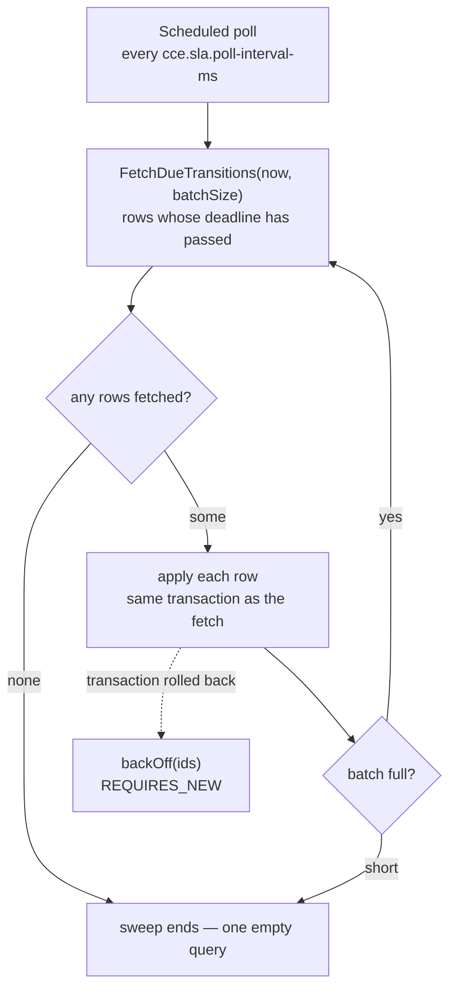
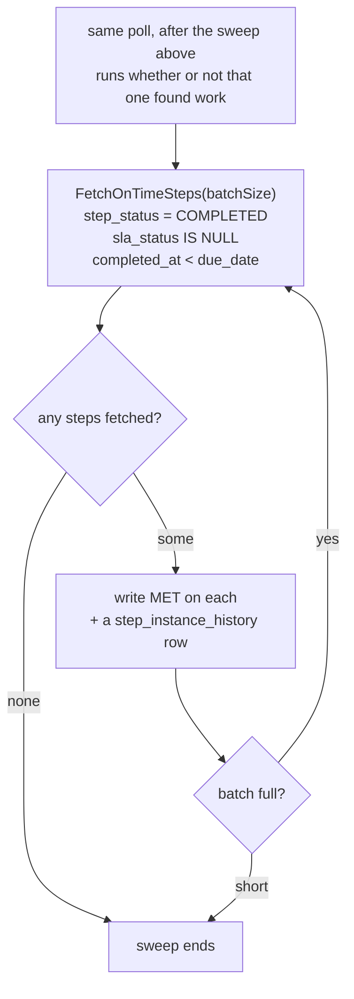

# Architecture & Design — Compliance Service

> The time plane: what happens because a deadline passed or was beaten — never because an event
> arrived.

System-wide context — why the services are split, the shared schema, the SLA handoff contract — lives
in the **cce-common-util** repository's
[Architecture Overview](../../cce-common-util/docs/architecture-overview.md). This document covers
only what is specific to this service.

---

## Operational prerequisite — Event Replay

**This service must not run while the Matcher Service still has an event backlog to process.** Stop it
for the duration, and start it again only once that backlog is drained.

**Event Replay** is the term for any such run: events re-published to `cce.events.inbound` after a fix,
a historical backfill during migration, or a restart that leaves the Matcher Service far behind on its
consumer group. Use that term when coordinating — it is what this constraint is called.

Running both at once costs nothing in throughput. What it produces is **wrong verdicts that cannot be
withdrawn**.

### Why it matters

This service concludes that work has not happened by finding no completion on `step_instance`. That
inference is only sound once every event that could have completed the step has been matched. While
events sit unprocessed in Kafka, an absent completion does not mean the work was not done — it means
the Matcher Service has not reached it yet.

During an Event Replay the two do not merely race occasionally; they collide by default:

1. **Deadlines are anchored to clinical time, not to now.** The Matcher Service computes a step's
   `due_date` from the occurrence time of the event that triggered it, and writes `process_by` and
   `next_attempt_at` from that. Replaying a month-old event therefore creates a transition row whose
   deadline has *already passed* — so it is eligible on the very next poll, seconds later.
2. This service fetches that row, finds `step_status` is not `COMPLETED`, and writes `OVERDUE` (or
   `MISSED`) with a matching deviation — the first and fourth rows of the table in
   [§4](#4-what-the-applier-does).
3. The completing event is still in the backlog. When the Matcher Service reaches it, it sets
   `completed_at` to that event's own clinical timestamp — which is often *earlier* than `process_by`,
   meaning the work was in fact done on time.
4. **Nothing corrects step 2**, and each reason is deliberate:
   - `sla_status` writes are forward-only, and `MET` is written only over a null, so a step recorded
     `OVERDUE` can never become `MET`.
   - The on-time sweep considers only steps with `sla_status IS NULL`, so it never revisits this one.
   - The deviation row already exists and is de-duplicated, so it is not reconsidered.
   - The intelligence actions already fired and were published to `cce.intelligence.triggers`. **A
     clinician has already been alerted.**

That last point is what makes this a prerequisite rather than a preference. A wrong `sla_status` and a
spurious deviation can in principle be repaired by a data fix; a delivered alert cannot be recalled.

### Why stopping is safe

Nothing is lost by holding this service off. That is not luck — it follows from the design:

- Transition rows are durable and are never cancelled, and `process_by` is immutable.
- The judgement never consults the wall clock, so a row applied hours or days late reaches **exactly**
  the verdict it would have reached on time. See [One gate](#one-gate-and-what-follows-from-it).
- `ORDER BY process_by ASC` takes the oldest deadline first, and batches drain within a cycle rather
  than one batch per interval, so a backlog accumulated during the replay clears in minutes.

The only cost of stopping is detection latency — nothing is judged while it is down. The cost of not
stopping is a permanently wrong clinical record.

The runbook — how to stop it, how to tell the Matcher Service is caught up, how to verify the drain,
and what to do if the sequence was missed — is in the
[Deployment Guide](deployment-guide.md#event-replay--sequencing-the-two-services).

## 1. Responsibility

Everything the schedule drives — and the one verdict that needs no schedule at all:

1. Pick up the `step_sla_state_transition` rows the Matcher Service scheduled, once they fall due, and
   judge whether each threshold was breached.
2. Sweep `step_instance` for completed steps that beat their `due_date`, with no row involved.
3. Write `step_instance.sla_status` — `OVERDUE` and `MISSED` from (1), `MET` from (2). This service is
   its only writer.
4. Record the resulting `OVERDUE` / `MISSED` deviations. On-time work breached nothing and records none.
5. Evaluate the intelligence actions those deviations trigger, and publish them.

The split between (1) and (2) is the shape of the whole service. A breach is measured against a
schedule, so a row has to come round for it. Timeliness is a statement about the step, answerable from
its own `completed_at` and `due_date` as soon as the completion lands — no threshold need fall for
`MET` to be known. §3 is how both are driven.

It also exposes a read API over `intelligence_event_log`.

**What it does not do**: match inbound events, enrol patients, create or complete steps, or manage
definitions. It has no Kafka consumer — nothing inbound reaches it. `ORDER_VIOLATION` deviations stay
with the Matcher Service, which detects them at completion from the event itself.

## 2. Owns no tables

This service creates nothing. Flyway is **disabled**; `ddl-auto` is `validate`.

Enabling Flyway here would add an empty ledger and invite a second service to write DDL for tables it
does not own. Instead the service validates its JPA mapping against the schema at startup and fails
fast if what it needs is absent — which is also how a deployment-order mistake surfaces immediately
rather than as a runtime error hours later.

Deploy **last**. Table ownership and the full ordering rationale:
[Data Dictionary §3](../../cce-common-util/docs/data-dictionary.md#3-ownership).

## 3. The fetch-and-apply cycle

Every cycle runs **two independent sweeps**. The first fetches a batch of
`step_sla_state_transition` rows whose deadline has passed and applies them; that is where a breach is
detected. The second sweeps `step_instance` for steps that beat their due date and records them as
`MET`.

They are separate because they answer different questions from different evidence. A breach is a
schedule's business — it happens at a deadline, so a row has to come round. Whether work was recorded
*on time* needs no schedule at all: `completed_at` against `due_date`, both on the step. The second
sweep therefore runs whether or not the first found anything, and a failure in one does not stop the
other.

Read them as **two sweeps, not two stages**. They query different tables, neither uses the other's
results, and they run one after the other only because a single thread drives both. The order carries no
more meaning than "a breach is the more pressing news".

Then the second sweep, over `step_instance` and nothing else:

**No back-off path, and nothing to mark processed.** `sla_status IS NULL` is both the filter and the
idempotency record: writing `MET` takes a step out of the set for good, and a batch that rolls back
leaves it in, to be picked up next cycle. There is no per-row attempt count because there is no row —
the step itself is the work item. That is the simplification driving off the step buys.

`MET` is written one step at a time rather than as a single `UPDATE`, because `step_instance_history`
has to carry every `sla_status` transition and a set update would leave a gap exactly where a step went
on time.

The two fetches live on separate repositories — `SlaTransitionFetchRepository` and
`OnTimeStepFetchRepository` — and both are kept out of cce-common-util's shared read side deliberately.
Fetching rows to act on, and the pessimistic lock that comes with it, is this service's alone; the
shared repositories are the read side another service could reach for.

### Step by step

**Scheduled poll** — a Spring `fixedDelay` timer, default 5s, is the only thing that starts work in this
service. `poll()` catches everything `evaluateDue()` throws, because an exception escaping a
`@Scheduled` method stops the schedule. Every replica runs its own timer.

**`fetchDueTransitions(now, batchSize)`** — the only query that brings a transition row in. Fetches rows
where `is_processed = false AND next_attempt_at <= now`, ordered by `process_by`, under
`FOR UPDATE SKIP LOCKED` (a `PESSIMISTIC_WRITE` lock with the `-2` timeout hint Hibernate translates to
`SKIP LOCKED`). The predicate selects on `next_attempt_at` rather than `process_by`: the two are equal
when the Matcher Service writes the row, and a failure pushes `next_attempt_at` out so a retry is
deferred without rewriting `process_by`, which stays the immutable record of when the deadline fell. The
partial index `idx_sslt_due` covers exactly this predicate, so the scan touches only the unprocessed
backlog.

Note what it does *not* read: this is a single-table query with no join to `step_instance`, so it knows
nothing about whether the step completed. Eligibility here is purely "this row's gate has passed"; what
the row *means* is decided later, in the apply.

**any rows fetched?** — zero is the steady state: one empty indexed query per interval, and the cycle
ends.

**apply each row** — per row: increment `attempts` (past five, the row is logged as an error every cycle
rather than failing quietly), load the step, decide whether the threshold was breached, write
`sla_status` forward-only, record the deviation if there is one, mirror the write into
`step_instance_history`, and mark the row processed with `processed_by`. §4 covers the judgement itself.
Each fetched id is also appended to a list the evaluator holds — plain memory rather than transactional
state, so it survives a rollback and the failure path knows which rows to defer.

`next_attempt_at` appears nowhere in that judgement. It is a fetch gate and nothing else — outside the
fetch predicate the only code that touches it is `backOff`, which writes it and never reads it. What
the apply reads is `transition_type` and `process_by` from the row, both immutable, and `step_status`,
`completed_at`, `sla_status` and `required_behavior` from the step. So *when* a row is applied cannot
change what it decides.

**batch full?** — a result that came back the full `cce.sla.batch-size` means there is probably more, so
the loop fetches again within the same cycle; a short batch means the backlog is drained.

**`backOff(ids)`** — the dashed edge, taken when `fetchAndApply` throws. The batch rolled back entirely,
so nothing was marked processed and no deviation was written. The evaluator counts the failed batch,
defers the ids it had fetched, and ends the cycle rather than starting another batch — whatever broke is
likely to break the next one too. See [Retry](#retry) for the backoff itself.

Three properties make this safe without any coordination machinery:

**The row lock is what reserves the row.** `FOR UPDATE SKIP LOCKED` means a row locked by one replica is
*invisible* to the others rather than contended, so every replica can poll the same table concurrently.
There is no lease table, no heartbeat, and no leader election. A replica that dies mid-batch drops its
connection, its locks release, and the work is immediately available again — no lease expiry to wait
out.

**Fetch and apply share one transaction.** Fetching in one transaction and applying in another would
leave a window where a row is marked taken but not yet acted on, and a crash inside that window makes
the state permanent. Here there is no such window: either the row is applied and committed, or the lock
is released and nothing happened.

**Batches drain within a cycle.** The evaluator keeps fetching until a batch comes back short, so a
backlog that accumulated while the service was down clears in one cycle rather than one batch per
interval. `MAX_BATCHES_PER_CYCLE` (100) stops a pathological backlog from monopolising the thread.

`ORDER BY process_by ASC` means the oldest deadline is always handled first, so a backlog degrades by
latency rather than by dropping the most overdue work.

The on-time sweep has two steps of its own:

**`fetchOnTimeSteps(batchSize)`** — a single-table read of `step_instance`, no join and no schedule
consulted: `step_status = COMPLETED AND sla_status IS NULL AND completed_at < due_date`, with both
timestamps required non-null, ordered by `completed_at` so the longest-waiting step is recorded first.
It takes the same `FOR UPDATE SKIP LOCKED` as the transition fetch, so every replica can sweep the
table at once and one that dies mid-batch releases its rows immediately.

Each predicate is load-bearing. `COMPLETED`, because only recorded work can have been on time.
`sla_status IS NULL`, because that is the whole of the sweep's bookkeeping — and because `MET` is
written over a null and nothing else, so a step already judged is not this sweep's to relabel.
`completed_at < due_date` strictly, because that comparison *is* the question, and work landing exactly
on the deadline did not beat it. And `due_date IS NOT NULL`, which excludes a step created from its own
trigger: it has no deadline to have beaten, so its `sla_status` stays null.

The query reads the null half of `idx_step_instance_completed_unjudged`, whose partial predicate spans
both unsettled statuses (`sla_status IS NULL OR sla_status = 'OVERDUE'`). Only the null half has a
consumer, so the `OVERDUE` half is dead weight the shared schema could drop. Either way the scan covers
the completed-but-unsettled set rather than every step ever created, and a step matches at most once —
the `MET` it gets is what removes it from the set, and a sweep empties what has accumulated.

Driving it the other way — scanning pending `DUE_DATE_REACHED` rows and checking each step — would mean
walking the entire future schedule every few seconds to find the few steps that finished early.

**write `MET` on each** — per step: `sla_status = MET` and the matching `step_instance_history` row,
through the same forward-only `writeSlaStatus` every other write goes through. No deviation is
recorded, so nothing here reaches the intelligence evaluation of §5 — there is nothing deviant about
on-time work. A step that somehow arrives already settled has its write refused and is counted
consumed rather than applied.

The step's own pending `DUE_DATE_REACHED` row is left alone. It is fetched when its schedule comes
round, finds the step settled, and is consumed then. It stays out of the backlog gauge in the meantime,
because that gauge counts only rows whose `next_attempt_at` has passed.

### One gate, and what follows from it

A row becomes ready when `next_attempt_at` passes. That is the whole of it — there is no second way in,
and nothing pulls a step's remaining rows forward because the step completed or was judged.

So a settled step keeps its unspent schedule until those dates arrive. A step recorded `MET` by the
on-time sweep, or `OVERDUE` by its own due-date row, still holds a pending `MISSED_DATE_REACHED` row; it
is fetched when its date comes round, finds the threshold kept or the status already past it, records
nothing, and is consumed. The row is disposed of late rather than early, and the step's `sla_status` is
the same either way.

**Why not fetch a settled step's rows early?** Because it would buy nothing and cost the retry
contract. A row's verdict is a function of `process_by` and the step's own columns, so taking one ahead
of its deadline produces exactly the outcome the deadline would have produced later — the write moves
earlier, nothing else changes. And a query for such rows has to ask for `next_attempt_at > now`, which
is precisely the state `backOff` puts a failed row into: it would re-fetch on the next cycle a row the
back-off had just deferred, so the exponential interval would never take effect for the rows it covered.
One gate, honoured, is both simpler and more correct.

### Why a driver and an applier

`SlaTransitionEvaluator` polls and loops; `SlaTransitionApplier` holds the `@Transactional`
boundary. They are separate beans because `@Transactional` takes effect through the Spring proxy — a
scheduled method calling a transactional method **on itself** bypasses the proxy entirely and runs
with no transaction at all. Splitting them is what makes the annotation real.

The evaluator's `poll()` never propagates: a failed cycle must not kill the scheduler thread.

## 4. What the applier does

This service is the **only writer of `step_instance.sla_status`**. The Matcher Service records that a
step completed and when — it never judges whether that was timely — so there is no question here of
overwriting what another service decided. A step's `sla_status` is null until a threshold falls due and
this service judges it.

The judgement compares `step_instance.completed_at`, the clinical occurrence time of the completing
event, against the threshold the row stands for. The wall clock is not consulted: all that remains to
ask is whether the work had happened by then.

**A breach is all a transition row decides.** `OVERDUE` and `MISSED` are measured against its
`process_by` — the schedule exists to detect a breach, and the row carries it.

**`MET` is not decided here at all.** It is settled by the second sweep, from
`step_instance.completed_at` against `step_instance.due_date`, with no row involved. So a due-date row
whose threshold was kept records nothing: it is consumed, and the step's timeliness is the other
sweep's to state.

The two columns normally hold the same instant — the Matcher writes `due_date` and the
`DUE_DATE_REACHED` row's `process_by` from one value in one transaction — but they are answering to
different owners, and only `due_date` is a statement about the work.

| Row | Step when applied | `sla_status` | Deviation |
|---|---|---|---|
| `DUE_DATE_REACHED` | not completed | `OVERDUE` | `OVERDUE` |
| `DUE_DATE_REACHED` | `completed_at >= process_by` | `OVERDUE` | `OVERDUE` |
| `DUE_DATE_REACHED` | `completed_at < process_by` | *unchanged* | — |
| `MISSED_DATE_REACHED` | not completed | `MISSED` | `MISSED` |
| `MISSED_DATE_REACHED` | `completed_at >= process_by` | `MISSED` | `MISSED` |
| `MISSED_DATE_REACHED` | `completed_at < process_by` | *unchanged* | — |

A step whose row no longer exists is consumed rather than retried: there is no schedule left to honour.
A step marked `COMPLETED` with no `completed_at` is treated as a breach — the row is better evidence
than a missing timestamp, and letting it pass would hide the gap instead of surfacing it. That rule
needs no clock to justify it: a row is only ever applied once its own threshold has passed, so a step
recorded complete with no timestamp is late by definition.

### Keeping a threshold is not the same as meeting an SLA

The two *unchanged* table rows are worth being careful about. A step completed between its thresholds
breached neither the missed date nor — if it landed before `process_by` — the due-date row's schedule.
Neither is a statement that it was on time.

This is why no transition row writes `MET`. "Did not breach this threshold" and "met its SLA" are
different claims, and a row that reported the first as the second would relabel a late completion as
on time. Timeliness is asked of the step, once, by the on-time sweep: `completed_at < due_date`, or
nothing.

A step with no `due_date` is therefore never recorded `MET`. It has no deadline to have beaten — a step
created from its own trigger is the usual case — so its `sla_status` stays null, which is what null
means.

Writes are **forward-only** for the same reason. `MET` and `MISSED` are settled outcomes, and `OVERDUE`
must never replace `MISSED` — which is exactly what a retry applying a step's two rows out of order
would otherwise do.

### Optional steps

A `MISSED` status and a `MISSED` deviation are both **`must`-only** — the rule the shared
[Data Dictionary](../../cce-common-util/docs/data-dictionary.md#deviationtype) states. Nothing was
required of an optional (`could`) step, so nothing was breached by its not happening.

The exemption applies on **both** the completed and the outstanding path, which is the part worth being
deliberate about: an optional step recorded *after* its missed threshold gets no `MISSED` deviation
either. Exempting only the step that never arrived would penalise doing optional work late more heavily
than not doing it at all.

The exemption is `MISSED`-only. An optional step still takes an `OVERDUE` when it passes its due date:
"running late" is a reportable fact about optional work, "breached" is not.

### What it does not write

The applier **never writes `step_status`**. That column belongs to the Matcher Service — see
[Architecture Overview §4](../../cce-common-util/docs/architecture-overview.md#4-step-status-and-sla-status).

Every `sla_status` write is mirrored into `step_instance_history` through the shared
`StateTransitionHistoryWriter`, in the same transaction. Without it the time-driven half of a step's
timeline would be missing from that table and from the CDC stream downstream of it: a step that went
overdue and was never completed would show only its creation.

### Retry

A batch whose transaction rolled back is backed off rather than lost: `attempts` is incremented and
`next_attempt_at` pushed out by `2^attempts` seconds, capped at `cce.sla.max-backoff-seconds`. The
backoff write runs `REQUIRES_NEW`, because the transaction it is recovering from has already rolled
back — joining it would roll the backoff back too, and the row would be retried immediately in a tight
loop.

Nothing re-fetches a deferred row ahead of its `next_attempt_at`, so the interval the backoff computes
is the interval that actually elapses. A second fetch path that reached rows by their step's state would
quietly undo that, because a deferred row is exactly a row whose `next_attempt_at` is in the future.

`processed_by` records which replica applied each row, so a misbehaving instance is identifiable from
the data.

## 5. Intelligence on deviation

When a deviation is newly recorded — not when it already existed — the shared
[`IntelligenceActionEvaluator`](../../cce-common-util/docs/library-reference.md#intelligence--intelligenceactionevaluator)
evaluates the step's intelligence actions and publishes any that fire to
`cce.intelligence.triggers`.

The de-duplication matters: without it, a transition retried after a failure would re-trigger an alert
a clinician has already received. `DeviationRecorder` reports whether the row was new, and the
evaluation is gated on that.

This service is **produce-only** on Kafka. Its `KafkaConfig` declares a producer factory, a template
and the outbound topic — no consumer factory, no listener container, no DLQ, because nothing is
consumed.

## 6. Observability

| Metric | Type | Meaning |
|---|---|---|
| `cce.sla.transitions.due` | gauge | rows the next cycle would fetch: unprocessed, with `next_attempt_at` already passed — the primary health signal |
| `cce.sla.steps.on-time-unsettled` | gauge | completed steps that beat their due date and have not been recorded `MET` yet — on-time work awaiting acknowledgement, not lateness |
| `cce.sla.transitions.applied` | counter | `sla_status` writes that advanced a step — a transition row's breach, or the on-time sweep's `MET` |
| `cce.sla.transitions.consumed` | counter | rows closed without recording a deviation — the event beat the deadline, the step was an exempt optional miss, or the SLA had already advanced |
| `cce.sla.evaluator.cycles` | counter | polling cycles run |
| `cce.sla.evaluator.batches.failed` | counter | batches that rolled back and were backed off |

The gauge counts only what is **ready to process** — it carries `fetchDueTransitions`'s own predicate,
so it reports what the next cycle will actually take. A gauge over every unprocessed row would fold in
the entire future schedule, so it would track enrolment volume rather than lateness and could never sit
near zero.

The gauge is the one to alert on. It sits near zero in a steady state and rises when transitions fall
due faster than they are applied — which is the failure this service can actually have. A sustained
rise means the sweep is not keeping up; a rise with `batches.failed` climbing alongside means rows are
failing and backing off rather than the sweep being slow.

`cycles` incrementing with everything else flat is the normal idle signature, and distinguishes "no
work to do" from "scheduler stopped".

## 7. Scaling

Scales with the **backlog**, not with inbound traffic — that is the reason it is a separate service.
A burst of clinical events cannot delay the SLA sweep, and a large SLA backlog cannot delay event
processing.

Replicas are safe to add freely: the fetch-and-apply cycle needs no coordination, and adding an instance
adds throughput directly. The limiting factor is database contention on
`step_sla_state_transition`, not anything in the application.

`cce.sla.batch-size` trades transaction length against round trips. A larger batch holds row locks
longer, which matters only if the Matcher Service is inserting into the same table heavily at the same
time.

## 8. Security

No authentication at the application layer; the read API is expected to sit behind the gateway
service. The service performs no writes on behalf of a caller — every write it makes is driven by the
scheduler, from rows another service created.
