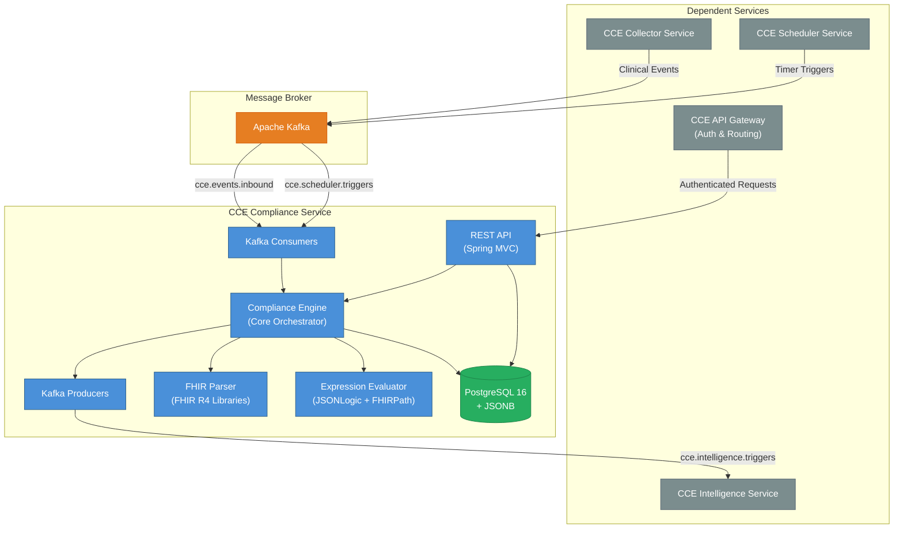
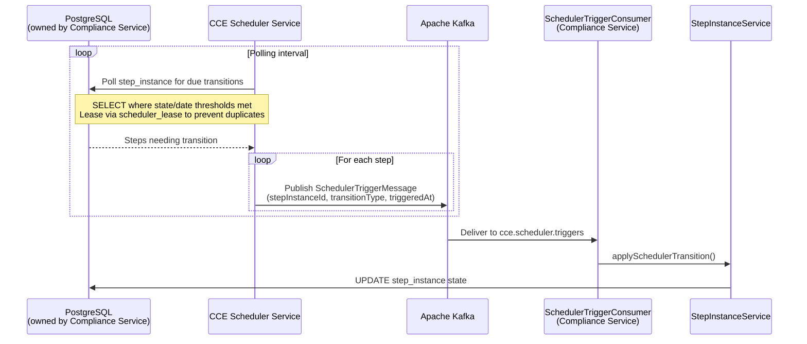
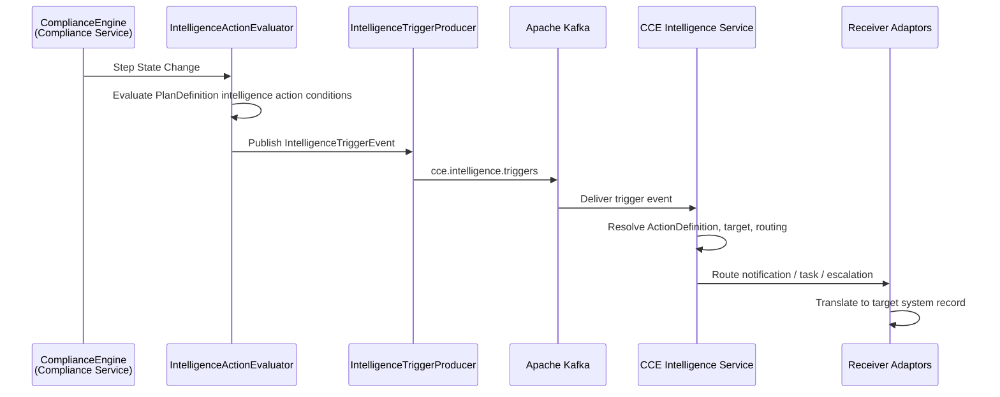
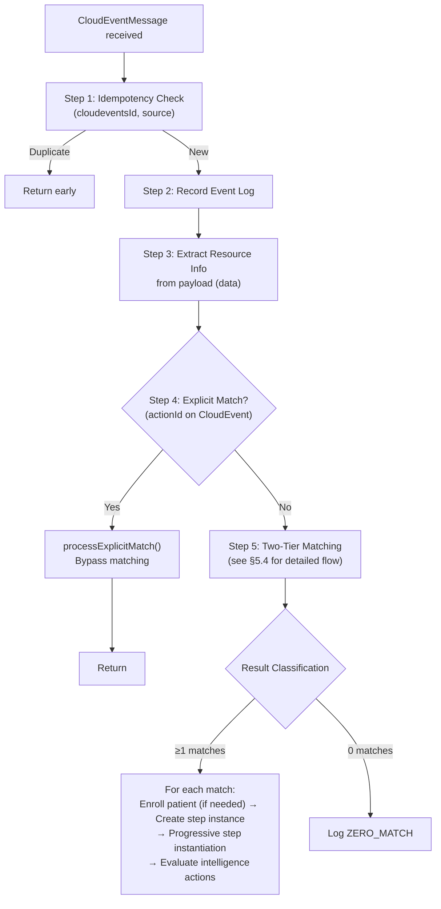
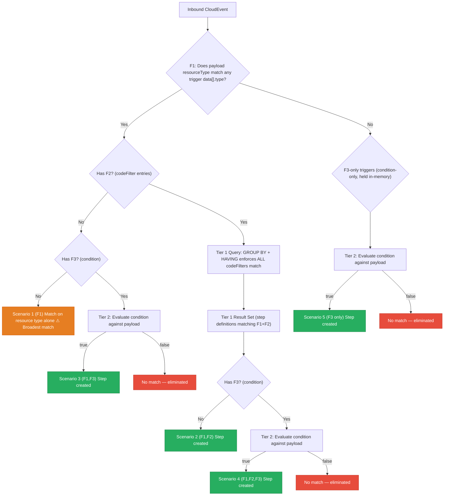
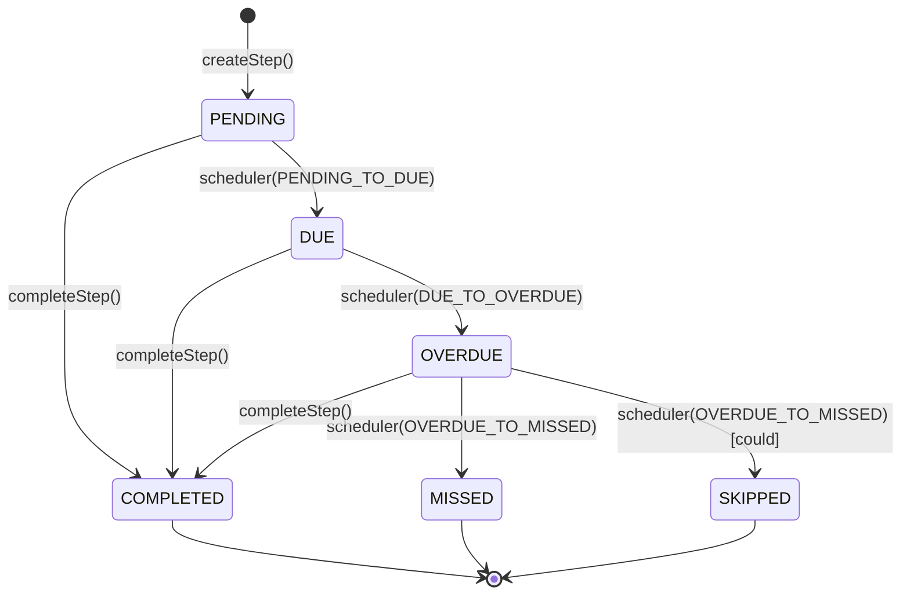
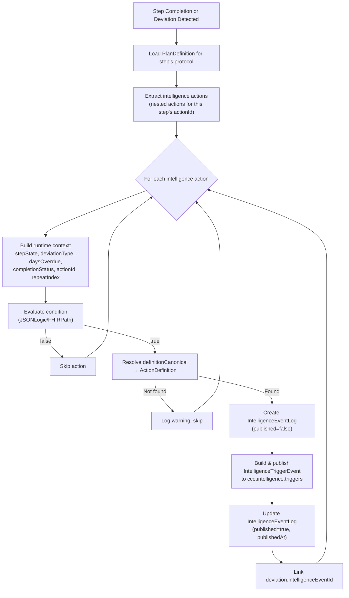
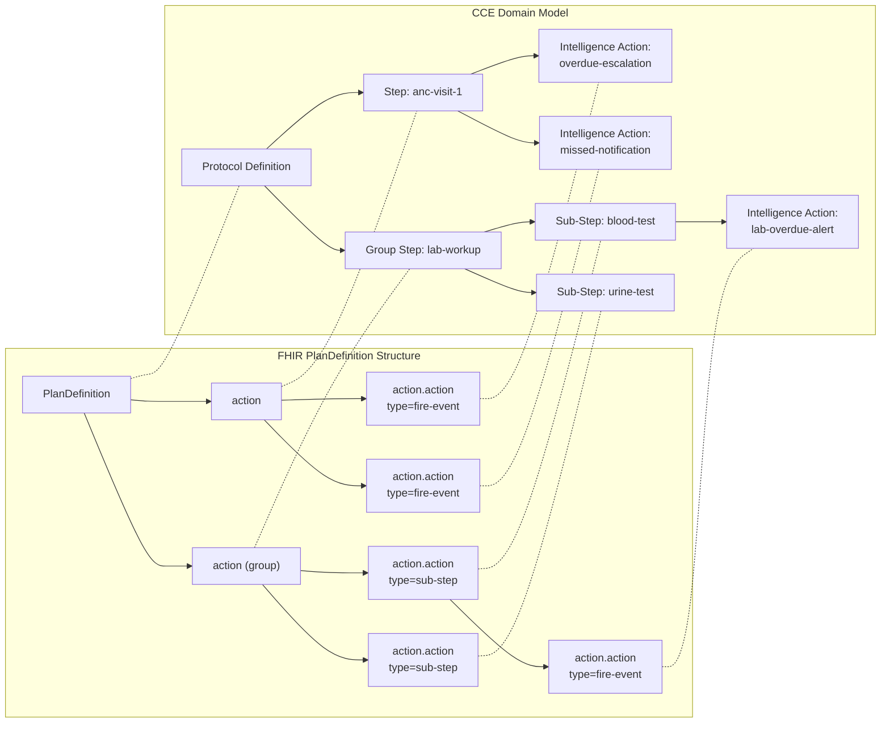
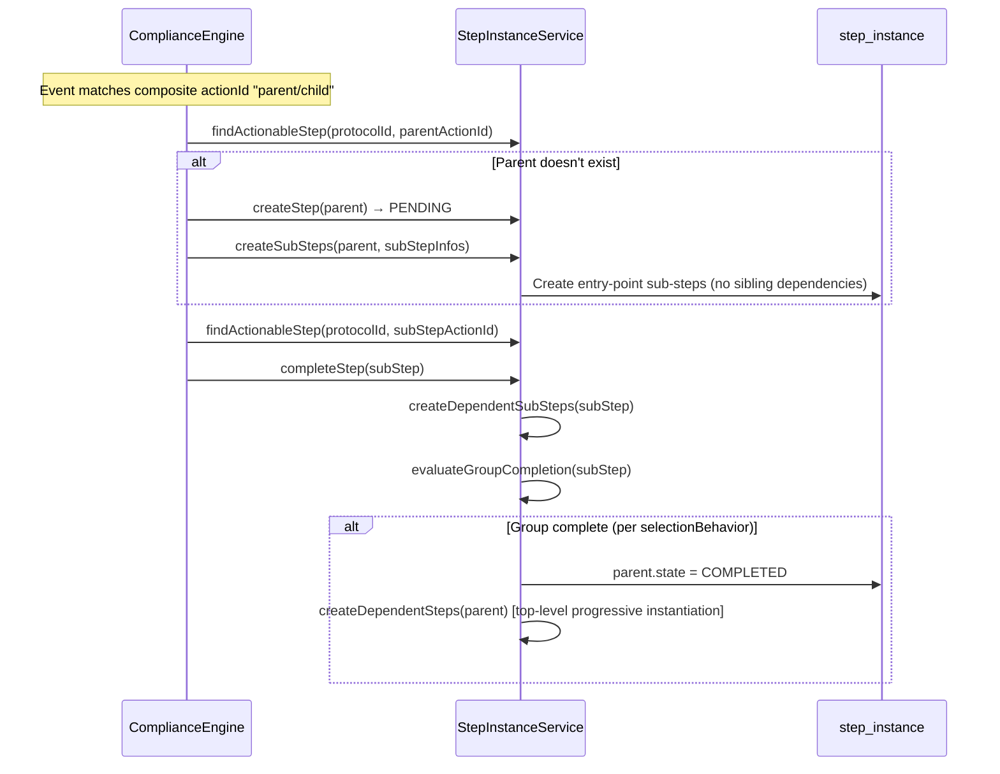

# Architecture & Design

## 1. System Context

The **CCE Compliance Service** is a core microservice within the **Clinical Compliance Engine (CCE)** platform. It tracks patient adherence to clinical protocols defined as FHIR R4 `PlanDefinition` resources — consuming clinical events, matching them against protocol steps, detecting deviations, evaluating intelligence actions, and publishing intelligence trigger events to downstream services.



**This service does NOT handle:** event collection/ingestion (CCE Collector Service), scheduling (CCE Scheduler Service), analytics, alerting (CCE Intelligence Service), or authentication/authorization (handled by the API Gateway).

### 1.1 Scheduler Service Contract

The **CCE Scheduler Service** is a headless background service with no REST API. It drives time-based step state transitions by polling the Compliance Service's `step_instance` table and publishing trigger messages to Kafka. Communication between the two services is **exclusively via Kafka** — there are no direct service-to-service HTTP calls.



#### Polling Query

The Scheduler Service identifies steps that need transitions using:

```sql
SELECT s FROM StepInstance s WHERE
  (s.state = 'PENDING' AND s.dueDate <= :now) OR
  (s.state = 'DUE' AND s.overdueDate <= :now) OR
  (s.state = 'OVERDUE' AND s.missedDate <= :now)
ORDER BY COALESCE(s.dueDate, s.overdueDate, s.missedDate) ASC
```

Each condition maps to a specific `transitionType`:

| Condition | Transition Type | Effect on Compliance Service |
|---|---|---|
| `state = PENDING` AND `dueDate ≤ now` | `PENDING_TO_DUE` | Step becomes actionable |
| `state = DUE` AND `overdueDate ≤ now` | `DUE_TO_OVERDUE` | Deviation recorded (`OVERDUE`) |
| `state = OVERDUE` AND `missedDate ≤ now` | `OVERDUE_TO_MISSED` | `MISSED` (must) or `SKIPPED` (could) |

#### Ownership & Coordination

| Aspect | Owner | Details |
|---|---|---|
| **`step_instance` table** | Compliance Service | Schema, writes, Flyway migrations |
| **`scheduler_lease` table** | Scheduler Service | Prevents duplicate trigger publishing across Scheduler instances |
| **Polling reads** | Scheduler Service | Read-only access to `step_instance` (state, dueDate, overdueDate, missedDate) |
| **State writes** | Compliance Service | Only the Compliance Service updates `step_instance.state` — the Scheduler never writes to it |
| **Kafka topic** | Shared | `cce.scheduler.triggers` — Scheduler produces, Compliance consumes |

> **Key invariant:** The Scheduler Service is a **read-only observer** of `step_instance`. It detects when a time threshold is crossed and notifies the Compliance Service via Kafka. The Compliance Service is the sole authority for state transitions — this ensures all business rules (requiredBehavior, deviation recording, auto-skip) are enforced in one place.

### 1.2 Intelligence Service Contract

The **CCE Intelligence Service** is the downstream consumer of intelligence trigger events published by the Compliance Service. It receives structured trigger events via Kafka, resolves delivery targets, and routes notifications, tasks, and escalations to the appropriate **Receiver Adaptors**. Communication is **exclusively via Kafka** — there are no direct service-to-service HTTP calls.



#### Message Contract

The Compliance Service publishes `IntelligenceTriggerEvent` messages to `cce.intelligence.triggers`. Each message contains all the context the Intelligence Service needs to route and deliver the action:

| Field | Purpose | Source |
|---|---|---|
| `id` | Unique event identifier | Generated UUID |
| `type` | Event category (e.g., `cce.compliance.deviation.overdue`) | Derived from deviation type or step completion status |
| `subject` | Patient identifier | Protocol instance subject |
| `actionId` | PlanDefinition step that triggered the intelligence action | Step instance's action ID |
| `protocolCanonical` | Protocol `url\|version` | Protocol definition canonical |
| `facilityId` | Facility where the event occurred | CloudEvent extension attribute |
| `metadata` | Additional context (due dates, timing, severity) | Step and deviation runtime state |
| `eventPayload` | Original FHIR resource payload from the inbound CloudEvent | CloudEvent `data` (null for scheduler-driven deviations) |

See [Kafka Events §5.3](kafka-events.md#53-intelligencetriggerevent-outbound--cceintelligencetriggers) for the full message schema.

#### Ownership & Boundaries

| Aspect | Owner | Details |
|---|---|---|
| **Intelligence action evaluation** | Compliance Service | Evaluates PlanDefinition intelligence action conditions, resolves `definitionCanonical` to `ActionDefinition` |
| **Trigger event publishing** | Compliance Service | Publishes `IntelligenceTriggerEvent` to Kafka; creates `intelligence_event_log` record (published=false → true) |
| **`action_definition` table** | Compliance Service | Schema, writes, Flyway migrations — stores `ActivityDefinition` resources referenced by intelligence actions |
| **`intelligence_event_log` table** | Compliance Service | Tracks each intelligence action execution with evaluation context and Kafka event payload |
| **Event consumption & routing** | Intelligence Service | Consumes from `cce.intelligence.triggers`, resolves delivery targets, routes to Receiver Adaptors |
| **Notification/task delivery** | Intelligence Service + Receiver Adaptors | Translates intelligence events into system-specific records (SMS, in-app alerts, EMR tasks, escalation workflows) |
| **Kafka topic** | Shared | `cce.intelligence.triggers` — Compliance produces, Intelligence consumes |

> **Key invariant:** The Compliance Service is the **sole publisher** to `cce.intelligence.triggers`. It evaluates conditions and publishes structured trigger events but has no knowledge of how they are delivered. The Intelligence Service is the sole consumer — it owns the routing logic, adaptor selection, and delivery confirmation. This separation ensures the Compliance Service remains **delivery-agnostic** and the Intelligence Service can evolve its routing independently.

## 2. Technology Stack

| Category | Technology | Version | Purpose |
|---|---|---|---|
| **Runtime** | Java | 21 LTS | Language runtime |
| **Framework** | Spring Boot | 3.4.2 | Application framework |
| **Persistence** | Spring Data JPA / Hibernate | 6.x | ORM and data access |
| **Database** | PostgreSQL | 16 | JSONB, GIN indexes |
| **Migration** | Flyway | 10.x | Schema version management |
| **JSONB Mapping** | Hibernate 6 `@JdbcTypeCode(SqlTypes.JSON)` | 6.x | Native JPA ↔ PostgreSQL JSONB |
| **Messaging** | Spring Kafka | 3.x | Event-driven messaging |
| **FHIR** | FHIR Libraries | 4.0.1 | FHIR R4 PlanDefinition parsing & validation |
| **Expression** | Apache Johnzon JsonLogic | 2.0.2 | Tier 2 conditional evaluation (JSONLogic) |
| **Metrics** | Micrometer + Prometheus | 1.x | Application metrics |
| **Tracing** | OpenTelemetry | 1.x | Distributed tracing |
| **Testing** | JUnit 5 + Mockito | 5.x / 5.x | Unit testing with mocked dependencies |

## 3. Package Structure

```
org.openphc.cce.compliance
├── ComplianceServiceApplication.java          # @SpringBootApplication entry point
├── config/                                    # AppConfig, ObservabilityConfig
├── domain/
│   ├── entity/                                # 10 JPA entities (incl. ActionDefinition, IntelligenceEventLog)
│   ├── enums/                                 # 10 value-based enums
│   └── repository/                            # 9 Spring Data JPA repositories
├── fhir/                                      # FHIR parsing, JSONLogic & FHIRPath evaluation
├── kafka/
│   ├── config/                                # Consumer/Producer factories, topic bindings
│   ├── consumer/                              # InboundEventConsumer, SchedulerTriggerConsumer
│   ├── model/                                 # CloudEventMessage, IntelligenceTriggerEvent
│   └── producer/                              # IntelligenceTriggerProducer
├── service/                                   # 12 business logic services + supporting records
└── web/                                       # Controllers, DTOs, DtoMapper, ExceptionHandler
```

## 4. Core Pipeline — ComplianceEngine

The `ComplianceEngine` is the central orchestrator. All inbound event processing flows through it:



### 4.1 Resource Extraction

Resource metadata is extracted from the CloudEvent **payload** (`data`), never from the envelope:

| Field | Extraction Paths |
|---|---|
| `resourceType` | `data.resourceType` (e.g., `"Observation"`, `"Encounter"`) |
| `allCodes` | `data.code.coding[*]`, `data.type.coding[*]`, `data.category[*].coding[*]`, `data.clinicalStatus.coding[*]`, `data.identifier[*]` (system+value), `data.status` |

## 5. Two-Tier Matching Algorithm

### 5.1 Tier 1 — Structural Match

Inverted index lookup on the `trigger_index` table using `GROUP BY` + `HAVING` to enforce **AND semantics** across all `codeFilter` entries:

```sql
SELECT protocol_definition_id, action_id
FROM trigger_index
WHERE resource_type = :resourceType
  AND CONCAT(path, '|', code_system, '|', code_value) IN (:codeTriples)
GROUP BY protocol_definition_id, action_id
HAVING COUNT(DISTINCT path) = (
    SELECT COUNT(DISTINCT t2.path)
    FROM trigger_index t2
    WHERE t2.protocol_definition_id = trigger_index.protocol_definition_id
      AND t2.action_id = trigger_index.action_id
      AND t2.resource_type = trigger_index.resource_type
);
```

The `:codeTriples` parameter is a list of `path|system|code` strings extracted from the inbound event payload. The correlated subquery counts the **total** distinct paths each action requires, ensuring actions with different numbers of codeFilters are correctly evaluated in a single query.

The index is built at protocol load time by decomposing each action's `TriggerDefinition.data[].codeFilter[]` into `(resourceType, path, codeSystem, codeValue, protocolDefinitionId, actionId)` rows.

### 5.2 Condition-Only Triggers

Triggers that have no `data[]` section (only a `condition`) are **not indexed** in `trigger_index`. They are held in-memory and evaluated via Tier 2 for every inbound event. These are validated at protocol load time — a trigger with no `data[]` and no `condition` is rejected.

### 5.3 Tier 2 — Condition Evaluation

For each Tier 1 candidate, evaluates the trigger's `condition` expression.  **Triggers with no `condition` pass automatically**.

| Variable | Source |
|---|---|
| `event` | CloudEvent data payload |
| `patient` | Patient context (`patientId`, demographics) |
| `step` | Current step context (`actionId`, `repeatIndex`, `state`) |
| `protocol` | Protocol context (`protocolCanonical`, `status`) |

**Supported languages:**
- `text/jsonlogic` — via Apache Johnzon `JsonLogic`
- `text/fhirpath` — via FHIR `IFhirPath` engine (R4)
- Any other — rejected with `UnsupportedExpressionLanguageException`

### 5.4 How Matching Works — Step by Step

> **Terminology:** In FHIR, `PlanDefinition.action[]` defines the steps of a protocol. In CCE, each `action` is a **step definition** — a template that becomes a `step_instance` when matched for a specific patient. Throughout this section, "step definition" and "action" are used interchangeably.

A trigger definition has three filter components. Each component is **independent** — a trigger may use any combination:

| Component | FHIR Path | What it checks |
|---|---|---|
| **F1** — Resource type | `trigger.data[].type` | Does the payload's `resourceType` match? (e.g., `Encounter`) |
| **F2** — Code filters | `trigger.data[].codeFilter[]` | Do the payload's coded fields match the required `(path, system, code)` tuples? |
| **F3** — Condition | `trigger.condition` | Does the payload satisfy a JSONLogic/FHIRPath expression? |

> **F1 is implicit:** Every trigger that has a `data[]` section always has `data[].type` (the FHIR resource type). So F1 is present whenever F2 is present. A trigger with no `data[]` at all is a **condition-only trigger** (F3 only).

#### Five Exclusive Matching Scenarios

Every trigger in the system falls into **exactly one** of these five scenarios:



| Scenario | Components | Trigger Shape | Matching Path | Step Created When |
|---|---|---|---|---|
| **1** | **(F1)** | `data[].type` only — no `codeFilter[]`, no `condition` | Resource type match only | Payload `resourceType` matches trigger `data[].type`. **Broadest match** — every event of that type triggers a step. |
| **2** | **(F1,F2)** | `data[].type` + `codeFilter[]`, no `condition` | Tier 1 (GROUP BY + HAVING) | All code filters match — **no further evaluation needed** |
| **3** | **(F1,F3)** | `data[].type` + `condition`, no `codeFilter[]` | Resource type match → Tier 2 | `resourceType` matches AND condition evaluates to `true` |
| **4** | **(F1,F2,F3)** | `data[].type` + `codeFilter[]` + `condition` | Tier 1 → **reuses Tier 1 result** → Tier 2 | All code filters match AND condition evaluates to `true` |
| **5** | **(F3)** | `condition` only, no `data[]` | Tier 2 only (in-memory) | Condition evaluates to `true` (checked for **every** inbound event) |

> **Scenario 1 (F1) — caution:** A trigger with only `data[].type` and no `codeFilter[]` or `condition` will match **every** inbound event of that resource type (e.g., every `Encounter`). This is intentionally supported for use cases like "enroll patient on any encounter of this type," but protocol authors should be aware of the broad match scope.

#### Exclusivity

Each scenario is **mutually exclusive** — a trigger belongs to exactly one scenario based on which components it defines:

- Has `data[]` with `codeFilter[]` and `condition`? → **Scenario 4 (F1,F2,F3)**
- Has `data[]` with `codeFilter[]` but no `condition`? → **Scenario 2 (F1,F2)**
- Has `data[]` with only `type` (no `codeFilter[]`) and `condition`? → **Scenario 3 (F1,F3)**
- Has `data[]` with only `type` (no `codeFilter[]`) and no `condition`? → **Scenario 1 (F1)**
- Has only `condition` (no `data[]`)? → **Scenario 5 (F3)**
- Has neither `data[]` nor `condition`? → **Rejected at protocol load time**

#### Tier 1 Result Reuse

Scenarios 2 and 4 both require Tier 1 matching (F1+F2). The Tier 1 query is executed **once**, and its result set is **reused**:

1. The `trigger_index` query runs once, returning all `(protocolDefinitionId, actionId)` pairs where all code filters match.
2. For **Scenario 2** step definitions (no condition): the Tier 1 result is final — step instances are created immediately.
3. For **Scenario 4** step definitions (has condition): the same Tier 1 result is filtered through Tier 2 condition evaluation. There is **no re-query** of `trigger_index`.

```
Tier 1 Result Set ──┬── step definitions without condition ──► Scenario 2 → create step instances
                    │
                    └── step definitions with condition ──► Tier 2 eval ──► Scenario 4 → create step instances (if true)
```

#### Example Trigger (Scenario 4: F1,F2,F3)

Consider a step definition (`action`) with a trigger that requires an `Encounter` (F1) with **four** code filters (F2) and a condition (F3):

```json
"trigger": [
  {
    "type": "data-added",
    "data": [
      {
        "type": "Encounter",
        "codeFilter": [
          {
            "path": "type",
            "code": [{ "system": "http://openphc.org/encounter-types", "code": "anc-visit" }]
          },
          {
            "path": "status",
            "code": [{ "code": "finished" }]
          },
          {
            "path": "class",
            "code": [{ "system": "http://terminology.hl7.org/CodeSystem/v3-ActCode", "code": "AMB" }]
          },
          {
            "path": "serviceType",
            "code": [{ "system": "http://openphc.org/service-types", "code": "high-risk-anc" }]
          }
        ]
      }
    ],
    "condition": {
      "language": "text/jsonlogic",
      "expression": "{\"==\": [{\"var\": \"class.code\"}, \"AMB\"]}"
    }
  }
]
```

At **protocol load time**, this trigger is decomposed into 4 `trigger_index` rows (one per `codeFilter`):

| `resource_type` | `path` | `code_system` | `code_value` |
|---|---|---|---|
| `Encounter` | `type` | `http://openphc.org/encounter-types` | `anc-visit` |
| `Encounter` | `status` | *(empty)* | `finished` |
| `Encounter` | `class` | `http://terminology.hl7.org/CodeSystem/v3-ActCode` | `AMB` |
| `Encounter` | `serviceType` | `http://openphc.org/service-types` | `high-risk-anc` |

When an inbound `Encounter` event arrives:

1. **Tier 1 (F1+F2)** — The query matches on `resource_type = 'Encounter'` and checks the inbound event's `path|system|code` triples against all 4 indexed rows. The correlated `HAVING` clause compares the matched path count against this action's total path count (4). If the payload is missing any one (e.g., no `serviceType` code), this step definition is eliminated.
2. **Tier 2 (F3)** — Since this step definition has a condition, the Tier 1 result is passed to Tier 2. The JSONLogic expression `{"==": [{"var": "class.code"}, "AMB"]}` is evaluated against the payload. Only if it returns `true` does this step definition produce a step instance.

> **Key point:** A step instance is created for **every** step definition that survives its matching scenario. If 3 different step definitions match a single inbound event (e.g., one via Scenario 1, one via Scenario 2, one via Scenario 4), 3 separate step instances are created.

## 6. State Machines

### 6.1 Step Instance



**Completion status:** `EARLY` (before dueDate), `ON_TIME` (between due and overdue), `LATE` (after overdueDate or state was OVERDUE).

**Intelligence action evaluation:** On step completion and on deviation detection (OVERDUE, MISSED), the intelligence action evaluator is invoked. See §6.3 for details.

**Required behavior:** Steps with `requiredBehavior=could` (from `PlanDefinition.action.requiredBehavior`) are optional. When the scheduler fires `OVERDUE_TO_MISSED` on a `could` step, it transitions to `SKIPPED` (no deviation) instead of `MISSED`. Additionally, when any step completes, preceding `could` steps still in actionable states are auto-skipped.

### 6.2 Protocol Instance

`ACTIVE → COMPLETED | WITHDRAWN | EXPIRED`. Terminal states: `COMPLETED`, `WITHDRAWN`, `EXPIRED`.

Protocol completion is **automatic** — when all steps reach terminal states (`COMPLETED`, `MISSED`, `SKIPPED`), the protocol transitions to `COMPLETED`. There is no manual complete endpoint; `WITHDRAWN` covers manual termination.

### 6.3 Intelligence Action Evaluation

Intelligence actions are modeled as **nested actions** within a PlanDefinition step (`action.action[]`). Each intelligence action defines a condition (JSONLogic/FHIRPath) evaluated against step runtime state, and a `definitionCanonical` pointing to an `ActivityDefinition` (stored in the `action_definition` table) that defines the action to take.

Intelligence action evaluation is triggered on any Step State change. Example:
1. **On deviation detection** — when a step transitions to `OVERDUE` or `MISSED` (scheduler-driven)
2. **On step completion** — when a step is completed by an inbound event (for actions like "notify on late completion")



#### Runtime Context Variables

| Variable | Type | Source | Available On |
|---|---|---|---|
| `stepState` | String | Current step state (e.g., `overdue`, `missed`, `completed`) | Both |
| `deviationType` | String | `overdue` or `missed` | Deviation only |
| `daysOverdue` | Long | Days past `dueDate` at detection time | Deviation only |
| `daysPastMissedDate` | Long | Days past `missedDate` at detection time | MISSED only |
| `actionId` | String | Step definition action ID | Both |
| `repeatIndex` | Integer | 0-based repeat counter | Both |
| `completionStatus` | String | `early`, `on_time`, `late` | Completion only |
| `dueDate` | OffsetDateTime | Step's scheduled due date | Both |
| `completedAt` | OffsetDateTime | Step's completion timestamp | Completion only |

#### Domain-to-FHIR Concept Mapping

The table below maps CCE domain concepts to their FHIR PlanDefinition counterparts:

| CCE Domain Concept | FHIR PlanDefinition Element | Description |
|---|---|---|
| **Protocol Definition** | `PlanDefinition` | The clinical protocol (e.g., ANC High-Risk Monitoring) |
| **Protocol Step** | `PlanDefinition.action` | A step in the protocol (e.g., "ANC Visit 2") |
| **Group Step** | `PlanDefinition.action` (with nested sub-steps) | A container step whose completion is delegated to sub-steps |
| **Sub-Step** | `PlanDefinition.action.action` (type=sub-step) | A nested action with its own trigger, tracked as a child step |
| **Intelligence Action** | `PlanDefinition.action.action` (type=fire-event) | A nested action that defines a conditional intelligence evaluation |



Each **intelligence action** (`PlanDefinition.action.action`) contains:
- `id` — unique identifier (mapped to `stepActionId` in `intelligence_event_log`)
- `condition[kind=applicability]` — JSONLogic/FHIRPath expression evaluated against step runtime state
- `definitionCanonical` — reference to an `ActivityDefinition` that defines the action to take
- `extension` — **required** severity and destination metadata (rejected at parse time if missing)

#### PlanDefinition Intelligence Action Structure

```json
{
  "id": "anc-visit-2",
  "title": "ANC Visit 2",
  "trigger": [{ "..." : "..." }],
  "action": [
    {
      "id": "anc-visit-2-overdue-escalation",
      "condition": [{
        "kind": "applicability",
        "expression": {
          "language": "text/jsonlogic",
          "expression": "{\"and\": [{\"==\": [{\"var\": \"stepState\"}, \"overdue\"]}, {\">\": [{\"var\": \"daysOverdue\"}, 3]}]}"
        }
      }],
      "definitionCanonical": "ActivityDefinition/anc-escalation-notification|1.0",
      "extension": [
        {
          "url": "http://openphc.org/fhir/StructureDefinition/intelligence-severity",
          "valueCode": "high"
        },
        {
          "url": "http://openphc.org/fhir/StructureDefinition/intelligence-destination",
          "valueCode": "openMRS"
        }
      ]
    }
  ]
}
```

#### Action Definitions

`ActionDefinition` entities store FHIR `ActivityDefinition` resources. They define what CCE does when an intelligence action fires:

| Field | Description |
|---|---|
| `canonicalUrl` + `version` | Unique identifier, referenced by `definitionCanonical` in PlanDefinition intelligence actions |
| `actionType` | FHIR `ActivityDefinition.kind`: `CommunicationRequest`, `Task`, `ServiceRequest` |
| `definition` | Full ActivityDefinition JSON (message template, routing config) |

> **Note:** `severity` and `intelligenceDestination` are **required** on the PlanDefinition intelligence action extensions (`intelligence-severity`, `intelligence-destination`). They are not stored on `action_definition`. PlanDefinitions missing these extensions are rejected at parse time.

#### Intelligence Event Logging

`IntelligenceEventLog` records track each intelligence action execution in a single flat row for auditability:

| Field | Description |
|---|---|
| `published` | `false` → `true` (on successful Kafka publish) |
| `event_payload` | Complete `IntelligenceTriggerEvent` JSON published to Kafka |
| `trigger_reason` | Why the action fired: `overdue`, `missed`, `completion` |
| `evaluation_context` | Runtime variables passed to the condition evaluator |

All execution and evaluation context is stored in a single row — no FK constraints, no joins required. See [Data Dictionary §11](data-dictionary.md#11-intelligence_event_log).

### 6.4 Sub-Step Groups

A **group step** is a `PlanDefinition.action` that contains nested `action.action[]` entries with `type.coding[0].code = "sub-step"`. Group steps have no trigger of their own — they are created via `relatedAction` from a predecessor, and their completion is delegated to their sub-steps.

#### Classification Rules

Nested actions (`action.action[]`) are classified by the parser:

| Criterion | Classification |
|---|---|
| Explicit `type.coding[0].code = "sub-step"` | Sub-step |
| Explicit `type.coding[0].code = "fire-event"` | Intelligence action |
| No type + has `trigger[]` | Sub-step (heuristic) |
| No type + has `condition` + `definitionCanonical` + severity | Intelligence action (backward-compatible) |

**Validation:** An action with both triggers AND sub-steps is rejected at load time (mutually exclusive patterns).

#### Group Completion Semantics

The parent's `selectionBehavior` determines when the group auto-completes:

| `selectionBehavior` | Group completes when... |
|---|---|
| `all` (default) | All sub-steps reach a terminal state and at least one completed |
| `any` | Any single sub-step completes |
| `one-or-more` | At least one sub-step completes |
| `exactly-one` | Exactly one sub-step completes |
| `at-most-one` | Exactly one sub-step completes |
| `all-or-none` | All sub-steps complete |

#### Trigger Indexing

Sub-step triggers are indexed in `trigger_index` using a **composite actionId** format: `"parentActionId/subStepId"`. This enables the Tier 1 query to match sub-step triggers and route them correctly through the engine.

#### Sub-Step Lifecycle



#### PlanDefinition Sub-Step Structure

```json
{
  "id": "lab-workup",
  "title": "Lab Workup Group",
  "selectionBehavior": "all",
  "action": [
    {
      "id": "blood-test",
      "type": { "coding": [{ "code": "sub-step" }] },
      "title": "Blood Test",
      "trigger": [{ "data": [{ "type": "Observation", "codeFilter": [...] }] }],
      "extension": [{ "url": ".../tolerance-days", "valueInteger": 3 }],
      "requiredBehavior": "must"
    },
    {
      "id": "urine-test",
      "type": { "coding": [{ "code": "sub-step" }] },
      "title": "Urine Test",
      "trigger": [{ "data": [{ "type": "Observation", "codeFilter": [...] }] }],
      "relatedAction": [{ "actionId": "blood-test", "relationship": "after-end" }],
      "requiredBehavior": "must"
    }
  ]
}
```

In this example, `blood-test` is created immediately when the group is instantiated (entry-point sub-step). `urine-test` depends on `blood-test` and is created progressively when `blood-test` completes.

## 7. Security

- **Authentication & Authorization:** Handled by the **CCE API Gateway**. This service does not implement security directly — all requests arrive pre-authenticated.
- Actuator endpoints are publicly accessible for health checks and monitoring.

See [API Reference](api-reference.md) for endpoint details.

## 8. Observability

### 8.1 Metrics

| Metric | Type | Description |
|---|---|---|
| `cce.events.processed` | Counter | Total inbound events processed |
| `cce.events.matched` | Counter (tagged) | By status: `matched`, `zero_match` |
| `cce.events.duplicate` | Counter | Duplicate events detected |
| `cce.events.zero_match` | Counter | Events with zero trigger matches |
| `cce.events.intelligence.published` | Counter | Intelligence trigger events published to Kafka |
| `cce.intelligence.actions.evaluated` | Counter | Total intelligence action conditions evaluated |
| `cce.intelligence.actions.fired` | Counter | Intelligence actions that matched and triggered |
| `cce.intelligence.publish.duration` | Timer | Time to publish intelligence event to Kafka |
| `cce.action.definitions.active` | Gauge | Active action definitions |
| `cce.step.matching.duration` | Timer | Tier 1 + Tier 2 matching time |
| `cce.consumer.inbound.errors` | Counter | Inbound event consumer processing errors |
| `cce.consumer.scheduler.errors` | Counter | Scheduler trigger consumer processing errors |
| `cce.protocol.instances.active` | Gauge | Active protocol instances |

### 8.2 Logging & Tracing

- **Format:** `timestamp [thread] [correlationId] level logger - message`
- **Tracing:** OpenTelemetry (OTLP), `correlationId` propagated via MDC and CloudEvents extensions
- **Health:** `/actuator/health` (liveness + readiness), `/actuator/prometheus`

## 9. Error Handling

### 9.1 REST API

| Error Type | HTTP Status |
|---|---|
| Resource not found | 404 |
| Invalid input | 400 |
| State conflict | 409 |
| FHIR validation failure | 422 |
| Internal error | 500 |

### 9.2 Kafka

- **Consumer errors:** Exception propagates to `DefaultErrorHandler` → retries with 1-second fixed backoff (up to 3 attempts) → routes to DLQ topic (`<topic>.dlq`) after exhausting retries
- **Dead Letter Queue:** Failed records are published to `cce.events.inbound.dlq` or `cce.scheduler.triggers.dlq` with original headers preserved
- **Retry configuration:** `cce.kafka.retry.max-attempts` (default 3), `cce.kafka.retry.backoff-interval-ms` (default 1000)
- **Producer:** Idempotent with `acks=all`
- **Deserialization:** `ErrorHandlingDeserializer` wraps errors gracefully

## 10. Scaling

| Dimension | Strategy |
|---|---|
| **Horizontal** | Kafka consumer group enables multi-instance; partition assignment is automatic (25 partitions per topic) |
| **Database** | Connection pool per instance (20 max) |
| **Kafka** | 3 concurrent listener threads per instance; 25 partitions per topic (configurable via `cce.kafka.topics.default-partitions`) |
| **API** | Stateless — any instance serves any request |
