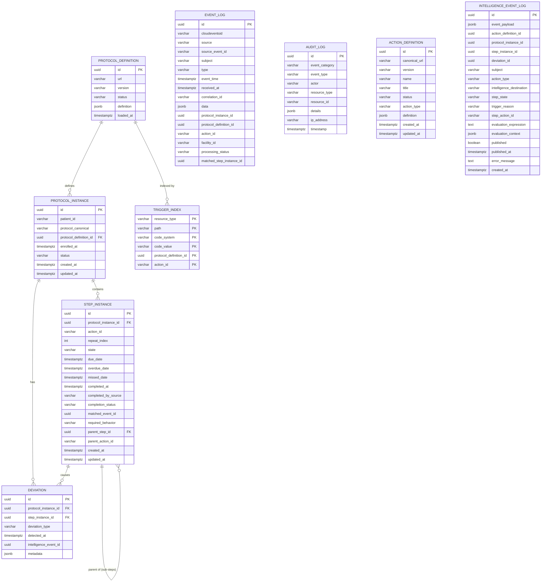

# Data Dictionary

> **CCE Compliance Service** — Complete database schema reference  
> **Database**: PostgreSQL 16 | **Schema**: `public` | **Migration**: Flyway  
> **Last Updated**: 2026-05-25

---

## Table of Contents

1. [Entity Relationship Diagram](#1-entity-relationship-diagram)
2. [Table Summary](#2-table-summary)
3. [protocol_definition](#3-protocol_definition)
4. [protocol_instance](#4-protocol_instance)
5. [step_instance](#5-step_instance)
6. [deviation](#6-deviation)
7. [trigger_index](#7-trigger_index)
8. [event_log](#8-event_log)
9. [audit_log](#9-audit_log)
10. [action_definition](#10-action_definition)
11. [intelligence_event_log](#11-intelligence_event_log)
12. [Enumerated Value Reference](#12-enumerated-value-reference)
13. [Relationships & Foreign Keys](#13-relationships--foreign-keys)
14. [JSONB Column Schemas](#14-jsonb-column-schemas)

---

## 1. Entity Relationship Diagram



> **Note:** The `scheduler_lease` table is owned and managed by the CCE Scheduler Service and is not shown in this ERD. See [Architecture Overview §1.1](architecture-overview.md#11-scheduler-service-contract) for the Scheduler Service interaction model.

---

## 2. Table Summary

| # | Table | Purpose | Row Growth |
|---|-------|---------|-----------|
| 1 | `protocol_definition` | Stores FHIR R4 PlanDefinition resources (protocol templates) | Low (tens) |
| 2 | `protocol_instance` | Patient enrollments in specific protocols | Medium (per-patient) |
| 3 | `step_instance` | Individual action steps within a patient's protocol journey | Medium–High |
| 4 | `deviation` | Compliance deviations (overdue, missed) | Medium |
| 5 | `trigger_index` | Inverted index for fast Tier 1 structural event matching | Low (rebuilt on protocol load) |
| 6 | `event_log` | Immutable log of all inbound CloudEvents and their processing outcomes | High (every event) |
| 7 | `audit_log` | System and user audit trail | Medium–High |
| 8 | `action_definition` | FHIR ActivityDefinition resources for intelligence actions | Low (tens) |
| 9 | `intelligence_event_log` | Intelligence action execution and evaluation context (flat, no FKs) | Medium–High |
---

## 3. protocol_definition

Stores FHIR R4 **PlanDefinition** resources that define compliance protocols. Each row represents a versioned protocol template containing actions, triggers, conditions, timing constraints, and related action dependencies. The full PlanDefinition JSON is stored in a JSONB column to preserve the complete FHIR resource while allowing PostgreSQL JSON queries.

### Columns

| Column | Data Type | Nullable | Default | Description |
|--------|-----------|----------|---------|-------------|
| `id` | `UUID` | **NOT NULL** | `gen_random_uuid()` | Primary key. Auto-generated unique identifier. |
| `url` | `VARCHAR` | **NOT NULL** | — | FHIR canonical URL (e.g., `http://openphc.org/fhir/PlanDefinition/anc-high-risk`). Combined with `version` forms the canonical reference. |
| `version` | `VARCHAR` | **NOT NULL** | — | Semantic version (e.g., `2.1`). Allows multiple versions of the same protocol URL to coexist. |
| `status` | `VARCHAR` | **NOT NULL** | — | Lifecycle status. Only `ACTIVE` definitions participate in trigger matching. See [ProtocolDefinitionStatus](#protocoldefinitionstatus). |
| `definition` | `JSONB` | **NOT NULL** | — | Full FHIR R4 PlanDefinition resource. Contains `action[]` with triggers, conditions, timing, and related actions. See [JSONB: definition](#protocol_definition--definition). |
| `loaded_at` | `TIMESTAMPTZ` | **NOT NULL** | `now()` | When this protocol definition was loaded into the system. |

### Constraints & Indexes

| Type | Name | Details |
|------|------|---------|
| Primary Key | `protocol_definition_pkey` | `id` |
| Unique | `protocol_definition_url_version_key` | `(url, version)` — Prevents duplicate protocol versions. |
| Check | — | `status IN ('ACTIVE', 'RETIRED')` |
| GIN Index | `idx_protocol_definition_triggers` | `definition` (`jsonb_path_ops`) — Fast JSON path queries. |

### Canonical Reference

The **canonical reference** is `url|version` (e.g., `http://openphc.org/fhir/PlanDefinition/anc-high-risk|2.1`). Computed by the JPA entity method `getCanonical()` and stored in `protocol_instance.protocol_canonical` for denormalized lookups.

---

## 4. protocol_instance

Represents a **patient's enrollment** in a specific compliance protocol. Created when the Compliance Engine processes an inbound event that matches a protocol's enrollment trigger. Each patient can have at most one `ACTIVE` instance per protocol definition.

### Columns

| Column | Data Type | Nullable | Default | Description |
|--------|-----------|----------|---------|-------------|
| `id` | `UUID` | **NOT NULL** | `gen_random_uuid()` | Primary key. |
| `patient_id` | `VARCHAR` | **NOT NULL** | — | UPID of the enrolled patient (e.g., `260115-0001-7823`). Derived from the CloudEvent `subject` field. |
| `protocol_canonical` | `VARCHAR` | **NOT NULL** | — | Denormalized `url|version` reference. Stored for fast display without joining `protocol_definition`. |
| `protocol_definition_id` | `UUID` | **NOT NULL** | — | Foreign key → `protocol_definition.id`. |
| `enrolled_at` | `TIMESTAMPTZ` | **NOT NULL** | — | Enrollment timestamp. Used as the anchor for timing calculations. |
| `status` | `VARCHAR` | **NOT NULL** | — | Instance lifecycle status. See [ProtocolInstanceStatus](#protocolinstancestatus). |
| `created_at` | `TIMESTAMPTZ` | **NOT NULL** | `now()` | Record creation timestamp. |
| `updated_at` | `TIMESTAMPTZ` | **NOT NULL** | `now()` | Last modification timestamp. |

### Constraints & Indexes

| Type | Name | Details |
|------|------|---------|
| Primary Key | `protocol_instance_pkey` | `id` |
| Foreign Key | `protocol_instance_protocol_definition_id_fkey` | `protocol_definition_id` → `protocol_definition(id)` |
| Check | — | `status IN ('ACTIVE', 'COMPLETED', 'WITHDRAWN', 'EXPIRED')` |
| B-tree Index | `idx_protocol_instance_patient` | `patient_id` — Fast lookup of all protocol enrollments for a patient. |
| Partial B-tree | `idx_protocol_instance_status` | `status WHERE status = 'ACTIVE'` — Optimizes active enrollment queries. |

---

## 5. step_instance

Tracks an **individual action occurrence** within a patient's protocol journey. Each step corresponds to a single `action` from the protocol definition. Steps follow a state machine lifecycle: `PENDING → DUE → OVERDUE → MISSED` (scheduler-driven, for `must` steps) or `→ SKIPPED` (scheduler-driven, for `could` steps) or `→ COMPLETED` (event-driven). Repeating steps are differentiated by `repeat_index`. Sub-steps reference their parent group step via `parent_step_id`.

### Columns

| Column | Data Type | Nullable | Default | Description |
|--------|-----------|----------|---------|-------------|
| `id` | `UUID` | **NOT NULL** | `gen_random_uuid()` | Primary key. |
| `protocol_instance_id` | `UUID` | **NOT NULL** | — | Foreign key → `protocol_instance.id`. |
| `action_id` | `VARCHAR` | **NOT NULL** | — | Protocol definition `action.id` this step instantiates (e.g., `anc-visit-1`). |
| `repeat_index` | `INTEGER` | **NOT NULL** | `0` | Zero-based occurrence counter for repeating actions. Non-repeating actions always have index 0. |
| `state` | `VARCHAR` | **NOT NULL** | — | Current step state. See [StepState](#stepstate). |
| `due_date` | `TIMESTAMPTZ` | Yes | — | Scheduled due date. Calculated from `relatedAction.offsetDuration`. `NULL` for event-triggered steps. |
| `overdue_date` | `TIMESTAMPTZ` | Yes | — | Overdue threshold. Typically `due_date + tolerance_days`. |
| `missed_date` | `TIMESTAMPTZ` | Yes | — | Missed cutoff date. |
| `completed_at` | `TIMESTAMPTZ` | Yes | — | Completion timestamp. `NULL` for non-completed steps. |
| `completed_by_source` | `VARCHAR` | Yes | — | CloudEvent `source` that completed this step. |
| `completion_status` | `VARCHAR` | Yes | — | Timeliness classification. See [CompletionStatus](#completionstatus). |
| `matched_event_id` | `UUID` | Yes | — | Links to `event_log.id` that completed this step. |
| `required_behavior` | `VARCHAR` | Yes | — | FHIR `requiredBehavior` code from `PlanDefinition.action`: `must`, `could`, or `must-unless-documented`. Determines whether the step produces a deviation on non-completion. |
| `parent_step_id` | `UUID` | Yes | — | Foreign key → `step_instance.id`. Non-null for sub-steps — references the parent group step. |
| `parent_action_id` | `VARCHAR` | Yes | — | The `action.id` of the parent group action in the PlanDefinition. Stored for fast lookup without re-parsing. |
| `created_at` | `TIMESTAMPTZ` | **NOT NULL** | `now()` | Record creation timestamp. |
| `updated_at` | `TIMESTAMPTZ` | **NOT NULL** | `now()` | Last modification timestamp. |

### Constraints & Indexes

| Type | Name | Details |
|------|------|---------|
| Primary Key | `step_instance_pkey` | `id` |
| Foreign Key | `step_instance_protocol_instance_id_fkey` | `protocol_instance_id` → `protocol_instance(id)` |
| Foreign Key | `step_instance_parent_step_id_fkey` | `parent_step_id` → `step_instance(id)` |
| Check | — | `state IN ('PENDING', 'DUE', 'OVERDUE', 'MISSED', 'COMPLETED', 'SKIPPED')` |
| Check | — | `completion_status IN ('ON_TIME', 'EARLY', 'LATE')` |
| Check | — | `required_behavior IN ('must', 'could', 'must-unless-documented')` |
| B-tree Index | `idx_step_instance_protocol` | `protocol_instance_id` — All steps within a protocol instance. |
| B-tree Index | `idx_step_instance_parent_step_id` | `parent_step_id` — All sub-steps for a given parent group step. |
| Partial B-tree | `idx_step_instance_state` | `state WHERE state IN ('PENDING', 'DUE', 'OVERDUE')` — Active (non-terminal) steps. |
| Partial B-tree | `idx_step_instance_due_date` | `due_date WHERE state IN ('PENDING', 'DUE', 'OVERDUE')` — Scheduler time-based transitions. |

### State Machine

```
              ┌──────────┐
    ┌─────────│ PENDING  │─────────┐
    │         └────┬─────┘         │
    │  scheduler   │               │ event match
    │  (due_date   │               │ (completes)
    │   reached)   ▼               ▼
    │         ┌──────────┐    ┌───────────┐
    │         │   DUE    │───▶│ COMPLETED │
    │         └────┬─────┘    └───────────┘
    │  tolerance   │               ▲
    │  window      │               │ event match
    │  expired     ▼               │
    │         ┌──────────┐         │
    └────────▶│ OVERDUE  │─────────┘
              └────┬─────┴─────────┐
       missed     │                │  missed cutoff
       cutoff     ▼                │  (could)
              ┌──────────┐         ▼
              │  MISSED  │    ┌──────────┐
              └──────────┘    │ SKIPPED  │
                (must)        └──────────┘
                                (could)
```

---

## 6. deviation

Records **compliance deviations** detected during protocol execution. Created when a step transitions to `OVERDUE` or `MISSED`. When intelligence actions are configured on the step's PlanDefinition action, the `IntelligenceActionEvaluator` is invoked and the `intelligence_event_id` is populated with the published event's UUID.

### Columns

| Column | Data Type | Nullable | Default | Description |
|--------|-----------|----------|---------|-------------|
| `id` | `UUID` | **NOT NULL** | `gen_random_uuid()` | Primary key. |
| `protocol_instance_id` | `UUID` | **NOT NULL** | — | Foreign key → `protocol_instance.id`. |
| `step_instance_id` | `UUID` | **NOT NULL** | — | Foreign key → `step_instance.id`. |
| `deviation_type` | `VARCHAR` | **NOT NULL** | — | Type classification. See [DeviationType](#deviationtype). |
| `detected_at` | `TIMESTAMPTZ` | **NOT NULL** | `now()` | Detection timestamp. |
| `intelligence_event_id` | `UUID` | Yes | — | Links to the intelligence event published to Kafka when an intelligence action fires on this deviation. `NULL` when no intelligence actions are configured for the step. |
| `metadata` | `JSONB` | Yes | — | Deviation-type-specific timing details. See [JSONB: deviation metadata](#deviation--metadata). |

### Constraints & Indexes

| Type | Name | Details |
|------|------|---------|
| Primary Key | `deviation_pkey` | `id` |
| Foreign Key | `deviation_protocol_instance_id_fkey` | `protocol_instance_id` → `protocol_instance(id)` |
| Foreign Key | `deviation_step_instance_id_fkey` | `step_instance_id` → `step_instance(id)` |
| Check | — | `deviation_type IN ('OVERDUE', 'MISSED', 'ORDER_VIOLATION')` |
| B-tree Index | `idx_deviation_protocol` | `protocol_instance_id` |
| B-tree Index | `idx_deviation_type` | `deviation_type` |

---

## 7. trigger_index

An **inverted index** for fast **Tier 1 structural matching** of inbound CloudEvents to protocol definition actions. Built at protocol load time by decomposing each action's trigger `data[].codeFilter[]` entries into `(resourceType, path, codeSystem, codeValue)` rows. Rebuilt whenever a protocol is reloaded.

Only triggers that contain a `data[]` section produce `trigger_index` entries. **Condition-only triggers** (no `data[]`, only `condition`) are held in-memory and evaluated via Tier 2 for every inbound event.

### Columns

| Column | Data Type | Nullable | Default | Description |
|--------|-----------|----------|---------|-------------|
| `resource_type` | `VARCHAR` | **NOT NULL** | — | FHIR resource type from the trigger's `DataRequirement.type` (e.g., `Encounter`, `Observation`). |
| `path` | `VARCHAR` | **NOT NULL** | — | The `codeFilter.path` this row was decomposed from (e.g., `type`, `status`, `class`, `serviceType`, `identifier`). |
| `code_system` | `VARCHAR` | **NOT NULL** | `''` | Code system URI. Empty string = no system specified. |
| `code_value` | `VARCHAR` | **NOT NULL** | `''` | Code value. Empty string = resource-type-only match (no codeFilter). |
| `protocol_definition_id` | `UUID` | **NOT NULL** | — | Foreign key → `protocol_definition.id`. |
| `action_id` | `VARCHAR` | **NOT NULL** | — | Protocol definition `action.id` this trigger belongs to. |

### Constraints & Indexes

| Type | Name | Details |
|------|------|---------|
| Composite PK | `trigger_index_pkey` | `(resource_type, path, code_system, code_value, protocol_definition_id, action_id)` |
| Foreign Key | `trigger_index_protocol_definition_id_fkey` | `protocol_definition_id` → `protocol_definition(id)` |
| B-tree Index | `idx_trigger_index_resource` | `resource_type` — Resource-type-only matching. |
| B-tree Index | `idx_trigger_index_code` | `(resource_type, path, code_system, code_value)` — Full structural matching (primary query path). |

### Matching Query

Uses `GROUP BY` + `HAVING` to enforce **AND semantics** — all codeFilter paths for an action must match:

```sql
SELECT protocol_definition_id, action_id
FROM trigger_index
WHERE resource_type = :resourceType
  AND CONCAT(path, '|', code_system, '|', code_value) IN (:codeTriples)
GROUP BY protocol_definition_id, action_id
HAVING COUNT(DISTINCT path) = (
    SELECT COUNT(DISTINCT t2.path)
    FROM trigger_index t2
    WHERE t2.protocol_definition_id = trigger_index.protocol_definition_id
      AND t2.action_id = trigger_index.action_id
      AND t2.resource_type = trigger_index.resource_type
);
```

The `:codeTriples` parameter is a list of `path|system|code` strings extracted from the inbound event payload. The correlated subquery counts the **total** distinct paths each action requires, so actions with different numbers of codeFilters are correctly evaluated in a single query.

### Load-Time Validation

| Trigger Shape | Index Entries | Matching Scenario |
|---|---|---|
| `data[].type` only (no `codeFilter[]`, no `condition`) | Resource-type-only row | Scenario 1 (F1) — matches every event of that type |
| `data[].type` + `codeFilter[]` (no `condition`) | Decomposed `(path, system, code)` rows | Scenario 2 (F1,F2) — Tier 1 only |
| `data[].type` + `condition` (no `codeFilter[]`) | Resource-type-only row | Scenario 3 (F1,F3) — type match → Tier 2 |
| `data[].type` + `codeFilter[]` + `condition` | Decomposed `(path, system, code)` rows | Scenario 4 (F1,F2,F3) — Tier 1 → Tier 2 |
| `condition` only (no `data[]`) | **None** — held in-memory | Scenario 5 (F3) — Tier 2 only |
| No `data[]` and no `condition` | **Rejected at load time** | N/A |

---

## 8. event_log

**Immutable append-only log** of every inbound CloudEvent. Records the full event payload and processing outcome. Used for:
- **Idempotency**: `(cloudevents_id, source)` uniqueness prevents duplicate processing.
- **Auditability**: Complete provenance trail of every clinical event.
- **Troubleshooting**: Full payload preservation enables replay and debugging.

### Columns

| Column | Data Type | Nullable | Default | Description |
|--------|-----------|----------|---------|-------------|
| `id` | `UUID` | **NOT NULL** | `gen_random_uuid()` | Primary key. |
| `cloudevents_id` | `VARCHAR` | **NOT NULL** | — | CloudEvents `id`. Used with `source` for idempotency. |
| `source` | `VARCHAR` | **NOT NULL** | — | CloudEvents `source` (e.g., `rhie-mediator`, `smartcare-emr`). |
| `source_event_id` | `VARCHAR` | Yes | — | Optional external identifier from the originating system. |
| `subject` | `VARCHAR` | **NOT NULL** | — | Patient UPID from CloudEvent `subject`. |
| `type` | `VARCHAR` | **NOT NULL** | — | CloudEvents `type`. |
| `event_time` | `TIMESTAMPTZ` | **NOT NULL** | — | Clinical event time from CloudEvent `time`. |
| `received_at` | `TIMESTAMPTZ` | **NOT NULL** | — | Ingestion timestamp. |
| `correlation_id` | `VARCHAR` | **NOT NULL** | — | Distributed tracing ID from CloudEvent `correlationid` extension. |
| `data` | `JSONB` | **NOT NULL** | — | Full CloudEvent `data` body. See [JSONB: event data](#event_log--data). |
| `protocol_instance_id` | `UUID` | Yes | — | Matched protocol instance. `NULL` for zero-match or duplicate events. |
| `protocol_definition_id` | `UUID` | Yes | — | Matched protocol definition. `NULL` for zero-match or duplicate events. |
| `action_id` | `VARCHAR` | Yes | — | Matched protocol definition action. `NULL` for zero-match or duplicate events. |
| `facility_id` | `VARCHAR` | Yes | — | FOSA ID from CloudEvent `facilityid` extension. |
| `processing_status` | `VARCHAR` | **NOT NULL** | — | Processing outcome. See [ProcessingStatus](#processingstatus). |
| `matched_step_instance_id` | `UUID` | Yes | — | Step completed as a result of this event. |

### Constraints & Indexes

| Type | Name | Details |
|------|------|---------|
| Unique | `event_log_cloudevents_id_source_key` | `(cloudevents_id, source)` — Idempotency guard. |
| Unique (partial) | `idx_event_log_source_sourceeventid` | `(source, source_event_id) WHERE source_event_id IS NOT NULL` |
| B-tree Index | `idx_event_log_subject` | `subject` — Patient-centric event queries. |
| Partial B-tree | `idx_event_log_facility` | `facility_id WHERE facility_id IS NOT NULL` — Facility-level queries. |


---

## 9. audit_log

**Immutable audit trail** for all significant system operations. Records both system-generated events (step completions, protocol enrollments, deviations) and API-driven operations (protocol loads, retirements).

### Columns

| Column | Data Type | Nullable | Default | Description |
|--------|-----------|----------|---------|-------------|
| `id` | `UUID` | **NOT NULL** | `gen_random_uuid()` | Primary key. |
| `event_category` | `VARCHAR` | **NOT NULL** | — | High-level category (e.g., `COMPLIANCE`, `PROTOCOL_MANAGEMENT`, `SECURITY`). |
| `event_type` | `VARCHAR` | **NOT NULL** | — | Specific action (e.g., `STEP_COMPLETED`, `PROTOCOL_LOADED`, `DEVIATION_DETECTED`). |
| `actor` | `VARCHAR` | Yes | — | `SYSTEM` for automated events, authenticated user identity for API calls. |
| `resource_type` | `VARCHAR` | Yes | — | Affected entity type (e.g., `StepInstance`, `ProtocolDefinition`). |
| `resource_id` | `VARCHAR` | Yes | — | Affected entity UUID (stored as VARCHAR). |
| `details` | `JSONB` | Yes | — | Event-specific context. See [JSONB: audit details](#audit_log--details). |
| `ip_address` | `VARCHAR` | Yes | — | Client IP. `NULL` for system-generated events. |
| `timestamp` | `TIMESTAMPTZ` | **NOT NULL** | `now()` | When the action occurred. |

### Constraints & Indexes

| Type | Name | Details |
|------|------|---------|
| Primary Key | `audit_log_pkey` | `id` |
| B-tree Index | `idx_audit_log_category` | `event_category` |
| B-tree Index | `idx_audit_log_actor` | `actor` |
| B-tree Index | `idx_audit_log_timestamp` | `timestamp` |

---

## 10. action_definition

Stores FHIR R4 **ActivityDefinition** resources that define what CCE does when an intelligence action fires. Referenced by PlanDefinition intelligence actions via `definitionCanonical`. Each action definition specifies the type of action (FHIR `ActivityDefinition.kind`: `CommunicationRequest`, `Task`, `ServiceRequest`) and the full ActivityDefinition JSON (including message templates and routing configuration). Severity and destination are required on the PlanDefinition intelligence action extensions and are never stored on this table.

### Columns

| Column | Data Type | Nullable | Default | Description |
|--------|-----------|----------|---------|-------------|
| `id` | `UUID` | **NOT NULL** | `gen_random_uuid()` | Primary key. |
| `canonical_url` | `VARCHAR` | **NOT NULL** | — | FHIR canonical URL (e.g., `ActivityDefinition/anc-escalation-notification`). Combined with `version` for uniqueness. |
| `version` | `VARCHAR` | **NOT NULL** | — | Semantic version (e.g., `1.0`). |
| `name` | `VARCHAR` | Yes | — | Computer-friendly name. |
| `title` | `VARCHAR` | Yes | — | Human-readable title. |
| `status` | `VARCHAR` | **NOT NULL** | — | Lifecycle status. See [ActionDefinitionStatus](#actiondefinitionstatus). |
| `action_type` | `VARCHAR` | **NOT NULL** | — | FHIR `ActivityDefinition.kind` value. Stored from the resource's `kind` field at load time. See [ActionType](#actiontype). |
| `definition` | `JSONB` | **NOT NULL** | — | Full FHIR R4 ActivityDefinition resource JSON. Contains message template, routing config, and action-specific properties. See [JSONB: action_definition](#action_definition--definition). |
| `created_at` | `TIMESTAMPTZ` | **NOT NULL** | `now()` | Record creation timestamp. |
| `updated_at` | `TIMESTAMPTZ` | **NOT NULL** | `now()` | Last modification timestamp. |

### Constraints & Indexes

| Type | Name | Details |
|------|------|---------|
| Primary Key | `action_definition_pkey` | `id` |
| Unique | `action_definition_url_version_key` | `(canonical_url, version)` — Prevents duplicate versions. |
| Check | — | `status IN ('ACTIVE', 'RETIRED')` |
| Check | — | `action_type IN ('CommunicationRequest', 'Task', 'ServiceRequest')` |
| Partial B-tree | `idx_action_definition_status` | `status WHERE status = 'ACTIVE'` — Active definitions for resolution. |
| B-tree Index | `idx_action_definition_canonical` | `canonical_url` — Lookup by canonical URL. |

### Canonical Reference

The **canonical reference** is `canonical_url|version` (e.g., `ActivityDefinition/anc-escalation-notification|1.0`). Used in PlanDefinition intelligence actions as `definitionCanonical` to reference the action to execute.

---

## 11. intelligence_event_log

Records each execution of an **intelligence action** (`PlanDefinition.action.action`) in a single flat row. Created when an intelligence action's condition evaluates to `true` on deviation detection or step completion. Combines the action execution record and its evaluation context (trigger reason, expression, runtime variables) into one table — no foreign key constraints, just plain UUID columns for full decoupling. The `event_payload` JSONB column stores the complete `IntelligenceTriggerEvent` published to Kafka, and the `published` boolean tracks whether the event was successfully sent.

### Columns

| Column | Data Type | Nullable | Default | Description |
|--------|-----------|----------|---------|-------------|
| `id` | `UUID` | **NOT NULL** | `gen_random_uuid()` | Primary key. Maps to `intelligenceEventId` in `IntelligenceTriggerEvent`. |
| `event_payload` | `JSONB` | **NOT NULL** | — | Complete `IntelligenceTriggerEvent` published to Kafka. See [JSONB: intelligence_event_log event_payload](#intelligence_event_log--event_payload). |
| `action_definition_id` | `UUID` | **NOT NULL** | — | ActionDefinition that was resolved and triggered. Plain UUID (no FK constraint). |
| `protocol_instance_id` | `UUID` | **NOT NULL** | — | The patient's protocol journey. Plain UUID (no FK constraint). |
| `step_instance_id` | `UUID` | Yes | — | The step that triggered the action. `NULL` for protocol-level actions. |
| `deviation_id` | `UUID` | Yes | — | The deviation that triggered the action. `NULL` for completion-triggered actions. |
| `subject` | `VARCHAR` | **NOT NULL** | — | Patient identifier (UPID). Denormalized for direct queries. |
| `action_type` | `VARCHAR` | **NOT NULL** | — | FHIR `ActivityDefinition.kind` (e.g., `CommunicationRequest`, `Task`, `ServiceRequest`). |
| `intelligence_destination` | `VARCHAR` | **NOT NULL** | — | Intelligence destination from PlanDefinition override or ActionDefinition. |
| `step_state` | `VARCHAR` | Yes | — | Step state at time of evaluation (e.g., `overdue`, `missed`, `completed`). |
| `trigger_reason` | `VARCHAR` | **NOT NULL** | — | Why this action was evaluated: `overdue`, `missed`, `completion`. |
| `step_action_id` | `VARCHAR` | Yes | — | The PlanDefinition intelligence action ID that fired (e.g., `bp-high-alert`). |
| `evaluation_expression` | `TEXT` | Yes | — | The condition expression that was evaluated (for debugging/audit). |
| `evaluation_context` | `JSONB` | Yes | — | Runtime variables passed to the expression evaluator. See [JSONB: intelligence_event_log evaluation_context](#intelligence_event_log--evaluation_context). |
| `published` | `BOOLEAN` | **NOT NULL** | `false` | Whether the event was successfully published to Kafka. |
| `published_at` | `TIMESTAMPTZ` | Yes | — | Timestamp of successful Kafka publish. `NULL` until published. |
| `error_message` | `TEXT` | Yes | — | Error message if Kafka publish failed. |
| `created_at` | `TIMESTAMPTZ` | **NOT NULL** | `now()` | Record creation timestamp. |

### Constraints & Indexes

| Type | Name | Details |
|------|------|---------|
| Primary Key | `intelligence_event_log_pkey` | `id` |
| B-tree Index | `idx_intel_event_log_action_definition` | `action_definition_id` — All events for an action definition. |
| B-tree Index | `idx_intel_event_log_protocol_instance` | `protocol_instance_id` — All events for a protocol instance. |
| Partial B-tree | `idx_intel_event_log_step_instance` | `step_instance_id WHERE step_instance_id IS NOT NULL` |
| B-tree Index | `idx_intel_event_log_subject` | `subject` — Patient-centric intelligence event queries. |
| Partial B-tree | `idx_intel_event_log_published` | `published WHERE published = false` — Find unpublished events for retry. |

### Design Notes

- **No FK constraints:** All UUID columns (`action_definition_id`, `protocol_instance_id`, `step_instance_id`, `deviation_id`) are plain UUIDs with no foreign key references. This decouples the intelligence event log from the core compliance tables and keeps the JPA entity flat.
- **Fat event pattern:** The `event_payload` JSONB column stores the complete Kafka event, making each row self-contained. Consumers of the REST API can see exactly what was published without joining other tables.
- **`published` boolean:** A simple boolean tracks whether the event was successfully sent to Kafka.

## 12. Enumerated Value Reference

### ProtocolDefinitionStatus

| Value | Description |
|-------|-------------|
| `ACTIVE` | Protocol participates in trigger matching. New enrollments allowed. |
| `RETIRED` | Deactivated. Existing enrollments continue but no new enrollments. Trigger index entries removed. |

### ProtocolInstanceStatus

| Value | Description |
|-------|-------------|
| `ACTIVE` | Patient enrolled and protocol being tracked. |
| `COMPLETED` | All required steps completed. |
| `WITHDRAWN` | Patient manually withdrawn. |
| `EXPIRED` | Protocol exceeded maximum duration. |

### StepState

| Value | Description | Transitions From | Transitions To |
|-------|-------------|-----------------|----------------|
| `PENDING` | Created but not yet due. | *(initial)* | `DUE`, `COMPLETED` |
| `DUE` | Due date reached. | `PENDING` | `OVERDUE`, `COMPLETED` |
| `OVERDUE` | Tolerance window expired. Deviation recorded (for `must` steps). | `DUE` | `MISSED`, `SKIPPED`, `COMPLETED` |
| `MISSED` | Missed cutoff exceeded. Deviation recorded. Only for `must` steps. | `OVERDUE` | *(terminal)* |
| `COMPLETED` | Completed by a matching inbound event. | `PENDING`, `DUE`, `OVERDUE` | *(terminal)* |
| `SKIPPED` | Optional step (`requiredBehavior=could`) auto-skipped by scheduler or when a subsequent step completes. | `PENDING`, `DUE`, `OVERDUE` | *(terminal)* |

### CompletionStatus

| Value | Condition |
|-------|-----------|
| `EARLY` | `completed_at < due_date` |
| `ON_TIME` | `due_date ≤ completed_at ≤ overdue_date` (or no `due_date`) |
| `LATE` | `completed_at > overdue_date` |

### DeviationType

| Value | Trigger |
|-------|---------|
| `OVERDUE` | Scheduler transitions step `DUE` → `OVERDUE`. |
| `MISSED` | Scheduler transitions step `OVERDUE` → `MISSED`. |
| `ORDER_VIOLATION` | Step completed out of sequence (violates `relatedAction` ordering). |


### ProcessingStatus

| Value | Description |
|-------|-------------|
| `MATCHED` | Matched one or more triggers. Step instances created for all matches. |
| `ZERO_MATCH` | No trigger match or all Tier 2 conditions failed. Logged only. |
| `DUPLICATE` | Already processed (idempotency check). No processing occurs. |

### FailureStage

| Value | Description |
|-------|-------------|
| `KAFKA_PUBLISH` | Failure publishing to a Kafka topic. |
| `PROCESSING` | Failure during the matching pipeline. |
| `VALIDATION` | Failure during input validation. |

### ActionDefinitionStatus

| Value | Description |
|-------|-------------|
| `ACTIVE` | Action definition available for intelligence action execution. |
| `RETIRED` | Deactivated. Existing intelligence events unaffected but no new events created. |

### ActionType

Values sourced from FHIR R4 `ActivityDefinition.kind` ([RequestResourceType](http://hl7.org/fhir/R4/valueset-request-resource-types.html)). Stored as-is from the ActivityDefinition resource at load time.

| Value | FHIR Resource | CCE Usage |
|-------|---------------|----------|
| `CommunicationRequest` | [CommunicationRequest](http://hl7.org/fhir/R4/communicationrequest.html) | Notifications, alerts, reminders, escalations |
| `Task` | [Task](http://hl7.org/fhir/R4/task.html) | Work items routed to target systems via Receiver Adaptors |
| `ServiceRequest` | [ServiceRequest](http://hl7.org/fhir/R4/servicerequest.html) | Referrals, lab orders, coordination requests |

> **Future enhancement:** The supported `kind` values are currently limited to the three above. As new intelligence action patterns emerge (e.g., `MedicationRequest` for prescription alerts), additional values can be added by extending the DB check constraint and the `ActionType` enum. The behavioral distinction (e.g., notification vs. escalation vs. reminder) is derived from `severity` + `target` at routing time in the Intelligence Service.

### IntelligenceSeverity

| Value | Description |
|-------|-------------|
| `LOW` | Informational. No immediate action required. |
| `MEDIUM` | Attention needed. Standard follow-up. |
| `HIGH` | Urgent. Prompt action required. |
| `CRITICAL` | Emergency. Immediate intervention needed. |

### Intelligence Destination

The `intelligence_destination` field on `intelligence_event_log` is a **free-form string** (not a constrained enum). It represents the routing destination for the Intelligence Service to deliver the action (e.g., `openMRS`, `SPICE`, `E-Buzima`). Values are extracted from the **required** PlanDefinition extension `http://openphc.org/fhir/StructureDefinition/intelligence-destination` at parse time. PlanDefinitions missing this extension on intelligence actions are rejected.

---

## 13. Relationships & Foreign Keys

| Parent Table | Child Table | FK Column | Cascade | Description |
|-------------|-------------|-----------|---------|-------------|
| `protocol_definition` | `protocol_instance` | `protocol_definition_id` | No cascade | Deletion prevented if instances exist. |
| `protocol_definition` | `trigger_index` | `protocol_definition_id` | Application-managed | Entries deleted when protocol retired or rebuilt. |
| `protocol_instance` | `step_instance` | `protocol_instance_id` | JPA `CascadeType.ALL` | Steps fully managed by parent. |
| `protocol_instance` | `deviation` | `protocol_instance_id` | JPA `CascadeType.ALL` | Deviations fully managed by parent. |
| `step_instance` | `deviation` | `step_instance_id` | No cascade (DB level) | Reference only; not cascade-deleted. |
| `action_definition` | `intelligence_event_log` | `action_definition_id` | No FK constraint | Plain UUID; delete guard in application code. |

> **Note:** The `intelligence_event_log` table uses plain UUID columns with no foreign key constraints. Referential integrity for `action_definition_id`, `protocol_instance_id`, `step_instance_id`, and `deviation_id` is enforced at the application level.


---

## 14. JSONB Column Schemas

### protocol_definition — `definition`

The `definition` column stores the complete FHIR R4 PlanDefinition resource. Key paths used by the application:

```jsonc
{
  "resourceType": "PlanDefinition",
  "url": "http://openphc.org/fhir/PlanDefinition/anc-high-risk",
  "version": "2.1",
  "status": "active",
  "title": "ANC High-Risk Monitoring Protocol",
  "action": [
    {
      "id": "anc-visit-1",                    // → trigger_index.action_id
      "title": "ANC Visit 1",
      "trigger": [{
        "type": "data-added",
        "data": [{
          "type": "Encounter",                 // → trigger_index.resource_type
          "codeFilter": [{
            "path": "type",                    // → trigger_index.path
            "code": [{
              "system": "http://openphc.org/encounter-types",  // → trigger_index.code_system
              "code": "anc-visit"                              // → trigger_index.code_value
            }]
          }]
        }],
        "condition": {                         // Tier 2 condition (optional)
          "language": "text/jsonlogic",
          "expression": "{\">\": [{\"var\": \"resource.valueQuantity.value\"}, 140]}"
        }
      }],
      "relatedAction": [{                      // step dependencies
        "actionId": "enrollment",
        "relationship": "after-start",
        "offsetDuration": { "value": 8, "unit": "wk" }
      }],
      "timingTiming": {                        // repeating step timing
        "repeat": { "count": 6, "frequency": 1, "period": 1, "periodUnit": "mo" }
      },
      "extension": [{                          // tolerance days
        "url": "http://openphc.org/fhir/StructureDefinition/tolerance-days",
        "valueInteger": 7
      }]
    }
  ]
}
```

### deviation — `metadata`

Contains deviation-type-specific timing information. 

| Field | Type | Presence | Description |
|-------|------|----------|-------------|
| `daysOverdue` | Long | OVERDUE only | Number of days past the step's `due_date` at detection time |
| `daysPastMissedDate` | Long | MISSED only | Number of days past the step's `missed_date` at detection time |

**Examples:**

| Type | Example |
|------|---------||
| OVERDUE | `{"daysOverdue": 3}` |
| MISSED | `{"daysPastMissedDate": 0}` |


### event_log — `data`

Contains the full CloudEvent `data` payload. For FHIR-based events:

```json
{
  "resourceType": "Encounter",
  "id": "9a8e5398-aaaa-4111-84a0-9e1e6e0a0001",
  "status": "finished",
  "type": [{ "coding": [{ "system": "...", "code": "anc-visit" }] }],
  "subject": { "reference": "Patient/260115-0001-7823" }
}
```

For non-FHIR events (e.g., CHW home visits):

```json
{
  "visit_type": "anc-home-visit",
  "status": "completed",
  "chw_id": "CHW-MUSANZE-042",
  "blood_pressure": { "systolic": 135, "diastolic": 85 }
}
```

### audit_log — `details`

Content varies by audit event type:

| Event Type | Example |
|------------|---------|
| STEP_COMPLETED | `{"protocolInstanceId": "pi-uuid-...", "actionId": "anc-visit-1", "completionStatus": "ON_TIME"}` |
| PROTOCOL_LOADED | `{"url": "http://openphc.org/.../anc-high-risk", "version": "2.1", "actionCount": 9, "triggerIndexEntries": 24}` |

### action_definition — `definition`

The `definition` column stores the complete FHIR R4 ActivityDefinition resource. Key paths used by the application:

```jsonc
{
  "resourceType": "ActivityDefinition",
  "url": "ActivityDefinition/anc-escalation-notification",
  "version": "1.0",
  "name": "anc-escalation-notification",
  "title": "ANC Escalation Notification",
  "status": "active",
  "kind": "CommunicationRequest",
  "description": "Escalation alert when ANC visit is overdue by more than 3 days",
  "extension": [
    {
      "url": "http://openphc.org/fhir/StructureDefinition/cce-message-template",
      "valueString": "Patient {{patientId}} has missed ANC visit {{actionId}} ({{daysOverdue}} days overdue). Protocol: {{protocolCanonical}}"
    }
  ]
}
```

### intelligence_event_log — `event_payload`

The `event_payload` column stores the complete `IntelligenceTriggerEvent` published to Kafka. This is the "fat event" — a self-contained record of exactly what was sent.

```json
{
  "id": "550e8400-e29b-41d4-a716-446655440099",
  "subject": "260225-0002-5501",
  "intelligenceEventId": "770e8400-e29b-41d4-a716-446655440000",
  "actionDefinitionId": "aad00001-0001-0001-0001-000000000001",
  "protocolDefinitionId": "ppd00001-0001-0001-0001-000000000001",
  "actionType": "CommunicationRequest",
  "severity": "HIGH",
  "intelligenceDestination": "openMRS",
  "stepState": "overdue",
  "actionId": "viral-load-check",
  "protocolCanonical": "http://example.org/PlanDefinition/hiv-treatment|1.0",
  "detectedAt": "2026-03-25T00:00:05Z",
  "eventPayload": { "resourceType": "ServiceRequest", "id": "498871", "..." : "..." }
}
```

> **Note:** The `intelligenceEventId` field in the event payload maps to the `intelligence_event_log.id` (the row's primary key). The `eventPayload` field contains the original FHIR resource from the inbound CloudEvent — present for event-driven completions, `null` for scheduler-driven deviations.

### intelligence_event_log — `evaluation_context`

Captures the full runtime variable map that was passed to the condition expression evaluator. Contents vary by trigger reason.

**Deviation context fields:**

| Field | Type | Presence | Description |
|-------|------|----------|-------------|
| `stepState` | String | Always | Step state at evaluation time (e.g., `overdue`, `missed`) |
| `deviationType` | String | Always | `overdue` or `missed` |
| `actionId` | String | Always | Step definition action ID |
| `repeatIndex` | Integer | Always | 0-based repeat index for recurring steps |
| `dueDate` | String | When set | ISO-8601 `OffsetDateTime` of step due date |
| `daysOverdue` | Long | When `dueDate` set | Days past due date (≥ 0) |
| `daysPastMissedDate` | Long | When `missedDate` set | Days past missed cutoff (≥ 0) |

**Completion context fields:**

| Field | Type | Presence | Description |
|-------|------|----------|-------------|
| `stepState` | String | Always | Always `completed` |
| `actionId` | String | Always | Step definition action ID |
| `repeatIndex` | Integer | Always | 0-based repeat index |
| `completedAt` | String | When set | ISO-8601 `OffsetDateTime` of completion |
| `dueDate` | String | When set | ISO-8601 `OffsetDateTime` of step due date |
| `completionStatus` | String | When set | `early`, `on_time`, or `late` |

**Examples:**

| Trigger Reason | Example |
|----------------|---------|
| Deviation (overdue) | `{"stepState": "overdue", "deviationType": "overdue", "actionId": "anc-visit-2", "repeatIndex": 0, "dueDate": "2026-03-01T00:00:00Z", "daysOverdue": 5}` |
| Completion | `{"stepState": "completed", "actionId": "anc-visit-2", "repeatIndex": 0, "completedAt": "2026-03-09T14:30:00Z", "dueDate": "2026-03-07T00:00:00Z", "completionStatus": "late"}` |
