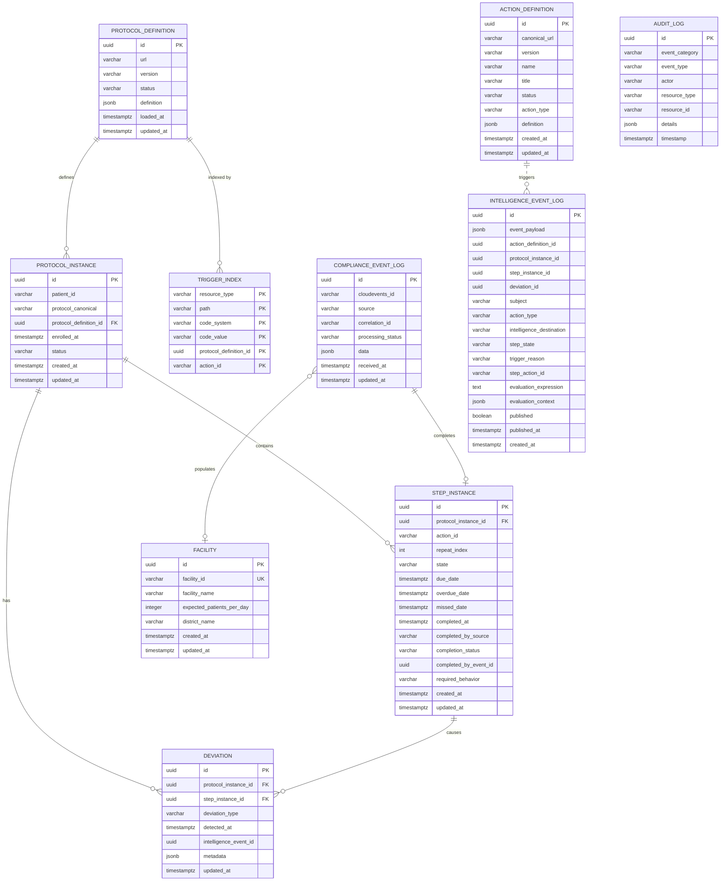

# Data Dictionary

> **CCE Compliance Service** — Complete database schema reference  
> **Database**: PostgreSQL 16 | **Schema**: `public` | **Migration**: Flyway  
> **Last Updated**: 2026-07-17

---

## Table of Contents

1. [Entity Relationship Diagram](#1-entity-relationship-diagram)
2. [Table Summary](#2-table-summary)
3. [protocol_definition](#3-protocol_definition)
4. [protocol_instance](#4-protocol_instance)
5. [step_instance](#5-step_instance)
6. [deviation](#6-deviation)
7. [trigger_index](#7-trigger_index)
8. [compliance_event_log](#8-compliance_event_log)
9. [audit_log](#9-audit_log)
10. [action_definition](#10-action_definition)
11. [intelligence_event_log](#11-intelligence_event_log)
12. [facility](#12-facility)
13. [State-Transition History Tables](#13-state-transition-history-tables)
14. [Enumerated Value Reference](#14-enumerated-value-reference)
15. [Relationships & Foreign Keys](#15-relationships--foreign-keys)
16. [JSONB Column Schemas](#16-jsonb-column-schemas)

---

## 1. Entity Relationship Diagram



> **Note:** The `scheduler_lease` table is owned and managed by the CCE Scheduler Service and is not shown in this ERD. See [Architecture Overview §1.1](architecture-overview.md#11-scheduler-service-contract) for the Scheduler Service interaction model.

---

## 2. Table Summary

| # | Table | Purpose | Row Growth |
|---|-------|---------|-----------|
| 1 | `protocol_definition` | Stores FHIR R4 PlanDefinition resources (protocol templates) | Low (tens) |
| 2 | `protocol_instance` | Patient enrollments in specific protocols | Medium (per-patient) |
| 3 | `step_instance` | Individual action steps within a patient's protocol journey | Medium–High |
| 4 | `deviation` | Compliance deviations (overdue, missed) | Medium |
| 5 | `trigger_index` | Inverted index for fast Tier 1 structural event matching | Low (rebuilt on protocol load) |
| 6 | `compliance_event_log` | Lean idempotency log of all inbound CloudEvents and their processing outcomes | High (every event) |
| 7 | `audit_log` | System and user audit trail | Medium–High |
| 8 | `action_definition` | FHIR ActivityDefinition resources for intelligence actions | Low (tens) |
| 9 | `intelligence_event_log` | Intelligence action execution and evaluation context (flat, no FKs) | Medium–High |
| 10 | `facility` | Reference lookup table of known facilities — auto-populated from inbound event payloads | Low (one row per facility) |
| 11 | `protocol_instance_history` | Append-only log of every `protocol_instance.status` transition (point-in-time, CDC → ClickHouse) | High (per status change) |
| 12 | `step_instance_history` | Append-only log of every `step_instance.state`/`completion_status` transition (point-in-time, CDC → ClickHouse) | High (per state change) |
---

## 3. protocol_definition

Stores FHIR R4 **PlanDefinition** resources that define compliance protocols. Each row represents a versioned protocol template containing actions, triggers, conditions, timing constraints, and related action dependencies. The full PlanDefinition JSON is stored in a JSONB column to preserve the complete FHIR resource while allowing PostgreSQL JSON queries.

### Columns

| Column | Data Type | Nullable | Default | Description |
|--------|-----------|----------|---------|-------------|
| `id` | `UUID` | **NOT NULL** | `gen_random_uuid()` | Primary key. Auto-generated unique identifier. |
| `url` | `VARCHAR` | **NOT NULL** | — | FHIR canonical URL (e.g., `http://openphc.org/fhir/PlanDefinition/anc-high-risk`). Combined with `version` forms the canonical reference. |
| `version` | `VARCHAR` | **NOT NULL** | — | Semantic version (e.g., `2.1`). Allows multiple versions of the same protocol URL to coexist. |
| `status` | `VARCHAR` | **NOT NULL** | — | Lifecycle status. Only `ACTIVE` definitions participate in trigger matching. See [ProtocolDefinitionStatus](#protocoldefinitionstatus). |
| `definition` | `JSONB` | **NOT NULL** | — | Full FHIR R4 PlanDefinition resource. Contains `action[]` with triggers, conditions, timing, and related actions. See [JSONB: definition](#protocol_definition--definition). |
| `loaded_at` | `TIMESTAMPTZ` | **NOT NULL** | `now()` | When this protocol definition was loaded into the system. |
| `updated_at` | `TIMESTAMPTZ` | **NOT NULL** | `now()` | Last modification timestamp (e.g., status change to RETIRED). |

### Constraints & Indexes

| Type | Name | Details |
|------|------|---------|
| Primary Key | `protocol_definition_pkey` | `id` |
| Unique | `protocol_definition_url_version_key` | `(url, version)` — Prevents duplicate protocol versions. |
| Check | — | `status IN ('ACTIVE', 'RETIRED')` |
| GIN Index | `idx_protocol_definition_triggers` | `definition` (`jsonb_path_ops`) — Fast JSON path queries. |

### Canonical Reference

The **canonical reference** is `url|version` (e.g., `http://openphc.org/fhir/PlanDefinition/anc-high-risk|2.1`). Computed by the JPA entity method `getCanonical()` and stored in `protocol_instance.protocol_canonical` for denormalized lookups.

---

## 4. protocol_instance

Represents a **patient's enrollment** in a specific compliance protocol. Created when the Compliance Engine processes an inbound event that matches a protocol's enrollment trigger. Each patient can have at most one `ACTIVE` instance per protocol definition.

### Columns

| Column | Data Type | Nullable | Default | Description |
|--------|-----------|----------|---------|-------------|
| `id` | `UUID` | **NOT NULL** | — (app-generated) | Primary key. Time-ordered **UUID v7** assigned by the application (`UuidV7Generator`), so rows sort by creation time — see [Scheduler watermark cursor](architecture-overview.md#11-scheduler-service-contract). The prior `gen_random_uuid()` (v4) default was dropped in `V4`. |
| `patient_id` | `VARCHAR` | **NOT NULL** | — | UPID of the enrolled patient (e.g., `260115-0001-7823`). Derived from the CloudEvent `subject` field. |
| `protocol_canonical` | `VARCHAR` | **NOT NULL** | — | Denormalized `url|version` reference. Stored for fast display without joining `protocol_definition`. |
| `protocol_definition_id` | `UUID` | **NOT NULL** | — | Foreign key → `protocol_definition.id`. |
| `enrolled_at` | `TIMESTAMPTZ` | **NOT NULL** | — | **Clinical occurrence time** of the first qualifying event (when the patient entered care) — resolved via `ComplianceEngine.resolveOccurredAt` (payload → envelope → `now()`), **not** ingestion/processing time. Fixed by the first matching event (enrollment is idempotent). Records the initial state-transition `changed_at` and is the date-filter anchor for downstream analytics cohorts. See [Architecture §4.2](architecture-overview.md#42-clinical-event-time-extraction). |
| `status` | `VARCHAR` | **NOT NULL** | — | Instance lifecycle status. See [ProtocolInstanceStatus](#protocolinstancestatus). |
| `created_at` | `TIMESTAMPTZ` | **NOT NULL** | `now()` | Record creation timestamp. |
| `updated_at` | `TIMESTAMPTZ` | **NOT NULL** | `now()` | Last modification timestamp. |

### Constraints & Indexes

| Type | Name | Details |
|------|------|---------|
| Primary Key | `protocol_instance_pkey` | `id` |
| Foreign Key | `protocol_instance_protocol_definition_id_fkey` | `protocol_definition_id` → `protocol_definition(id)` |
| Check | — | `status IN ('ACTIVE', 'COMPLETED', 'WITHDRAWN', 'EXPIRED')` |
| B-tree Index | `idx_protocol_instance_patient` | `patient_id` — Fast lookup of all protocol enrollments for a patient. |
| Partial B-tree | `idx_protocol_instance_status` | `status WHERE status = 'ACTIVE'` — Optimizes active enrollment queries. |

---

## 5. step_instance

Tracks an **individual action occurrence** within a patient's protocol journey. Each step corresponds to a single `action` from the protocol definition (including nested actions that are flattened at parse time). Steps follow a state machine lifecycle: `PENDING → DUE → OVERDUE → MISSED` (scheduler-driven, for `must` steps) or `→ SKIPPED` (scheduler-driven, for `could` steps) or `→ COMPLETED` (event-driven). Repeating steps are differentiated by `repeat_index`. Nested sub-steps from FHIR `action.action[]` are flattened to peer-level steps connected via `relatedSteps` references — there is no parent-child column.

### Columns

| Column | Data Type | Nullable | Default | Description |
|--------|-----------|----------|---------|-------------|
| `id` | `UUID` | **NOT NULL** | — (app-generated) | Primary key. Time-ordered **UUID v7** assigned by the application (`UuidV7Generator`); rows sort by creation time, which the Scheduler uses as a [watermark cursor](architecture-overview.md#11-scheduler-service-contract) for incremental polling. The prior `gen_random_uuid()` (v4) default was dropped in `V4`. |
| `protocol_instance_id` | `UUID` | **NOT NULL** | — | Foreign key → `protocol_instance.id`. |
| `action_id` | `VARCHAR` | **NOT NULL** | — | Protocol definition `action.id` this step instantiates (e.g., `anc-visit-1`). Must be unique within a PlanDefinition. |
| `repeat_index` | `INTEGER` | **NOT NULL** | `0` | Zero-based occurrence counter for repeating actions. Non-repeating actions always have index 0. |
| `state` | `VARCHAR` | **NOT NULL** | — | Current step state. See [StepState](#stepstate). |
| `due_date` | `TIMESTAMPTZ` | Yes | — | Scheduled due date. Calculated from `relatedAction.offsetDuration`, anchored to the predecessor's `completed_at` (clinical occurrence time — see §4.2). `NULL` for event-triggered steps. |
| `overdue_date` | `TIMESTAMPTZ` | Yes | — | Overdue threshold. Typically `due_date + tolerance_days`. |
| `missed_date` | `TIMESTAMPTZ` | Yes | — | Missed cutoff date. Typically `overdue_date + tolerance_days`. |
| `completed_at` | `TIMESTAMPTZ` | Yes | — | **Clinical occurrence time** of the completing event (when the act happened), not ingestion time — clamped to `now()`. Drives completion status and dependent steps' due dates. `NULL` for non-completed steps. See [Architecture §4.2](architecture-overview.md#42-clinical-event-time-extraction). |
| `completed_by_source` | `VARCHAR` | Yes | — | CloudEvent `source` that completed this step. |
| `completion_status` | `VARCHAR` | Yes | — | Timeliness classification. See [CompletionStatus](#completionstatus). |
| `completed_by_event_id` | `UUID` | Yes | — | Foreign key → `compliance_event_log.id`. Links to the event that completed this step. |
| `required_behavior` | `VARCHAR` | Yes | — | FHIR `requiredBehavior` code from `PlanDefinition.action`: `must`, `could`, or `must-unless-documented`. Determines whether the step produces a deviation on non-completion. |
| `created_at` | `TIMESTAMPTZ` | **NOT NULL** | `now()` | Record creation timestamp. |
| `updated_at` | `TIMESTAMPTZ` | **NOT NULL** | `now()` | Last modification timestamp. |

### Constraints & Indexes

| Type | Name | Details |
|------|------|---------|
| Primary Key | `step_instance_pkey` | `id` |
| Foreign Key | `step_instance_protocol_instance_id_fkey` | `protocol_instance_id` → `protocol_instance(id)` |
| Check | — | `state IN ('PENDING', 'DUE', 'OVERDUE', 'MISSED', 'COMPLETED', 'SKIPPED')` |
| Check | — | `completion_status IN ('ON_TIME', 'EARLY', 'LATE')` |
| Check | — | `required_behavior IN ('must', 'could', 'must-unless-documented')` |
| B-tree Index | `idx_step_instance_protocol` | `protocol_instance_id` — All steps within a protocol instance. |
| Partial B-tree | `idx_step_instance_state` | `state WHERE state IN ('PENDING', 'DUE', 'OVERDUE')` — Active (non-terminal) steps. |
| Partial B-tree | `idx_step_instance_due_date` | `due_date WHERE state IN ('PENDING', 'DUE', 'OVERDUE')` — Scheduler time-based transitions. |

### State Machine

```
              ┌──────────┐
    ┌─────────│ PENDING  │─────────┐
    │         └────┬─────┘         │
    │  scheduler   │               │ event match
    │  (due_date   │               │ (completes)
    │   reached)   ▼               ▼
    │         ┌──────────┐    ┌───────────┐
    │         │   DUE    │───▶│ COMPLETED │
    │         └────┬─────┘    └───────────┘
    │  tolerance   │               ▲
    │  window      │               │ event match
    │  expired     ▼               │
    │         ┌──────────┐         │
    └────────▶│ OVERDUE  │─────────┘
              └────┬─────┴─────────┐
       missed     │                │  missed cutoff
       cutoff     ▼                │  (could)
              ┌──────────┐         ▼
              │  MISSED  │    ┌──────────┐
              └──────────┘    │ SKIPPED  │
                (must)        └──────────┘
                                (could)
```

---

## 6. deviation

Records **compliance deviations** detected during protocol execution. Created when a step transitions to `OVERDUE` or `MISSED`, or when an order violation is detected on completion. When intelligence actions are configured on the step's PlanDefinition action, the `IntelligenceActionEvaluator` is invoked and the `intelligence_event_id` is populated with the published event's UUID.

A step has **at most one deviation per type** — enforced by the `deviation_step_type_key` unique constraint on `(step_instance_id, deviation_type)`. This makes deviation creation idempotent against redelivered scheduler triggers (Kafka is at-least-once) and concurrent consumer threads: `DeviationService.createDeviation` pre-checks for an existing deviation and returns it instead of inserting a duplicate, with the unique constraint as the ultimate backstop. It returns a `DeviationResult(deviation, created)`; the `created` flag lets callers fire one-time side effects (intelligence action evaluation) **only** when a new deviation was actually inserted, so a redelivered or concurrent trigger produces neither a duplicate deviation row nor a duplicate intelligence event.

### Columns

| Column | Data Type | Nullable | Default | Description |
|--------|-----------|----------|---------|-------------|
| `id` | `UUID` | **NOT NULL** | — (app-generated) | Primary key. Time-ordered **UUID v7** assigned by the application (`UuidV7Generator`), so rows sort by creation time — see [Scheduler watermark cursor](architecture-overview.md#11-scheduler-service-contract). The prior `gen_random_uuid()` (v4) default was dropped in `V4`. |
| `protocol_instance_id` | `UUID` | **NOT NULL** | — | Foreign key → `protocol_instance.id`. |
| `step_instance_id` | `UUID` | **NOT NULL** | — | Foreign key → `step_instance.id`. |
| `deviation_type` | `VARCHAR` | **NOT NULL** | — | Type classification. See [DeviationType](#deviationtype). |
| `detected_at` | `TIMESTAMPTZ` | **NOT NULL** | `now()` | Detection timestamp. |
| `intelligence_event_id` | `UUID` | Yes | — | Links to the intelligence event published to Kafka when an intelligence action fires on this deviation. `NULL` when no intelligence actions are configured for the step. |
| `metadata` | `JSONB` | Yes | — | Deviation-type-specific timing details. See [JSONB: deviation metadata](#deviation--metadata). |
| `updated_at` | `TIMESTAMPTZ` | **NOT NULL** | `now()` | Last modification timestamp (e.g., when `intelligence_event_id` is linked). |

### Constraints & Indexes

| Type | Name | Details |
|------|------|---------|
| Primary Key | `deviation_pkey` | `id` |
| Foreign Key | `deviation_protocol_instance_id_fkey` | `protocol_instance_id` → `protocol_instance(id)` |
| Foreign Key | `deviation_step_instance_id_fkey` | `step_instance_id` → `step_instance(id)` |
| Unique | `deviation_step_type_key` | `(step_instance_id, deviation_type)` — At most one deviation per type per step. Idempotency guard against redelivered / concurrent scheduler triggers. |
| Check | — | `deviation_type IN ('OVERDUE', 'MISSED', 'ORDER_VIOLATION')` |
| B-tree Index | `idx_deviation_protocol` | `protocol_instance_id` |
| B-tree Index | `idx_deviation_type` | `deviation_type` |

---

## 7. trigger_index

An **inverted index** for fast **Tier 1 structural matching** of inbound CloudEvents to protocol definition actions. Built at protocol load time by decomposing each action's trigger `data[].codeFilter[]` entries into `(resourceType, path, codeSystem, codeValue)` rows. Rebuilt whenever a protocol is reloaded.

Only triggers that contain a `data[]` section produce `trigger_index` entries. **Condition-only triggers** (no `data[]`, only `condition`) are held in-memory and evaluated via Tier 2 for every inbound event.

`codeFilter.path` may resolve to either a `CodeableConcept` or a bare `Coding` on the actual FHIR resource — e.g. `Encounter.type` is a `CodeableConcept` but `Encounter.class` is a bare `Coding`, despite both being valid `codeFilter` paths per FHIR R4's `DataRequirement.codeFilter`. `ResourceInfoExtractor.extractCodes()` (the inbound-event counterpart to this index) handles both shapes when decomposing a payload into `(path, system, code)` triples for comparison against `trigger_index`.

### Columns

| Column | Data Type | Nullable | Default | Description |
|--------|-----------|----------|---------|-------------|
| `resource_type` | `VARCHAR` | **NOT NULL** | — | FHIR resource type from the trigger's `DataRequirement.type` (e.g., `Encounter`, `Observation`). |
| `path` | `VARCHAR` | **NOT NULL** | — | The `codeFilter.path` this row was decomposed from (e.g., `type`, `status`, `class`, `serviceType`, `identifier`). |
| `code_system` | `VARCHAR` | **NOT NULL** | `''` | Code system URI. Empty string = no system specified. |
| `code_value` | `VARCHAR` | **NOT NULL** | `''` | Code value. Empty string = resource-type-only match (no codeFilter). |
| `protocol_definition_id` | `UUID` | **NOT NULL** | — | Foreign key → `protocol_definition.id`. |
| `action_id` | `VARCHAR` | **NOT NULL** | — | Protocol definition `action.id` this trigger belongs to. All steps (including those originally nested in `action.action[]`) use their plain action ID — the flat model treats all steps uniformly. |

### Constraints & Indexes

| Type | Name | Details |
|------|------|---------|
| Composite PK | `trigger_index_pkey` | `(resource_type, path, code_system, code_value, protocol_definition_id, action_id)` |
| Foreign Key | `trigger_index_protocol_definition_id_fkey` | `protocol_definition_id` → `protocol_definition(id)` |
| B-tree Index | `idx_trigger_index_resource` | `resource_type` — Resource-type-only matching. |
| B-tree Index | `idx_trigger_index_code` | `(resource_type, path, code_system, code_value)` — Full structural matching (primary query path). |

### Matching Query

Uses `GROUP BY` + `HAVING` to enforce **AND semantics** — all codeFilter paths for an action must match:

```sql
SELECT protocol_definition_id, action_id
FROM trigger_index
WHERE resource_type = :resourceType
  AND CONCAT(path, '|', code_system, '|', code_value) IN (:codeTriples)
GROUP BY protocol_definition_id, action_id
HAVING COUNT(DISTINCT path) = (
    SELECT COUNT(DISTINCT t2.path)
    FROM trigger_index t2
    WHERE t2.protocol_definition_id = trigger_index.protocol_definition_id
      AND t2.action_id = trigger_index.action_id
      AND t2.resource_type = trigger_index.resource_type
);
```

The `:codeTriples` parameter is a list of `path|system|code` strings extracted from the inbound event payload. The correlated subquery counts the **total** distinct paths each action requires, so actions with different numbers of codeFilters are correctly evaluated in a single query.

### Load-Time Validation

| Trigger Shape | Index Entries | Matching Scenario |
|---|---|---|
| `data[].type` only (no `codeFilter[]`, no `condition`) | Resource-type-only row | Scenario 1 (F1) — matches every event of that type |
| `data[].type` + `codeFilter[]` (no `condition`) | Decomposed `(path, system, code)` rows | Scenario 2 (F1,F2) — Tier 1 only |
| `data[].type` + `condition` (no `codeFilter[]`) | Resource-type-only row | Scenario 3 (F1,F3) — type match → Tier 2 |
| `data[].type` + `codeFilter[]` + `condition` | Decomposed `(path, system, code)` rows | Scenario 4 (F1,F2,F3) — Tier 1 → Tier 2 |
| `condition` only (no `data[]`) | **None** — held in-memory | Scenario 5 (F3) — Tier 2 only |
| No `data[]` and no `condition` | **Rejected at load time** | N/A |

---

## 8. compliance_event_log

**Lean idempotency log** of every inbound CloudEvent. Records the event source and processing outcome. Used for:
- **Idempotency**: `(cloudevents_id, source)` uniqueness prevents duplicate processing.
- **Auditability**: Links step completions back to the originating event.
- **Troubleshooting**: Payload preservation (optional) enables replay and debugging.

### Columns

| Column | Data Type | Nullable | Default | Description |
|--------|-----------|----------|---------|-------------|
| `id` | `UUID` | **NOT NULL** | `gen_random_uuid()` | Primary key. |
| `cloudevents_id` | `VARCHAR` | **NOT NULL** | — | CloudEvents `id`. Used with `source` for idempotency. |
| `source` | `VARCHAR` | **NOT NULL** | — | CloudEvents `source` (e.g., `rhie-mediator`, `smartcare-emr`). |
| `correlation_id` | `VARCHAR` | Yes | — | Distributed tracing ID from CloudEvent `correlationid` extension. |
| `processing_status` | `VARCHAR` | **NOT NULL** | — | Processing outcome. See [ProcessingStatus](#processingstatus). |
| `data` | `JSONB` | Yes | — | Full CloudEvent `data` body (optional, stored for debugging). |
| `received_at` | `TIMESTAMPTZ` | **NOT NULL** | `now()` | Ingestion timestamp. |
| `updated_at` | `TIMESTAMPTZ` | **NOT NULL** | `now()` | Last modification timestamp (e.g., when `processing_status` changes). |

### Constraints & Indexes

| Type | Name | Details |
|------|------|---------|
| Primary Key | `compliance_event_log_pkey` | `id` |
| Unique | `compliance_event_log_cloudevents_id_source_key` | `(cloudevents_id, source)` — Idempotency guard. |
| Check | — | `processing_status IN ('MATCHED', 'ZERO_MATCH', 'DUPLICATE')` |

### Design Notes

- **Lean design:** Unlike a full audit log, `compliance_event_log` stores only what's needed for idempotency and event-to-step linking. Patient, facility, and action details are not denormalized here — they live in the step instances and audit log.
- **FK from step_instance:** `step_instance.completed_by_event_id` references `compliance_event_log.id`, linking each completed step to its triggering event.


---

## 9. audit_log

**Immutable audit trail** for all significant system operations. Records both system-generated events (step completions, protocol enrollments, deviations) and API-driven operations (protocol loads, retirements).

### Columns

| Column | Data Type | Nullable | Default | Description |
|--------|-----------|----------|---------|-------------|
| `id` | `UUID` | **NOT NULL** | `gen_random_uuid()` | Primary key. |
| `event_category` | `VARCHAR` | **NOT NULL** | — | High-level category (e.g., `COMPLIANCE`, `PROTOCOL_MANAGEMENT`, `SECURITY`). |
| `event_type` | `VARCHAR` | **NOT NULL** | — | Specific action (e.g., `STEP_COMPLETED`, `PROTOCOL_LOADED`, `DEVIATION_DETECTED`). |
| `actor` | `VARCHAR` | Yes | — | `SYSTEM` for automated events, authenticated user identity for API calls. |
| `resource_type` | `VARCHAR` | Yes | — | Affected entity type (e.g., `StepInstance`, `ProtocolDefinition`). |
| `resource_id` | `VARCHAR` | Yes | — | Affected entity UUID (stored as VARCHAR). |
| `details` | `JSONB` | Yes | — | Event-specific context. See [JSONB: audit details](#audit_log--details). |
| `timestamp` | `TIMESTAMPTZ` | **NOT NULL** | `now()` | When the action occurred. |

### Constraints & Indexes

| Type | Name | Details |
|------|------|---------|
| Primary Key | `audit_log_pkey` | `id` |
| B-tree Index | `idx_audit_log_category` | `event_category` |
| B-tree Index | `idx_audit_log_actor` | `actor` |
| B-tree Index | `idx_audit_log_timestamp` | `timestamp` |

---

## 10. action_definition

Stores FHIR R4 **ActivityDefinition** resources that define what CCE does when an intelligence action fires. Referenced by PlanDefinition intelligence actions via `definitionCanonical`. Each action definition specifies the type of action (FHIR `ActivityDefinition.kind`: `CommunicationRequest`, `Task`, `ServiceRequest`) and the full ActivityDefinition JSON (including message templates and routing configuration). Severity and destination are required on the PlanDefinition intelligence action extensions and are never stored on this table.

### Columns

| Column | Data Type | Nullable | Default | Description |
|--------|-----------|----------|---------|-------------|
| `id` | `UUID` | **NOT NULL** | `gen_random_uuid()` | Primary key. |
| `canonical_url` | `VARCHAR` | **NOT NULL** | — | FHIR canonical URL (e.g., `ActivityDefinition/anc-escalation-notification`). Combined with `version` for uniqueness. |
| `version` | `VARCHAR` | **NOT NULL** | — | Semantic version (e.g., `1.0`). |
| `name` | `VARCHAR` | Yes | — | Computer-friendly name. |
| `title` | `VARCHAR` | Yes | — | Human-readable title. |
| `status` | `VARCHAR` | **NOT NULL** | — | Lifecycle status. See [ActionDefinitionStatus](#actiondefinitionstatus). |
| `action_type` | `VARCHAR` | **NOT NULL** | — | FHIR `ActivityDefinition.kind` value. Stored from the resource's `kind` field at load time. See [ActionDefinitionKind](#actiondefinitionkind). |
| `definition` | `JSONB` | **NOT NULL** | — | Full FHIR R4 ActivityDefinition resource JSON. Contains message template, routing config, and action-specific properties. See [JSONB: action_definition](#action_definition--definition). |
| `created_at` | `TIMESTAMPTZ` | **NOT NULL** | `now()` | Record creation timestamp. |
| `updated_at` | `TIMESTAMPTZ` | **NOT NULL** | `now()` | Last modification timestamp. |

### Constraints & Indexes

| Type | Name | Details |
|------|------|---------|
| Primary Key | `action_definition_pkey` | `id` |
| Unique | `action_definition_url_version_key` | `(canonical_url, version)` — Prevents duplicate versions. |
| Check | — | `status IN ('ACTIVE', 'RETIRED')` |
| Check | — | `action_type IN ('CommunicationRequest', 'Task', 'ServiceRequest')` |
| Partial B-tree | `idx_action_definition_status` | `status WHERE status = 'ACTIVE'` — Active definitions for resolution. |
| B-tree Index | `idx_action_definition_canonical` | `canonical_url` — Lookup by canonical URL. |

### Canonical Reference

The **canonical reference** is `canonical_url|version` (e.g., `ActivityDefinition/anc-escalation-notification|1.0`). Used in PlanDefinition intelligence actions as `definitionCanonical` to reference the action to execute.

---

## 11. intelligence_event_log

Records each execution of an **intelligence action** (`PlanDefinition.action.action`) in a single flat row. Created when an intelligence action's condition evaluates to `true` on deviation detection or step completion. Combines the action execution record and its evaluation context (trigger reason, expression, runtime variables) into one table — no foreign key constraints, just plain UUID columns for full decoupling. The `event_payload` JSONB column stores the complete `IntelligenceTriggerEvent` published to Kafka, and the `published` boolean tracks whether the event was successfully sent.

### Columns

| Column | Data Type | Nullable | Default | Description |
|--------|-----------|----------|---------|-------------|
| `id` | `UUID` | **NOT NULL** | `gen_random_uuid()` | Primary key. Maps to `intelligenceEventId` in `IntelligenceTriggerEvent`. |
| `event_payload` | `JSONB` | **NOT NULL** | — | Complete `IntelligenceTriggerEvent` published to Kafka. See [JSONB: intelligence_event_log event_payload](#intelligence_event_log--event_payload). |
| `action_definition_id` | `UUID` | **NOT NULL** | — | ActionDefinition that was resolved and triggered. Plain UUID (no FK constraint). |
| `protocol_instance_id` | `UUID` | **NOT NULL** | — | The patient's protocol journey. Plain UUID (no FK constraint). |
| `step_instance_id` | `UUID` | Yes | — | The step that triggered the action. `NULL` for protocol-level actions. |
| `deviation_id` | `UUID` | Yes | — | The deviation that triggered the action. `NULL` for completion-triggered actions. |
| `subject` | `VARCHAR` | **NOT NULL** | — | Patient identifier (UPID). Denormalized for direct queries. |
| `action_type` | `VARCHAR` | **NOT NULL** | — | FHIR `ActivityDefinition.kind` (e.g., `CommunicationRequest`, `Task`, `ServiceRequest`). |
| `intelligence_destination` | `VARCHAR` | **NOT NULL** | — | Intelligence destination from PlanDefinition override or ActionDefinition. |
| `step_state` | `VARCHAR` | Yes | — | Step state at time of evaluation (e.g., `overdue`, `missed`, `completed`). |
| `trigger_reason` | `VARCHAR` | **NOT NULL** | — | Why this action was evaluated: `overdue`, `missed`, `completion`. |
| `step_action_id` | `VARCHAR` | Yes | — | The PlanDefinition intelligence action ID that fired (e.g., `bp-high-alert`). |
| `evaluation_expression` | `TEXT` | Yes | — | The condition expression that was evaluated (for debugging/audit). |
| `evaluation_context` | `JSONB` | Yes | — | Runtime variables passed to the expression evaluator. See [JSONB: intelligence_event_log evaluation_context](#intelligence_event_log--evaluation_context). |
| `published` | `BOOLEAN` | **NOT NULL** | `false` | Whether the event was successfully published to Kafka. |
| `published_at` | `TIMESTAMPTZ` | Yes | — | Timestamp of successful Kafka publish. `NULL` until published. |
| `created_at` | `TIMESTAMPTZ` | **NOT NULL** | `now()` | Record creation timestamp. |

### Constraints & Indexes

| Type | Name | Details |
|------|------|---------|
| Primary Key | `intelligence_event_log_pkey` | `id` |
| B-tree Index | `idx_intel_event_log_action_definition` | `action_definition_id` — All events for an action definition. |
| B-tree Index | `idx_intel_event_log_protocol_instance` | `protocol_instance_id` — All events for a protocol instance. |
| Partial B-tree | `idx_intel_event_log_step_instance` | `step_instance_id WHERE step_instance_id IS NOT NULL` |
| B-tree Index | `idx_intel_event_log_subject` | `subject` — Patient-centric intelligence event queries. |
| Partial B-tree | `idx_intel_event_log_published` | `published WHERE published = false` — Find unpublished events for retry. |

### Design Notes

- **No FK constraints:** All UUID columns (`action_definition_id`, `protocol_instance_id`, `step_instance_id`, `deviation_id`) are plain UUIDs with no foreign key references. This decouples the intelligence event log from the core compliance tables and keeps the JPA entity flat.
- **Fat event pattern:** The `event_payload` JSONB column stores the complete Kafka event, making each row self-contained. Consumers of the REST API can see exactly what was published without joining other tables.
- **`published` boolean:** A simple boolean tracks whether the event was successfully sent to Kafka.

## 12. facility

Reference lookup table of known facilities, auto-populated from inbound FHIR event payloads by the `InboundEventConsumer`. Acts as the authoritative facility registry within the compliance service and is CDC-synced to ClickHouse for analytics.

### Columns

| Column | Type | Nullable | Default | Description |
|--------|------|----------|---------|-------------|
| `id` | `UUID` | **NOT NULL** | `gen_random_uuid()` | Surrogate primary key. |
| `facility_id` | `VARCHAR` | **NOT NULL** | — | The bare facility identifier extracted from the FHIR resource location reference (e.g., `"1302"` from `"Location/1302"`). Unique across the table. |
| `facility_name` | `VARCHAR` | Yes | `NULL` | Human-readable facility display name extracted from the FHIR `display` field of the same reference node. Null when the payload carries no display value — updated on the next event that does. |
| `expected_patients_per_day` | `INTEGER` | Yes | `NULL` | Programme-configured daily patient volume baseline. Updated directly in the database by programme staff. Used by analytics MVs to calculate adoption rates. |
| `district_name` | `VARCHAR` | Yes | `NULL` | District the facility belongs to. Not populated by the compliance service — updated directly in the database by programme staff (added in `V7`). |
| `created_at` | `TIMESTAMPTZ` | **NOT NULL** | `now()` | Timestamp of first insertion. |
| `updated_at` | `TIMESTAMPTZ` | **NOT NULL** | `now()` | Timestamp of last modification. |

### Constraints & Indexes

| Type | Name | Columns / Details |
|------|------|-------------------|
| Primary Key | `facility_pkey` | `id` |
| Unique | `facility_facility_id_key` | `facility_id` — Idempotency guard; ensures one row per facility. |

### REPLICA IDENTITY

`REPLICA IDENTITY FULL` is set so Debezium captures the full row on UPDATE/DELETE, enabling correct CDC sync to ClickHouse.

### Auto-population Behaviour

The `InboundEventConsumer` calls `FacilityService.upsertFacility()` for every inbound event before handing off to the compliance engine. The service extracts `facility_id` and `facility_name` from the FHIR payload in a single pass and applies the following upsert rules:

| Scenario | Action |
|----------|--------|
| `facility_id` not resolvable | Skip — nothing is written |
| New facility (id not in table) | INSERT — `facility_name` may be null if no display value found |
| Existing facility, incoming has a name, name differs from stored | UPDATE `facility_name` to incoming value (covers null → name and name → new name) |
| Existing facility, incoming has no name | No-op — stored name is preserved |

Resource-type-specific paths for `facility_id` and `facility_name`, tried in order until one resolves:

| Resource Type | `facility_id` source (priority order) | `facility_name` source (priority order) |
|---------------|---------------------|----------------------|
| `ServiceRequest` | `locationReference[0].reference` (strip prefix) or `identifier.value` | envelope `facilityname`, else `locationReference[0].display` |
| `Encounter` | 1. `hospitalization.origin.reference`/`identifier.value` 2. `location[0].location.reference`/`identifier.value` | envelope `facilityname`, else display of whichever reference node resolved the id above |
| `Procedure` | `location.reference` (strip prefix) or `identifier.value` | envelope `facilityname`, else `location.display` |
| `Immunization` | `location.reference` (strip prefix) or `identifier.value` | envelope `facilityname`, else `location.display` |
| Any other type (`Observation`, `Condition`, `MedicationRequest`, ...) | `source-facility` extension `valueString` — the only signal these resource types carry | envelope `facilityname`, else `null` (extension has no display) |

Per FHIR R4 (https://hl7.org/fhir/R4/encounter.html), `hospitalization` is only ever populated on a transfer `Encounter` — plain visit/consultation encounters never carry it. For a `TRANSFER_ENCOUNTER`, `location[0].location` holds the transfer **destination**, not the reporting/source facility, so `hospitalization.origin` is checked first and is the correct source facility; `location[0]` is the fallback used by the non-transfer encounter types that have no `hospitalization` at all. The `source-facility` extension is deliberately never consulted for `Encounter` — it does not reliably distinguish origin from destination and is superseded by reading `hospitalization.origin` directly.

If the CloudEvent envelope already carries a `facilityid` extension attribute (set by the emitter), that value is used directly as the ID without re-parsing the payload. Likewise, if the envelope carries a `facilityname` extension attribute, it is used directly as the name; only when it is absent or blank does resolution fall back to the FHIR body's matching reference node's `display` field. Failures are non-fatal — a warning is logged and compliance processing continues unaffected.

### Design Notes

- **Owned by the compliance service:** Unlike the CCE Collector Service, which does not extract facility names, this service is the first point where both the bare ID and display name are available together from the FHIR payload.
- **CDC-synced to ClickHouse:** Via the Debezium connector. Downstream analytics materialized views join against this table for facility-level KPIs and adoption rate calculations.
- **`expected_patients_per_day` is NULL by default:** Programme staff update this column directly in the database once they know the facility's expected volume. The compliance service never writes to this column.
- **`district_name` is NULL by default:** Added in `V7__facility_district.sql` with no backfill. Like `expected_patients_per_day`, it is populated directly in the database by programme staff — the compliance service never writes to it.

---

## 13. State-Transition History Tables

Append-only audit logs that record **every** transition of the two UPDATE-in-place lifecycle
columns. They exist because `protocol_instance.status` and `step_instance.state` are overwritten
in place — the prior value is lost — so point-in-time analytics ("what state was this on date D")
and historical rebuilds of the ClickHouse daily-summary MVs are otherwise impossible.

- **Populated at the application layer** by `StateTransitionHistoryService`, invoked from
  `ProtocolInstanceService` / `StepInstanceService` immediately after every status/state write
  (enrollment, event-driven completion, scheduler-driven DUE/OVERDUE/MISSED, auto-skip). The
  history INSERT runs in the **same transaction** as the parent change (`Propagation.MANDATORY`),
  so it is atomic with the transition — no gaps across the service layer. (`V4__state_history.sql`
  creates the tables only.) Caveat: it does **not** capture raw out-of-band SQL UPDATEs — all
  lifecycle mutations must go through the service layer.
- **Append-only:** rows are only ever INSERTed. Never UPDATEd or DELETEd.
- **CDC-synced to ClickHouse** — added to `cce_analytics_pub` and granted in the data-pipeline's
  `cdc/01-configure-replication.sql` (not in the V4 migration). Append-only, so the default PK
  replica identity suffices. Not part of the ER diagram — they reference their direct parent by ID
  (`protocol_instance_id` / `step_instance_id`) but enforce no FK.
- **Lean schema — no denormalized grouping keys.** These tables carry only the direct parent id;
  the backfill recovers `protocol_definition_id` (for protocol history) and `protocol_instance_id`
  (for step history) by joining the immutable base tables (`protocol_instance` / `step_instance`).
  Trade-off: if a base row is hard-deleted (only manual/out-of-band SQL does this — the app never
  deletes these rows), its history can no longer be grouped and drops out of the backfill. Accepted:
  a deleted instance is treated as removed from historical rollups too.
- Consumed **only** by the historical-backfill job (`data-pipeline/schema/09-historical-backfill.sql`),
  run after a full re-snapshot. Normal forward operation never reads them.

### protocol_instance_history

| Column | Type | Nullable | Description |
|--------|------|----------|-------------|
| `id` | `BIGSERIAL` | **NOT NULL** | Primary key (insertion order). |
| `protocol_instance_id` | `UUID` | **NOT NULL** | The enrollment whose status changed. Backfill joins `protocol_instance` on this id to recover `protocol_definition_id`. |
| `status` | `VARCHAR` | **NOT NULL** | The status value *after* this transition. See [ProtocolInstanceStatus](#protocolinstancestatus). |
| `changed_at` | `TIMESTAMPTZ` | **NOT NULL** | When the transition occurred (`enrolled_at` for the initial enrollment, the transition time for subsequent status changes). |

Indexes: **none beyond the PK** — write-only CDC source (read only by Debezium snapshot/WAL); analytical queries run in ClickHouse, so secondary indexes here would be INSERT overhead with no reader.

### step_instance_history

| Column | Type | Nullable | Description |
|--------|------|----------|-------------|
| `id` | `BIGSERIAL` | **NOT NULL** | Primary key (insertion order). |
| `step_instance_id` | `UUID` | **NOT NULL** | The step whose state changed. Backfill joins `step_instance` on this id to recover `protocol_instance_id`. |
| `state` | `VARCHAR` | **NOT NULL** | The state value *after* this transition. See [StepState](#stepstate). |
| `completion_status` | `VARCHAR` | Yes | EARLY / ON_TIME / LATE — set when `state` becomes COMPLETED. See [CompletionStatus](#completionstatus). |
| `changed_at` | `TIMESTAMPTZ` | **NOT NULL** | When the transition occurred (`created_at` for the initial creation, the transition time thereafter). |

Indexes: **none beyond the PK** (same rationale as `protocol_instance_history`).

---

## 14. Enumerated Value Reference

### ProtocolDefinitionStatus

| Value | Description |
|-------|-------------|
| `ACTIVE` | Protocol participates in trigger matching. New enrollments allowed. |
| `RETIRED` | Deactivated. Existing enrollments continue but no new enrollments. Trigger index entries removed. |

### ProtocolInstanceStatus

| Value | Description |
|-------|-------------|
| `ACTIVE` | Patient enrolled and protocol being tracked. Currently the **only** status any code path sets — see note below. |
| `COMPLETED` | All required steps completed. *(Not currently set by any code — the automatic completion check, `ProtocolInstanceService.checkAndCompleteProtocol`, was removed pending finalized criteria. See [Architecture Overview §6.2](architecture-overview.md#62-protocol-instance).)* |
| `WITHDRAWN` | Patient manually withdrawn. *(Not currently set — no withdrawal endpoint exists.)* |
| `EXPIRED` | Protocol exceeded maximum duration. *(Not currently set — no expiry job exists.)* |

### StepState

| Value | Description | Transitions From | Transitions To |
|-------|-------------|-----------------|----------------|
| `PENDING` | Created but not yet due. | *(initial)* | `DUE`, `COMPLETED` |
| `DUE` | Due date reached. | `PENDING` | `OVERDUE`, `COMPLETED` |
| `OVERDUE` | Tolerance window expired. Deviation recorded (for `must` steps). | `DUE` | `MISSED`, `SKIPPED`, `COMPLETED` |
| `MISSED` | Missed cutoff exceeded. Deviation recorded. Only for `must` steps. | `OVERDUE` | *(terminal)* |
| `COMPLETED` | Completed by a matching inbound event. | `PENDING`, `DUE`, `OVERDUE` | *(terminal)* |
| `SKIPPED` | Optional step (`requiredBehavior=could`) auto-skipped by scheduler or when a subsequent step completes. | `PENDING`, `DUE`, `OVERDUE` | *(terminal)* |

### CompletionStatus

Evaluated against `completed_at` (the **clinical occurrence time** of the completing event — see [Architecture §4.2](architecture-overview.md#42-clinical-event-time-extraction)), so timeliness reflects when the act happened, not when the event was ingested. A step already in `OVERDUE` when completed is always `LATE`.

| Value | Condition |
|-------|-----------|
| `EARLY` | `completed_at < due_date` |
| `ON_TIME` | `due_date ≤ completed_at ≤ overdue_date` (or no `due_date`) |
| `LATE` | `completed_at > overdue_date` |

### DeviationType

| Value | Trigger |
|-------|---------|
| `OVERDUE` | Scheduler transitions step `DUE` → `OVERDUE`. |
| `MISSED` | Scheduler transitions step `OVERDUE` → `MISSED`. |
| `ORDER_VIOLATION` | Step completed out of sequence (violates `relatedAction` ordering). |


### ProcessingStatus

| Value | Description |
|-------|-------------|
| `MATCHED` | Matched one or more triggers. Step instances created for all matches. |
| `ZERO_MATCH` | No trigger match or all Tier 2 conditions failed. Logged only. |
| `DUPLICATE` | Already processed (idempotency check). No processing occurs. |

### FailureStage

| Value | Description |
|-------|-------------|
| `KAFKA_PUBLISH` | Failure publishing to a Kafka topic. |
| `PROCESSING` | Failure during the matching pipeline. |
| `VALIDATION` | Failure during input validation. |

### ActionDefinitionStatus

| Value | Description |
|-------|-------------|
| `ACTIVE` | Action definition available for intelligence action execution. |
| `RETIRED` | Deactivated. Existing intelligence events unaffected but no new events created. |

### ActionDefinitionKind

Values sourced from FHIR R4 `ActivityDefinition.kind` ([RequestResourceType](http://hl7.org/fhir/R4/valueset-request-resource-types.html)). Stored as-is from the ActivityDefinition resource at load time.

| Value | FHIR Resource | CCE Usage |
|-------|---------------|----------|
| `CommunicationRequest` | [CommunicationRequest](http://hl7.org/fhir/R4/communicationrequest.html) | Notifications, alerts, reminders, escalations |
| `Task` | [Task](http://hl7.org/fhir/R4/task.html) | Work items routed to target systems via Receiver Adaptors |
| `ServiceRequest` | [ServiceRequest](http://hl7.org/fhir/R4/servicerequest.html) | Referrals, lab orders, coordination requests |

> **Future enhancement:** The supported `kind` values are currently limited to the three above. As new intelligence action patterns emerge (e.g., `MedicationRequest` for prescription alerts), additional values can be added by extending the DB check constraint and the `ActionDefinitionKind` enum. The behavioral distinction (e.g., notification vs. escalation vs. reminder) is derived from `severity` + `target` at routing time in the Intelligence Service.

### IntelligenceSeverity

| Value | Description |
|-------|-------------|
| `LOW` | Informational. No immediate action required. |
| `MEDIUM` | Attention needed. Standard follow-up. |
| `HIGH` | Urgent. Prompt action required. |
| `CRITICAL` | Emergency. Immediate intervention needed. |

### Intelligence Destination

The `intelligence_destination` field on `intelligence_event_log` is a **free-form string** (not a constrained enum). It represents the routing destination for the Intelligence Service to deliver the action (e.g., `openMRS`, `SPICE`, `E-Buzima`). Values are extracted from the **required** PlanDefinition extension `http://openphc.org/fhir/StructureDefinition/intelligence-destination` at parse time. PlanDefinitions missing this extension on intelligence actions are rejected.

---

## 15. Relationships & Foreign Keys

| Parent Table | Child Table | FK Column | Cascade | Description |
|-------------|-------------|-----------|---------|-------------|
| `protocol_definition` | `protocol_instance` | `protocol_definition_id` | No cascade | Deletion prevented if instances exist. |
| `protocol_definition` | `trigger_index` | `protocol_definition_id` | Application-managed | Entries deleted when protocol retired or rebuilt. |
| `protocol_instance` | `step_instance` | `protocol_instance_id` | JPA `CascadeType.ALL` | Steps fully managed by parent. |
| `protocol_instance` | `deviation` | `protocol_instance_id` | JPA `CascadeType.ALL` | Deviations fully managed by parent. |
| `step_instance` | `deviation` | `step_instance_id` | No cascade (DB level) | Reference only; not cascade-deleted. |
| `compliance_event_log` | `step_instance` | `completed_by_event_id` | No cascade | Links completed step to triggering event. |
| `action_definition` | `intelligence_event_log` | `action_definition_id` | No FK constraint | Plain UUID; delete guard in application code. |

> **Note:** The `intelligence_event_log` table uses plain UUID columns with no foreign key constraints. Referential integrity for `action_definition_id`, `protocol_instance_id`, `step_instance_id`, and `deviation_id` is enforced at the application level.


---

## 16. JSONB Column Schemas

### protocol_definition — `definition`

The `definition` column stores the complete FHIR R4 PlanDefinition resource. Key paths used by the application:

```jsonc
{
  "resourceType": "PlanDefinition",
  "url": "http://openphc.org/fhir/PlanDefinition/anc-high-risk",
  "version": "2.1",
  "status": "active",
  "title": "ANC High-Risk Monitoring Protocol",
  "action": [
    {
      "id": "anc-visit-1",                    // → trigger_index.action_id
      "title": "ANC Visit 1",
      "trigger": [{
        "type": "data-added",
        "data": [{
          "type": "Encounter",                 // → trigger_index.resource_type
          "codeFilter": [{
            "path": "type",                    // → trigger_index.path
            "code": [{
              "system": "http://openphc.org/encounter-types",  // → trigger_index.code_system
              "code": "anc-visit"                              // → trigger_index.code_value
            }]
          }]
        }],
        "condition": {                         // Tier 2 condition (optional)
          "language": "text/jsonlogic",
          "expression": "{\">\": [{\"var\": \"resource.valueQuantity.value\"}, 140]}"
        }
      }],
      "relatedAction": [{                      // step dependencies
        "actionId": "enrollment",
        "relationship": "after-start",
        "offsetDuration": { "value": 8, "unit": "wk" }
      }],
      "timingTiming": {                        // repeating step timing
        "repeat": { "count": 6, "frequency": 1, "period": 1, "periodUnit": "mo" }
      },
      "extension": [{                          // tolerance days
        "url": "http://openphc.org/fhir/StructureDefinition/tolerance-days",
        "valueInteger": 7
      }]
    }
  ]
}
```

### deviation — `metadata`

Contains deviation-type-specific timing information. 

| Field | Type | Presence | Description |
|-------|------|----------|-------------|
| `daysOverdue` | Long | OVERDUE only | Number of days past the step's `due_date` at detection time |
| `daysPastMissedDate` | Long | MISSED only | Number of days past the step's `missed_date` at detection time |

**Examples:**

| Type | Example |
|------|---------||
| OVERDUE | `{"daysOverdue": 3}` |
| MISSED | `{"daysPastMissedDate": 0}` |


### compliance_event_log — `data`

Contains the full CloudEvent `data` payload (when stored). For FHIR-based events:

```json
{
  "resourceType": "Encounter",
  "id": "9a8e5398-aaaa-4111-84a0-9e1e6e0a0001",
  "status": "finished",
  "type": [{ "coding": [{ "system": "...", "code": "anc-visit" }] }],
  "subject": { "reference": "Patient/260115-0001-7823" }
}
```

For non-FHIR events (e.g., CHW home visits):

```json
{
  "visit_type": "anc-home-visit",
  "status": "completed",
  "chw_id": "CHW-MUSANZE-042",
  "blood_pressure": { "systolic": 135, "diastolic": 85 }
}
```

### audit_log — `details`

Content varies by audit event type:

| Event Type | Example |
|------------|---------|
| STEP_COMPLETED | `{"protocolInstanceId": "pi-uuid-...", "actionId": "anc-visit-1", "completionStatus": "ON_TIME"}` |
| PROTOCOL_LOADED | `{"url": "http://openphc.org/.../anc-high-risk", "version": "2.1", "actionCount": 9, "triggerIndexEntries": 24}` |

### action_definition — `definition`

The `definition` column stores the complete FHIR R4 ActivityDefinition resource. Key paths used by the application:

```jsonc
{
  "resourceType": "ActivityDefinition",
  "url": "ActivityDefinition/anc-escalation-notification",
  "version": "1.0",
  "name": "anc-escalation-notification",
  "title": "ANC Escalation Notification",
  "status": "active",
  "kind": "CommunicationRequest",
  "description": "Escalation alert when ANC visit is overdue by more than 3 days",
  "extension": [
    {
      "url": "http://openphc.org/fhir/StructureDefinition/cce-message-template",
      "valueString": "Patient {{patientId}} has missed ANC visit {{actionId}} ({{daysOverdue}} days overdue). Protocol: {{protocolCanonical}}"
    }
  ]
}
```

### intelligence_event_log — `event_payload`

The `event_payload` column stores the complete `IntelligenceTriggerEvent` published to Kafka. This is the "fat event" — a self-contained record of exactly what was sent.

```json
{
  "id": "550e8400-e29b-41d4-a716-446655440099",
  "subject": "260225-0002-5501",
  "intelligenceEventId": "770e8400-e29b-41d4-a716-446655440000",
  "actionDefinitionId": "aad00001-0001-0001-0001-000000000001",
  "protocolDefinitionId": "ppd00001-0001-0001-0001-000000000001",
  "actionType": "CommunicationRequest",
  "severity": "HIGH",
  "intelligenceDestination": "openMRS",
  "stepState": "overdue",
  "actionId": "viral-load-check",
  "protocolCanonical": "http://example.org/PlanDefinition/hiv-treatment|1.0",
  "detectedAt": "2026-03-25T00:00:05Z",
  "eventPayload": { "resourceType": "ServiceRequest", "id": "498871", "..." : "..." }
}
```

> **Note:** The `intelligenceEventId` field in the event payload maps to the `intelligence_event_log.id` (the row's primary key). The `eventPayload` field contains the original FHIR resource from the inbound CloudEvent — present for event-driven completions, `null` for scheduler-driven deviations.

### intelligence_event_log — `evaluation_context`

Captures the full runtime variable map that was passed to the condition expression evaluator. Contents vary by trigger reason.

**Deviation context fields:**

| Field | Type | Presence | Description |
|-------|------|----------|-------------|
| `stepState` | String | Always | Step state at evaluation time (e.g., `overdue`, `missed`) |
| `deviationType` | String | Always | `overdue` or `missed` |
| `actionId` | String | Always | Step definition action ID |
| `repeatIndex` | Integer | Always | 0-based repeat index for recurring steps |
| `dueDate` | String | When set | ISO-8601 `OffsetDateTime` of step due date |
| `daysOverdue` | Long | When `dueDate` set | Days past due date (≥ 0) |
| `daysPastMissedDate` | Long | When `missedDate` set | Days past missed cutoff (≥ 0) |

**Completion context fields:**

| Field | Type | Presence | Description |
|-------|------|----------|-------------|
| `stepState` | String | Always | Always `completed` |
| `actionId` | String | Always | Step definition action ID |
| `repeatIndex` | Integer | Always | 0-based repeat index |
| `completedAt` | String | When set | ISO-8601 `OffsetDateTime` of completion |
| `dueDate` | String | When set | ISO-8601 `OffsetDateTime` of step due date |
| `completionStatus` | String | When set | `early`, `on_time`, or `late` |

**Examples:**

| Trigger Reason | Example |
|----------------|---------|
| Deviation (overdue) | `{"stepState": "overdue", "deviationType": "overdue", "actionId": "anc-visit-2", "repeatIndex": 0, "dueDate": "2026-03-01T00:00:00Z", "daysOverdue": 5}` |
| Completion | `{"stepState": "completed", "actionId": "anc-visit-2", "repeatIndex": 0, "completedAt": "2026-03-09T14:30:00Z", "dueDate": "2026-03-07T00:00:00Z", "completionStatus": "late"}` |
