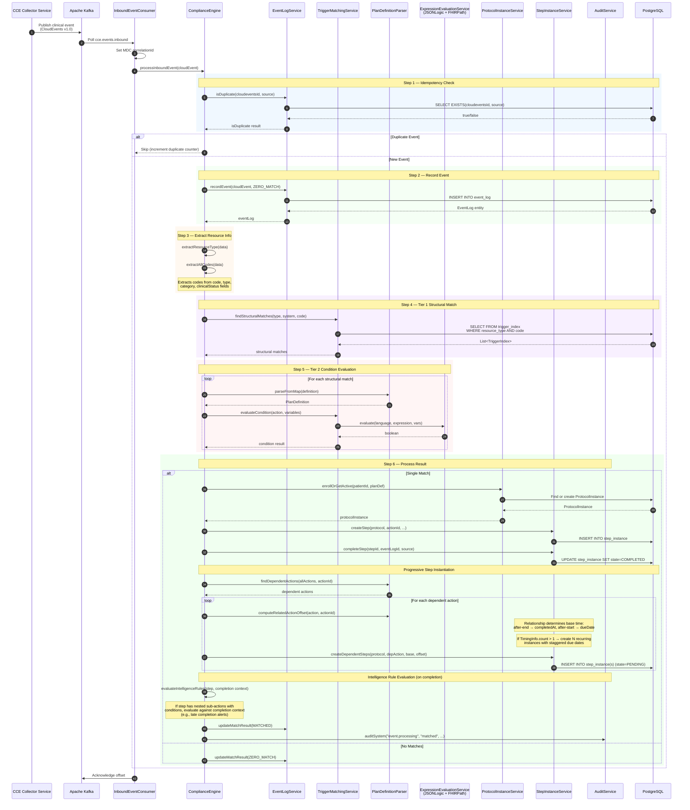
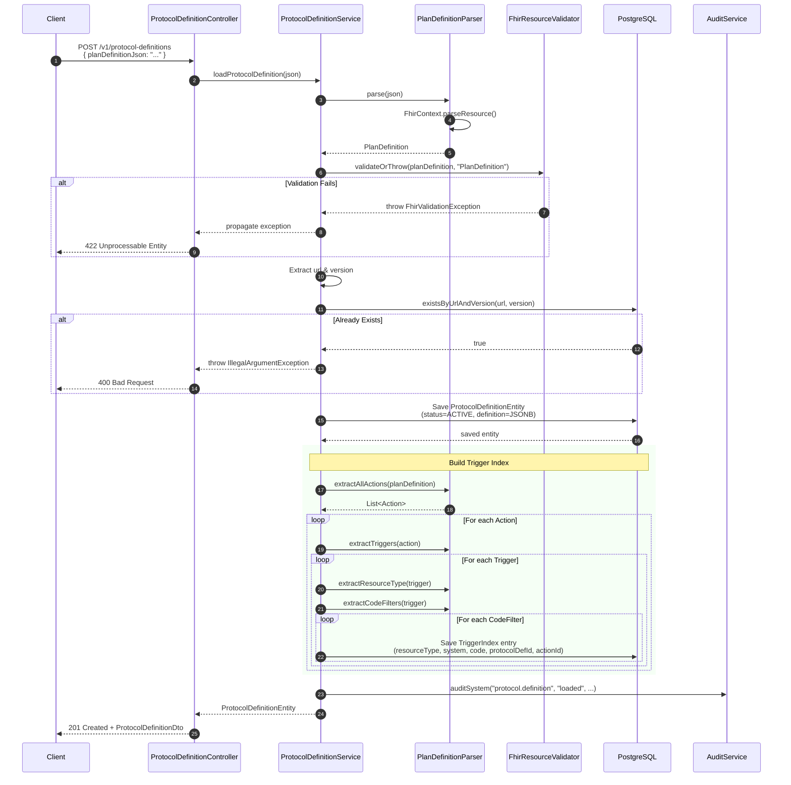
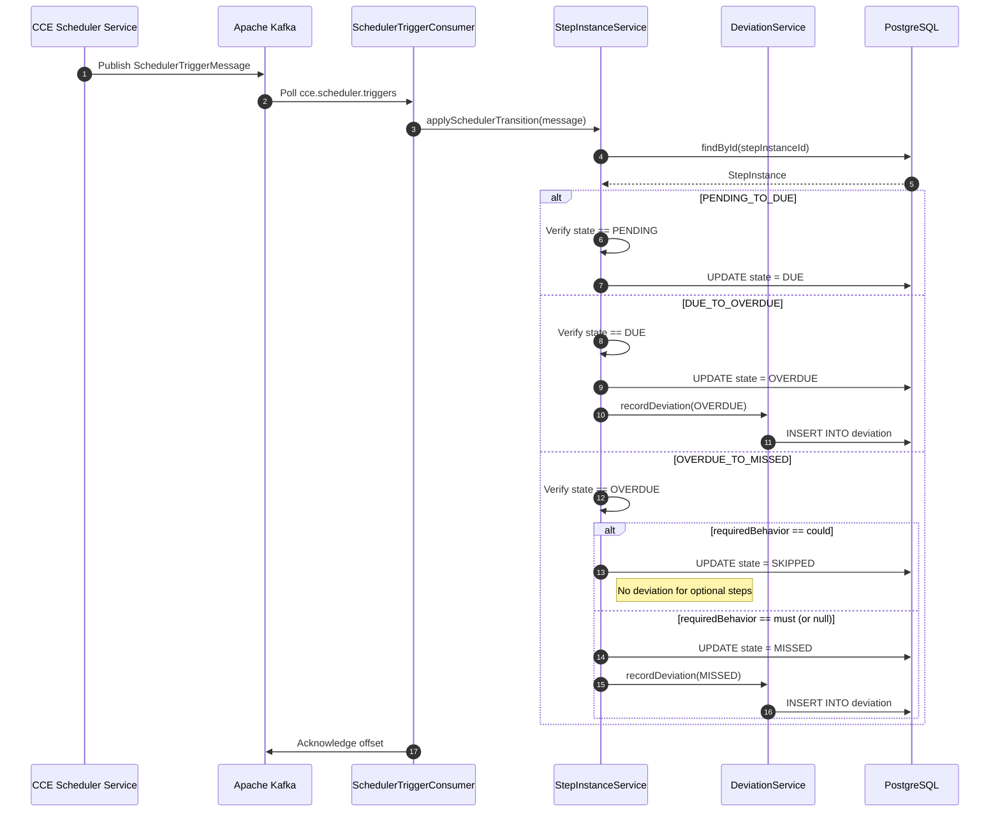
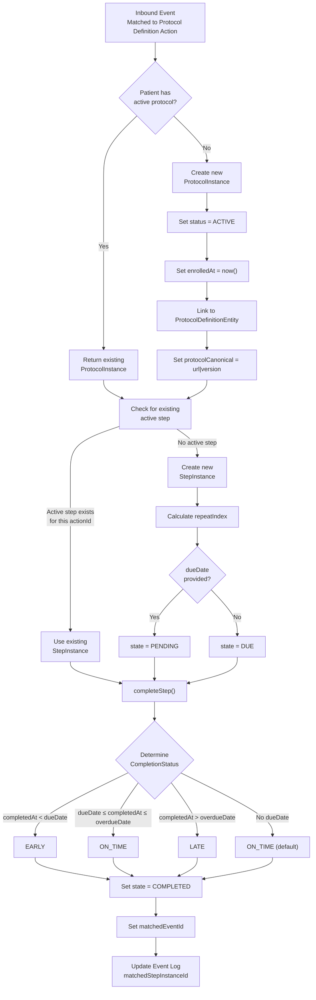
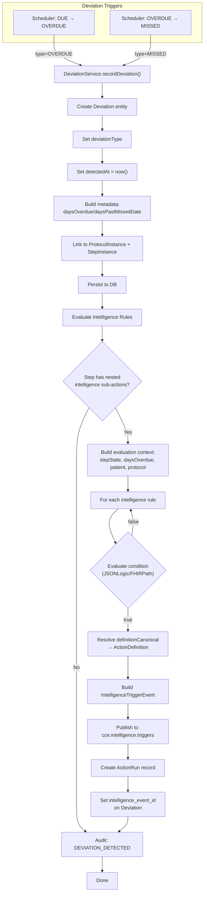
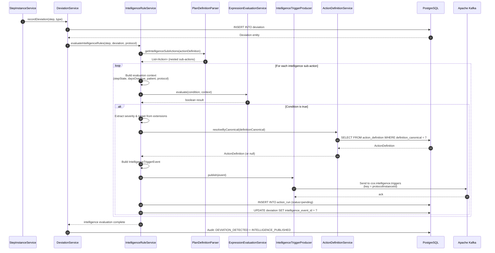
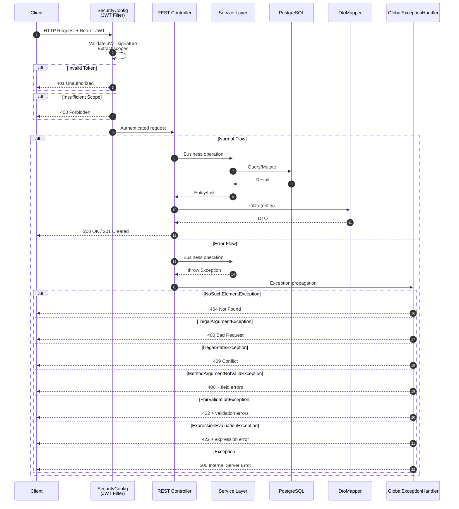
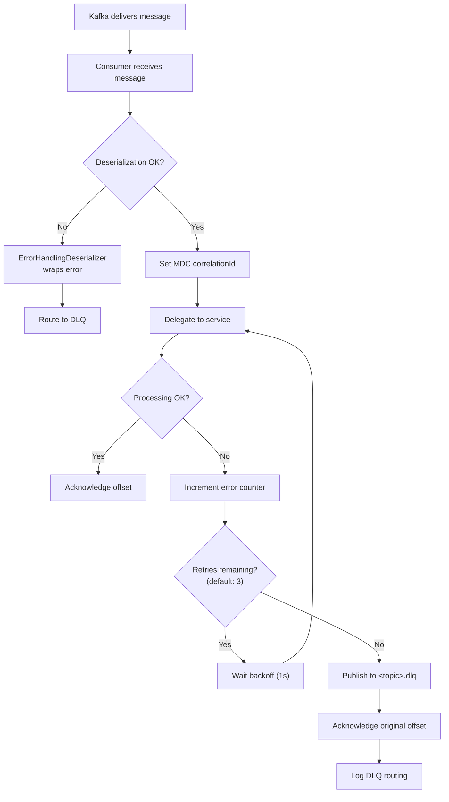

# Flow Diagrams

This document provides detailed sequence and flow diagrams for all major workflows in the CCE Compliance Service.

---

## 1. Inbound Clinical Event Processing (End-to-End)

This is the primary workflow — processing a clinical event from Kafka through the entire compliance engine pipeline.

## 2. Protocol Definition Loading Flow

## 3. Scheduler-Driven State Transitions

> The Scheduler Service polls `step_instance` for time-threshold crossings and publishes trigger messages to Kafka. See [Architecture Overview §1.1](architecture-overview.md#11-scheduler-service-contract) for the polling query, lease mechanism, and ownership boundaries. The diagram below shows the Compliance Service side — receiving and processing those triggers.

## 4. Protocol Enrollment Flow

## 5. Deviation Detection & Intelligence Rule Evaluation

When a step transitions to `OVERDUE` or `MISSED`, the system records a deviation and evaluates intelligence rules defined on that step in the PlanDefinition.

## 6. Intelligence Rule Evaluation — Detailed Sequence

## 8. REST API Request Flow

## 9. Kafka Consumer Error Handling

