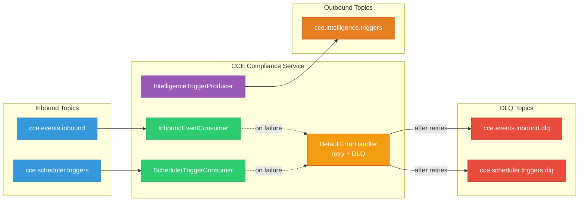
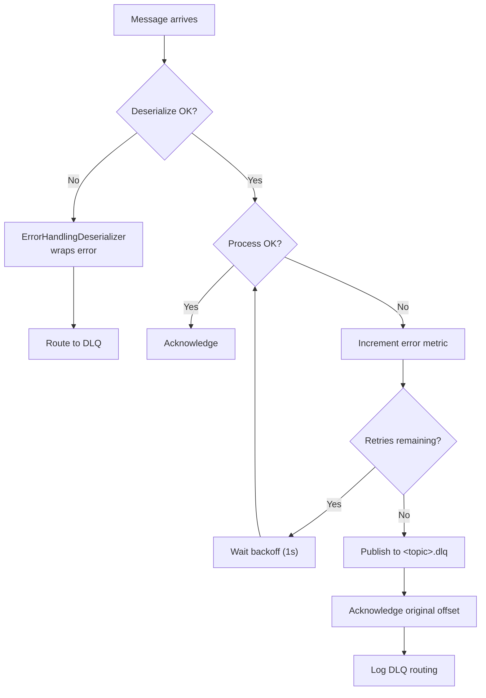

# Kafka & Event Architecture

## 1. Overview

The CCE Compliance Service uses **Apache Kafka** for asynchronous, event-driven communication with other CCE platform services. All messages follow the **CloudEvents v1.0** specification.



## 2. Topic Reference

| Topic | Direction | Partitions | Consumer Group | Description |
|---|---|---|---|---|
| `cce.events.inbound` | Inbound | 25 | `cce-compliance-service` | Clinical events from CCE Collector Service |
| `cce.scheduler.triggers` | Inbound | 25 | `cce-compliance-service` | Timer-based state transitions |
| `cce.events.inbound.dlq` | DLQ | 25 | — | Dead letter queue for failed inbound events |
| `cce.scheduler.triggers.dlq` | DLQ | 25 | — | Dead letter queue for failed scheduler triggers |
| `cce.intelligence.triggers` | Outbound | 25 | — | Intelligence trigger events published on deviation detection and step completion |

All topics are declared as `NewTopic` beans in `KafkaConfig` and auto-created by Spring’s `KafkaAdmin` on startup. Partition count is configurable via `cce.kafka.topics.default-partitions` (default: 25).

## 3. Consumer Configuration

### 3.1 Common Settings

```yaml
spring.kafka:
  bootstrap-servers: ${KAFKA_BOOTSTRAP_SERVERS:localhost:9092}
  consumer:
    group-id: cce-compliance-service
    auto-offset-reset: earliest
    enable-auto-commit: false
    properties:
      isolation.level: read_committed
      max.poll.records: 100
      max.poll.interval.ms: 300000
  listener:
    ack-mode: record
    concurrency: 3
```

| Setting | Value | Rationale |
|---|---|---|
| `auto-offset-reset` | `earliest` | Process all events from beginning on first join |
| `enable-auto-commit` | `false` | Framework-managed offset commits (not Kafka auto-commit) |
| `isolation.level` | `read_committed` | Only consume committed messages (transactional producers) |
| `max.poll.records` | `100` | Batch size per poll |
| `max.poll.interval.ms` | `300000` | 5-minute max processing time before rebalance |
| `ack-mode` | `RECORD` | Offset committed automatically per record after successful processing |
| `concurrency` | `3` | 3 concurrent listener threads per instance |

### 3.2 Deserialization

```java
// Consumer factory uses ErrorHandlingDeserializer wrapping JsonDeserializer
ConsumerFactory<String, CloudEventMessage>
  Key:   StringDeserializer
  Value: ErrorHandlingDeserializer → JsonDeserializer<CloudEventMessage>

// Trusted packages (set programmatically on the ConsumerFactory bean, not via application.yml)
JsonDeserializer.TRUSTED_PACKAGES: "org.openphc.cce.compliance.kafka.model"
```

**Error handling:** If deserialization fails, `ErrorHandlingDeserializer` wraps the error gracefully instead of crashing the consumer.

### 3.3 Retry & Dead Letter Queue

```yaml
cce.kafka:
  retry:
    max-attempts: 3           # Retry attempts before sending to DLQ
    backoff-interval-ms: 1000 # Fixed interval between retries (ms)
```

Spring Kafka's `DefaultErrorHandler` is configured on the container factory with a `FixedBackOff` and a `DeadLetterPublishingRecoverer`. When a consumer listener throws an exception:

1. **Retry** — The error handler retries the message up to `max-attempts` times with `backoff-interval-ms` between each attempt.
2. **DLQ** — After exhausting retries, the failed record is published to the corresponding DLQ topic (`<original-topic>.dlq`).
3. **Acknowledge** — The original offset is acknowledged (committed) so the consumer moves past the poison pill.

| Setting | Value | Description |
|---|---|---|
| `max-attempts` | `3` | Number of retry attempts before DLQ |
| `backoff-interval-ms` | `1000` | Fixed delay between retries (milliseconds) |
| DLQ topic naming | `<topic>.dlq` | Convention: `cce.events.inbound.dlq`, `cce.scheduler.triggers.dlq` |

> **`prod` profile overrides** (`application-prod.yml`): `max-attempts: 5` and `backoff-interval-ms: 2000` (both env-overridable via `KAFKA_RETRY_MAX_ATTEMPTS` / `KAFKA_RETRY_BACKOFF_MS`). Listener `concurrency` is also raised to `5` (`KAFKA_CONCURRENCY`) in `prod`.

### 3.4 Topic Provisioning

```yaml
cce.kafka:
  topics:
    inbound-events: cce.events.inbound
    scheduler-triggers: cce.scheduler.triggers
    intelligence-triggers: cce.intelligence.triggers
    default-partitions: 25    # Partition count for all managed topics
```

All 5 topics (3 primary + 2 DLQ) are declared as `NewTopic` beans in `KafkaConfig` using `TopicBuilder`. Spring’s `KafkaAdmin` creates them on startup if they don’t already exist. Existing topics are not modified.

| Property | Default | Description |
|---|---|---|
| `cce.kafka.topics.default-partitions` | `25` | Partition count applied to all `NewTopic` beans |

## 4. Producer Configuration

```yaml
spring.kafka:
  producer:
    key-serializer: StringSerializer
    value-serializer: JsonSerializer
    acks: all
    retries: 3
    properties:
      enable.idempotence: true
      max.in.flight.requests.per.connection: 5
```

| Setting | Value | Rationale |
|---|---|---|
| `acks` | `all` | Wait for all in-sync replicas to acknowledge |
| `retries` | `3` | Retry on transient failures |
| `enable.idempotence` | `true` | Exactly-once semantics within a partition |
| `max.in.flight.requests.per.connection` | `5` | Max allowed with idempotent producer |

---

## 5. Message Schemas

### 5.1 CloudEventMessage (Inbound — `cce.events.inbound`)

The primary message envelope for all inbound clinical events, following [CloudEvents v1.0](https://cloudevents.io/).

All Kafka messages use **CloudEvents spec field names (lowercase)** — no camelCase translation is performed. This matches the Collector Service's end-to-end field name preservation.

```json
{
  "id": "evt-eb010001-0002-4000-8000-000000000002",
  "source": "ebuzima",
  "type": "Observation",
  "specversion": "1.0",
  "subject": "260225-0002-5501",
  "time": "2026-03-15T10:30:00Z",
  "datacontenttype": "application/fhir+json",
  "correlationid": "corr-abc-123-def-456",
  "sourceeventid": "lab-evt-78901",
  "protocolinstanceid": null,
  "protocoldefinitionid": null,
  "actionid": null,
  "facilityid": "0002",
  "data": {
    "resourceType": "Observation",
    "code": {
      "coding": [
        {
          "system": "http://loinc.org",
          "code": "25836-8",
          "display": "HIV-1 RNA [#/volume] in Specimen by NAA with probe detection"
        }
      ]
    },
    "valueQuantity": {
      "value": 1500,
      "unit": "copies/mL",
      "system": "http://unitsofmeasure.org",
      "code": "{copies}/mL"
    },
    "subject": {
      "reference": "Patient/260225-0002-5501"
    },
    "effectiveDateTime": "2026-03-15T09:00:00Z"
  }
}

> **Note:** `null` fields are omitted from the JSON output (`@JsonInclude(NON_NULL)`).
```

#### Field Reference

| Field | Required | Type | Description |
|---|---|---|---|
| `id` | Yes | String | Globally unique event identifier |
| `source` | Yes | String | Event source (e.g., `rhie-mediator`, `ebuzima/kigali-south`) |
| `type` | Yes | String | Event type. Validated by Collector and emitter adaptors. |
| `specversion` | Yes | String | Always `"1.0"` |
| `subject` | Yes | String | Patient UPID (e.g., `260225-0002-5501`) — also the Kafka message key. Always present (guaranteed by Collector). |
| `time` | Yes | String (ISO 8601) | Envelope timestamp (emitter/adaptor transmission time; server-generated if absent). Always present. Used as the fallback completion time when clinical occurrence time cannot be extracted from the payload — see [Architecture §4.2](architecture-overview.md#42-clinical-event-time-extraction). |
| `datacontenttype` | Yes | String | MIME type of data field (`application/fhir+json` or `application/json`). Always present (Collector defaults to `application/fhir+json`). |
| **CCE Extensions:** | | | |
| `correlationid` | Yes | String | Distributed trace correlation ID. Always present (Collector generates `corr-<uuid>` if absent). |
| `sourceeventid` | No | String | Source system's internal event ID |
| `protocolinstanceid` | No | String (UUID) | Pre-populated if source knows the target protocol instance (usually null — Compliance Service resolves) |
| `protocoldefinitionid` | No | String (UUID) | Pre-populated if source knows the target protocol (usually null — Compliance Service resolves) |
| `actionid` | No | String | Pre-populated if source knows the target action/step (usually null — Compliance Service resolves) |
| `facilityid` | No | String | Healthcare facility FOSA ID (e.g., `0002`) |
| **Payload:** | | | |
| `data` | Yes | Map | Event payload — FHIR R4 resource (when `datacontenttype` = `application/fhir+json`) or valid JSON object (when `datacontenttype` = `application/json`). Always present (guaranteed by Collector). |

#### Event Type Conventions

| Pattern | Example | Description |
|---|---|---|
| `cce.compliance.deviation.*` | `cce.compliance.deviation.overdue` | Compliance-generated deviation events |

#### Payload Content Types

| `datacontenttype` | Validation by Collector | Compliance Service Handling |
|---|---|---|
| `application/fhir+json` (default) | FHIR R4 structural validation via FHIR Libraries | Parse via `FhirContext.forR4()`, extract resource type + codes for trigger matching |
| `application/json` | Valid JSON object check (no FHIR validation) | Extract fields directly from JSON map; used for non-FHIR payloads (e.g., CHW apps, named events) |

---

### 5.2 SchedulerTriggerMessage (Inbound — `cce.scheduler.triggers`)

Timer-based triggers from the CCE Scheduler Service for step state transitions.

```json
{
  "stepInstanceId": "770e8400-e29b-41d4-a716-446655440002",
  "transitionType": "DUE_TO_OVERDUE",
  "triggeredAt": "2026-03-25T00:00:00Z",
  "correlationid": "sched-corr-123"
}
```

| Field | Type | Description |
|---|---|---|
| `stepInstanceId` | UUID | Target step instance |
| `transitionType` | String | `PENDING_TO_DUE`, `DUE_TO_OVERDUE`, or `OVERDUE_TO_MISSED` |
| `triggeredAt` | OffsetDateTime | When the timer fired |
| `correlationid` | String | Trace correlation |

#### State Transitions


> **How does the Scheduler know when to fire?** The Scheduler Service polls `step_instance` (owned by the Compliance Service) for rows where the current time has crossed a date threshold (`dueDate`, `overdueDate`, or `missedDate`). It uses a `scheduler_lease` table to prevent duplicate publishes across instances. See [Architecture Overview §1.1 — Scheduler Service Contract](architecture-overview.md#11-scheduler-service-contract) for the full interaction model, polling query, and ownership boundaries.

---

### 5.3 IntelligenceTriggerEvent (Outbound — `cce.intelligence.triggers`)

Published when an intelligence action fires — triggered by deviation detection (OVERDUE/MISSED) or step completion when the step's PlanDefinition action has nested intelligence actions with matching conditions.

```json
{
  "id": "550e8400-e29b-41d4-a716-446655440099",
  "subject": "260225-0002-5501",
  "intelligenceEventId": "990e8400-e29b-41d4-a716-446655440010",
  "actionDefinitionId": "aad00001-0001-0001-0001-000000000001",
  "protocolDefinitionId": "ppd00001-0001-0001-0001-000000000001",
  "actionType": "CommunicationRequest",
  "severity": "HIGH",
  "intelligenceDestination": "openMRS",
  "stepState": "overdue",
  "actionId": "viral-load-check",
  "protocolCanonical": "http://example.org/PlanDefinition/hiv-treatment|1.0",
  "detectedAt": "2026-03-25T00:00:05Z",
  "eventPayload": { "resourceType": "ServiceRequest", "id": "498871", "..." : "..." }
}
```

| Field | Type | Description |
|---|---|---|
| `id` | UUID | Unique event identifier |
| `subject` | String | Patient identifier (UPID) |
| `intelligenceEventId` | UUID | Intelligence event log record ID tracking this execution |
| `actionDefinitionId` | UUID | ActionDefinition that was resolved and triggered |
| `protocolDefinitionId` | UUID | Protocol definition the step belongs to |
| `actionType` | String | Action type from ActionDefinition (e.g., `CommunicationRequest`, `Task`, `ServiceRequest`) |
| `severity` | String | Severity from PlanDefinition override or ActionDefinition (e.g., `HIGH`, `MEDIUM`, `LOW`, `CRITICAL`) |
| `intelligenceDestination` | String | Intelligence destination from PlanDefinition override or ActionDefinition (e.g., `openMRS`, `SPICE`, `E-Buzima`) |
| `stepState` | String | Current step state (lowercase) |
| `actionId` | String | Protocol definition action ID |
| `protocolCanonical` | String | Protocol `url\|version` |
| `detectedAt` | OffsetDateTime | Detection timestamp |
| `eventPayload` | JsonNode | Original FHIR resource payload from the inbound CloudEvent. Present for event-driven completions; `null` for scheduler-driven deviations (OVERDUE/MISSED). |

**Kafka Key:** `intelligenceEventId` (ensures unique partitioning per action execution)

#### Intelligence Event Types

| Trigger |
|---|
| Step transitioned DUE → OVERDUE |
| Step transitioned OVERDUE → MISSED |
| Step completed with `completionStatus=LATE` |


> **Intelligence event publishing lifecycle:** When a deviation is detected or a step completed, the `IntelligenceActionEvaluator` extracts intelligence actions from the step's PlanDefinition, evaluates each action's condition (JSONLogic/FHIRPath) against the step's runtime state, and publishes an `IntelligenceTriggerEvent` for each matching action. An `IntelligenceEventLog` record stores the complete event payload, evaluation context (trigger reason, deviation, step action ID, expression, and runtime variables), and publish status. See [Architecture Overview §6.3](architecture-overview.md#63-intelligence-action-evaluation) for the full pipeline.

---

## 6. Consumer Implementations

### 6.1 InboundEventConsumer

```java
@KafkaListener(topics = "${cce.kafka.topics.inbound-events}")
public void consume(CloudEventMessage event) {
    MDC.put("correlationId", event.getCorrelationid());
    MDC.put("source", event.getSource());
    MDC.put("eventType", event.getType());
    MDC.put("subject", event.getSubject());
    try {
        try {
            facilityService.upsertFacility(event);
        } catch (Exception e) {
            log.warn("Facility registration failed for facilityId={} — compliance processing will continue",
                    event.getFacilityid(), e);
        }
        complianceEngine.processInboundEvent(event);
    } catch (Exception e) {
        errorCounter.increment();  // cce.consumer.inbound.errors
        throw e; // Propagate to DefaultErrorHandler for retry + DLQ
    } finally {
        MDC.clear();
    }
}
```

Each inbound event triggers two independent operations before the offset is committed:

1. **Facility registration** (`FacilityService.upsertFacility`) — best-effort reference-data upsert of the event's `facilityid`. Runs in its own transaction, outside `ComplianceEngine`'s. Failures are non-fatal: logged as a warning, and compliance processing continues — a transient error on the facility reference table must not cause the event to be retried or routed to the DLQ.
2. **Compliance processing** (`ComplianceEngine.processInboundEvent`) — protocol matching, enrolment, and step progression. Failures here are fatal and propagate to the error handler.

**Behavior on failure:** Exception from compliance processing propagates to `DefaultErrorHandler` → retries with backoff → routes to `cce.events.inbound.dlq` after exhausting retries. Offset is committed automatically on success (`AckMode.RECORD`).

### 6.2 SchedulerTriggerConsumer

```java
@KafkaListener(
    topics = "${cce.kafka.topics.scheduler-triggers}",
    properties = {
        "spring.json.value.default.type=org.openphc.cce.compliance.kafka.model.SchedulerTriggerMessage"
    }
)
public void consume(SchedulerTriggerMessage trigger) {
    MDC.put("correlationId", trigger.getCorrelationid());
    try {
        stepInstanceService.applySchedulerTransition(trigger);
    } catch (Exception e) {
        errorCounter.increment();  // cce.consumer.scheduler.errors
        throw e; // Propagate to DefaultErrorHandler for retry + DLQ
    } finally {
        MDC.clear();
    }
}
```

**Note:** Uses `spring.json.value.default.type` property override since inbound messages are not CloudEventMessage.

**Downstream effects of `OVERDUE_TO_MISSED`:** Beyond raising a `MISSED` deviation, `applySchedulerTransition` parses the step's `PlanDefinition` and, if the step belongs to a repeating step group, checks whether that cycle can now be advanced — creating the next cycle's `step_instance` rows before the protocol-completion check runs. This is an internal side effect of processing the consumed message; it does not change the topic, message schema, or produce any new Kafka event.

## 7. Producer Implementations

### 7.1 IntelligenceTriggerProducer

Publishes `IntelligenceTriggerEvent` to `cce.intelligence.triggers` when intelligence actions fire.

```java
@Component
public class IntelligenceTriggerProducer {

    private final KafkaTemplate<String, Object> kafkaTemplate;
    private final String topic; // ${cce.kafka.topics.intelligence-triggers}
    private final Counter publishedCounter; // cce.events.intelligence.published

    public CompletableFuture<SendResult<String, Object>> publish(IntelligenceTriggerEvent event) {
        // Key: intelligenceEventId (unique per action execution)
        String key = event.getIntelligenceEventId().toString();
        return kafkaTemplate.send(topic, key, event)
            .whenComplete((result, ex) -> {
                if (ex == null) {
                    publishedCounter.increment();
                    log.info("Published intelligence trigger event: id={}, intelligenceEventId={}, topic={}",
                        event.getId(), key, topic);
                } else {
                    log.error("Failed to publish intelligence trigger event: id={}, intelligenceEventId={}, topic={}",
                        event.getId(), key, topic, ex);
                }
            });
    }
}
```

**Behavior:**
- **Fire-and-forget:** Publish failures are logged but do not fail the main compliance transaction
- **Kafka key:** `intelligenceEventId` (same key documented in §5.3) — ensures unique partitioning per action execution
- **Idempotency:** Producer-level idempotency (`enable.idempotence=true`) prevents duplicate publishes within a partition
- **Metrics:** `cce.events.intelligence.published` counter incremented on successful publish; `cce.intelligence.publish.duration` timer records publish latency

## 8. Ordering & Delivery Guarantees

| Guarantee | Mechanism |
|---|---|
| **At-least-once delivery** | `AckMode.RECORD` + `DefaultErrorHandler` + no auto-commit |
| **Idempotency (inbound events)** | `(cloudeventsId, source)` deduplication in compliance_event_log |
| **Idempotency (scheduler triggers)** | State-transition guard in `applyTransition` (a redelivered trigger finds the step already in the target state and is skipped) + `(step_instance_id, deviation_type)` unique constraint on `deviation`. `createDeviation` returns a `created` flag so intelligence evaluation only fires for a freshly inserted deviation — no duplicate deviations **and** no duplicate intelligence events under redelivery or concurrent processing |
| **Idempotency (producer)** | `enable.idempotence=true` on producer |
| **Ordering (per partition)** | Key-based routing ensures ordering per action execution |
| **Transactional reads** | `isolation.level=read_committed` prevents reading uncommitted |
| **Durability** | `acks=all` waits for all ISR replicas |


## 9. Error Recovery Flow


